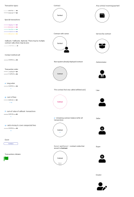
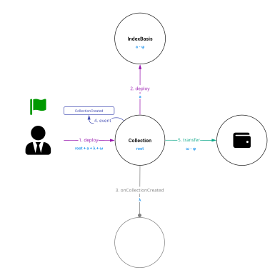
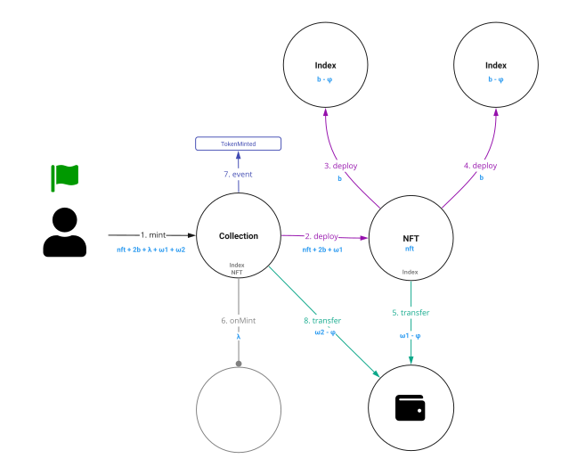
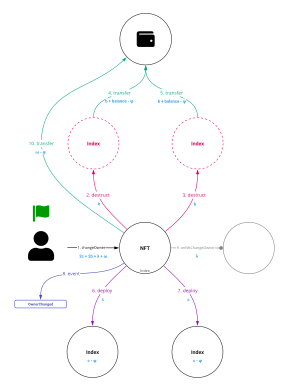

# Non-Fungible Token on-chain indexes (TIP-4.3)
## Abstract
Using the Index contract code, you can find all your NFT with one [dApp](https://main.ton.dev/graphql) query

## Motivation
A standard interface allows search any NFT using base [dApp](https://main.ton.dev/graphql) functionality

## Specification
* `Collection` - contract that minted token
* `NFT` - contract that store token information
* `IndexBasis` -  contract, that help to find all collections by the `code hash` of which
* `Index` - contract, that help to find:
  * All user tokens in current collection using `owner address` and `collection address`
  * All user tokens in all collections using `owner address`

`Code` of `IndexBasis` and `Index` contracts and `code hash` of contracts is fixed and **CANNOT BE CHANGED**

## IIndexBasis
```solidity
pragma ton-solidity >= 0.58.0;

interface IIndexBasis {
    function getInfo() external view responsible returns (address collection);
    function destruct(address gasReceiver) external;
}
```

## IndexBasis
```solidity
pragma ton-solidity >= 0.58.0;

import './IIndexBasis.sol';

/**
 * Errors
 *   101 - Method for collection only
 **/
contract IndexBasis is IIndexBasis {
    address static _collection;

    modifier onlyCollection() {
        require(msg.sender == _collection, 101, "Method for collection only");
        tvm.accept();
        _;
    }

    constructor() public onlyCollection {}

    function getInfo() override public view responsible returns (address collection) {
        return {value: 0, flag: 64} _collection;
    }

    function destruct(address gasReceiver) override public onlyCollection {
        selfdestruct(gasReceiver);
    }
}
```

`IndexBasis` `code hash` without salting is `8b36621923212d315cc719a47f5aac4f97b2e044863fdb8a7d600c0765064257`

### IIndexBasis.getInfo()
```solidity
function getInfo() external view responsible returns (address collection);
```

* `collection` (`address`) - address of collection token contract

### IIndexBasis.destruct()
```solidity
function destruct(address gasReceiver) external;
```

* `gasReceiver` (`address`) - address of contract that receive all remaining contract balance after `selfdestruct()` call

## IIndex
```solidity
pragma ton-solidity >= 0.58.0;

interface IIndex {
    function getInfo() external view responsible returns (
        address collection,
        address owner,
        address nft
    );
    function destruct(address gasReceiver) external;
}
```

## Index
```solidity
pragma ton-solidity >= 0.58.0;

import './IIndex.sol';

/**
 * Errors
 *   101 - Method for NFT only
 *   102 - Salt doesn't contain any value
 **/
contract Index is IIndex {
    address static _nft;
    
    address _collection;
    address _owner;

    constructor(address collection) public {
        optional(TvmCell) salt = tvm.codeSalt(tvm.code());
        require(salt.hasValue(), 102, "Salt doesn't contain any value");
        (, address collection_, address owner) = salt
            .get()
            .toSlice()
            .decode(string, address, address);
        require(msg.sender == _nft);
        tvm.accept();
        _collection = collection_;
        _owner = owner;
        if (collection_.value == 0) {
            _collection = collection;
        }
    }

    function getInfo() override public view responsible returns (
        address collection,
        address owner,
        address nft
    ) {
        return {value: 0, flag: 64} (
            _collection,
            _owner,
            _nft
        );
    }

    function destruct(address gasReceiver) override public {
        require(msg.sender == _nft, 101, "Method for NFT only");
        selfdestruct(gasReceiver);
    }
}
```

`Index` `code hash` without salting is `61e5f39a693dc133ea8faf3e80fac069250161b0bced3790c20ae234ce6fd866`

### Index.getInfo()
```solidity
function getInfo() external view responsible returns (
    address collection,
    address owner,
    address nft
);
```

* `collection` (`address`) - address of collection token contract
* `owner` (`address`) - address of token owner contract
* `nft` (`address`) - address of token contract

### IIndexBasis.destruct()
```solidity
function destruct(address gasReceiver) external;
```

* `gasReceiver` (`address`) - address of contract that receive all remaining contract balance after `selfdestruct()` call

## Salt
Use [tvm.setCodeSalt()](https://github.com/tonlabs/TON-Solidity-Compiler/blob/master/API.md#tvmcodesalt) for `IndexBasis` or `Index` deployment

Example:
```solidity
function deployIndexBasis(TvmCell codeIndex, address collection) private pure {
    string stamp = "nft";
    TvmBuilder salt;
    salt.store(stamp);
    TvmCell code = tvm.setCodeSalt(codeIndex, salt.toCell());
    TvmCell stateInit = tvm.buildStateInit({
        contr: IndexBasis,
        varInit: {_collection: collection},
        code: code
    });
    new IndexBasis{stateInit: stateInit, value: 1 ton}();
}
```

To deploy the index, you need to add a salt to the code with the `stamp` (`string`).
`stamp` is needed to get a **unique** `code hash`.
The unique `code hash` is needed to avoid collisions with other index contracts that are used to index other types of contracts

### Salt for NFT contracts use:
```solidity
string stamp = "nft";
```

For other types of contracts, you must use another `stamp`

## Example of dApp query for search by index
```graphql
query {
  accounts( 
    filter: {
      code_hash: {
        eq: "207dc560c5956de1a2c1479356f8f3ee70a59767db2bf4788b1d61ad42cdad82"
      }
    }
  ){
    id
  }
}
```

Part of example response
```json
{
  "data": {
    "accounts": [
      {
        "id": "0:000001b0422f6a7069786fa9a27aa7bb8042f58e1df01dfebc51dcb2baa5eeae"
      },
      {
        "id": "0:00022772794253c1bf8cb4fa59d6161d574033c13d881f3eea14675b911e61b0"
      }
    ]
  }
}
```

## Source code
* [IIndexBasis.sol](contracts/src/IIndexBasis.sol)
* [IndexBasis.sol](contracts/src/IndexBasis.sol)
  * [IndexBasis.abi.json](contracts/build/IndexBasis.abi.json)
  * [IndexBasis.tvc](contracts/build/IndexBasis.tvc)
* [Index.sol](contracts/src/Index.sol)
  * [Index.abi.json](contracts/build/Index.abi.json)
  * [Index.tvc](contracts/build/Index.tvc)

## Visualization
### Legend


### `IndexBasis` deployment for `Collection`


### `Index` contracts deployment for `NFT`


### Redeploy `Index` contracts after `changeOwner`
