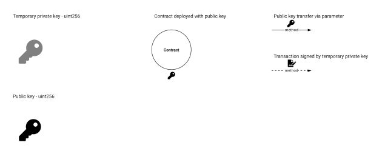
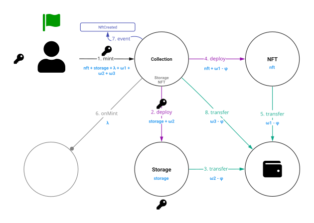
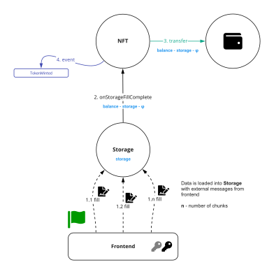
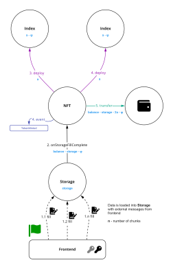

`---
title: 4.4. On-chain storage 
sidebar_position: 4
---

# Non-Fungible Token On-chain storage (TIP-4.4)

## Abstract
Using the Storage contract, you can store NFT-related bytes in blockchain

## Motivation
Fault tolerance. If off-chain services are unavailable, the user will be able to view NFT-related bytes, because it is stored on-chain

## Specification
* `Collection` - contract that minted token
* `NFT` - contract that store token information and `Storage` contract address
* `Storage` -  contract, that linked to `NFT` and store byte content

## Collection
Every [TIP-4.1](1.md) `Collection` contract must implement `ICollectionStorage`
```solidity
pragma ton-solidity >= 0.58.0;

interface ICollectionStorage {
    function storageCode() external view responsible returns (TvmCell code);
    function storageCodeHash() external view responsible returns (uint256 codeHash);
}
```

### ICollectionStorage.storageCode()
```solidity
function storageCode() external view responsible returns (TvmCell code);
```

* `code` (`TvmCell`) - token contract code

### ICollectionStorage.storageCode()
```solidity
function storageCodeHash() external view responsible returns (uint256 hash);
```

* `hash` (`uint256`) - token contract code hash

## NFT
Every [TIP-4.1](1.md) `NFT` contract must implement `INFTStorage`
```solidity
pragma ton-solidity >= 0.58.0;

interface INFTStorage {
    function onStorageFillComplete(address gasReceiver) external;
}
```

### NFT.onStorageFillComplete()
```solidity
function onStorageFillComplete(address gasReceiver) external;
```
* `gasReceiver` (`address`) - address of contract that receive all remaining contract balance then last chunk filled

## Storage
Every `Storage` contract must implement `IStorage`
```solidity
pragma ton-solidity >= 0.58.0;

interface IStorage {
    function fill(uint8 id, bytes chunk) external;
    function getInfo() external view returns (
        address nft,
        address collection,
        string mimeType,
        mapping(uint8 => bytes) content
    );
}
```

### IStorage.fill()
```solidity
function fill(uint8 id, bytes chunk, address gasReceiver) external;
```

* `id` (`uint8`) - chunk number. From `0` to `255`
* `bytes` (`chunk`) - data. Max size of data limited by external message payload size. Maximum size is `16kb` at 2022-03-18
* `gasReceiver` (`address`) - address of contract that receive all remaining contract balance then last chunk filled

### IStorage.getInfo()
```solidity
function getInfo() external view returns (
    address nft,
    address collection,
    string mimeType,
    mapping(uint8 => bytes) chunks
);
```

* `nft` (`address`) - address of token contract
* `collection` (`address`) - address of collection token contract
* `mimeType` (`string`) - [MIME types](https://developer.mozilla.org/en-US/docs/Web/HTTP/Basics_of_HTTP/MIME_types) are defined and standardized in IETF's [RFC 6838](https://datatracker.ietf.org/doc/html/rfc6838)
* `chunks` (`mapping(uint8 => bytes)`) - byte content. Maximum content size is `256 chunks * chunk size`. Maximum chunk size is `16kb` and maximum content size is `4MB` at 2022-03-18.

## Filling cost 1MB
[//]: # (TODO)

## Storage cost 1MB per year
[//]: # (TODO)

## Visualization
### Legend



### `NFT` minting with `Storage`


### `Storage` filling


### `Storage` with `Index`
How to interaction [on-chain indexes](3.md) and `Storage` contracts
