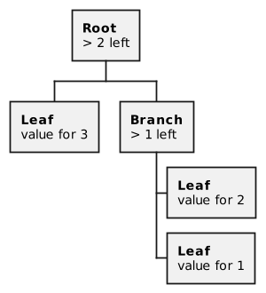

# TL-B and BoC

## TL-B

Typed Language - Binary is used to describe the scheme of deserialization of objects to cells.

### Scheme

TL-B schemes are comprised of declarations. Each declaration, in turn, describes a *constructor* for some *type*. For example, a *Bool type* may have *constructors* for `true` and `false` values.

Please see typical TL-B declarations below:

```
bool_false$0 = Bool;
bool_true$1 = Bool;

unary_zero$0 = Unary ~0;
unary_succ$1 {n:#} x:(Unary ~n) = Unary ~(n + 1);

acc_trans#5 account_addr:bits256
   transactions:(HashmapAug 64 ^Transaction CurrencyCollection)
   state_update:^(HASH_UPDATE Account)
   = AccountBlock;
```

Each TL-B declaration is comprised of:

- A constructor name followed by an optional constructor tag
- A list of both explicit and implicit field definitions separated by whitespaces (`" "`, `"\n"`, etc)
- `=` sign
- *Type name* (optionally parametrized) 

Example: Two constructors with different binary prefixes for a `Bool` type.

```
bool_false$0 = Bool;
bool_true$1 = Bool;
```

#### Constructor

A constructor is declared via `constructor_name[separator,tag]`.

A `constructor_name` is comprised of `[A-z0-9_]` symbols. Normally, `snake_case` names are used.

A constructor name can be followed by a `separator`. If there is no separator it means that the `tag` will be calculated automatically as a `32bit CRC32-sum` of constructor declarations. If there is a `separator`, it can take two values: `#` and `$.` The first value means that a `tag` will be given in a hexadecimal form while the second means a binary `tag`. After both separators, there may be an underscore symbol `_` which stands for an empty tag.

There is also a special constructor name called `anonymous constructor` which means that there is only one unnamed constructor with an empty tag for a given type.

Please see the table below for possible tag definitions.

|  Constructor |                  tag                 |
|:------------:|:------------------------------------:|
| `_`          | empty tag for anonymous constructor  |
| `some`       | automatically calculated 32-bit tag  |
| `some#bba`   | 12-bit tag equal to `0b101110111010` |
| `some$01011` | 5-bit tag equal to `0b01011`         |
| `some#_`     | empty tag                            |
| `some$_`     | empty tag                            |

Please note that pregenerated tags are not usually used. Those explicitly declared are preferred.

#### Field definitions

##### Explicit

Each field definition has the *ident*: *type-expr*. 

*ident* is an identifier for the name of the field. It is replaced by an underscore _ for anonymous fields. 

*type-expr* is the field type. 

The type provided here is a type expression. It may include simple types or parametrized types with suitable parameters. 

The identifiers of the previously defined fields of types `#` (natural numbers) or `Type` (type of types) may be used as parameters for the **parametrized types**. 

There are a few predefined types:

- `#` - means an unsigned 32-bit number
- `## N` - the same as `uintN` - means an unsigned N-bit number
- `#<= N` - means a number between `0` and `N` (including both). Such a number is stored in `ceil(log2(N+1))` bits.
- `N * Bit` - means N-bit slice
- `^Cell` - means an arbitrary cell in reference
- `^[ field_definitions ]` - means that field definitions are stored in the referenced cell
- `Type` - stands for arbitrary type (but only presents in implicit definitions).

*type-expr* usually consist of optionally parametrized *Type* only as: `last_trans_lt:uint64 or _:StateInit`. Yet, it is possible that *type-expr* also contains conditions. In that case, *type-expr* consists of *ident*, `:`, *condition*, `?`, type. If a condition, which can refer to previously defined fields, renders to `false`, the corresponding field is not presented. For instance, `prev:n?^(ProofChain n)` means that `prev` field is only presented for objects when `n>0`.

##### Implicit​

Some fields may be implicit. Their definitions are surrounded by **curly brackets**. It indicates that the field is not actually present in the serialization. Their value must be deduced from some other data. Usually, the parameters of the type are being serialized. For instance

```
nothing$0 {X:Type} = Maybe X;
just$1 {X:Type} value:X = Maybe X;
```

Some other constructor may define the field `var:(Maybe #)`. In that case, the variable will be serialized either as `1` bit and a serialization of `#` (uint32) if `var` is present or as `0` bit if `var` is absent. That way, `Maybe` is declared as a C++-like template type for arbitrary type X. However, if `Maybe` is declared as `nothing$0 {X:#} = Maybe X;`, that will mean that `Maybe` is declared for an arbitrary number (not totally arbitrary type X).

#### Type definition

A type name consists of `[A-z0-9_]` symbols. By practice, it is a **CamelCase** name.

It can be parametrized by one or more parameters.

In some cases, the variables are prefixed by a tilde (`~`). Basically, it means that, prior to deserialization, the exact value of that variable is not known. It will be computed during deserialization.

Let's consider:

```
unary_zero$0 = Unary ~0;
unary_succ$1 {n:#} x:(Unary ~n) = Unary ~(n + 1);
```

In the case when we want to deserialize the `Unary ~N` object from the slice containing `0b1111111100101` bit string. Thus, when we intend to deserialize `Unary ~N`, it means that we do not know yet whether we deserialize `Unary 0`, `Unary 7` or `Unary 1020`. 

We begin with `0b1111111100101` and compare it with the constructor prefixes `0b0` for `unary_zero` and `0b1` for `unary_succ`. We can see that we have `unary_succ`. However, the value of N cannot be deducted. It should be obtained from the deserialization of variable `x`. This variable has type `Unary ~(N-1)` and the value of `N-1` can be deducted from the deserialization of the remaining bits in the slice. We get the remaining bits of the slice and try to deserialize `Unary ~(N-1)` and again see the `unary_succ` tag.

We, therefore, recursively dive into `Unary` until we get to the `Unary ~(N-8)`. Then, we see that the rest of the slice starts from the `unary_zero` tag and thus constitutes a `Unary 0` object. Looking back, we can see that we initially had a `Unary 8` object. After the deserialization of `Unary ~N` from Slice(`0b1111111100101`) we get a `Unary 8` object and the remaining slice(`0b0101`) from which subsequent variables of the constructor can be deserialized.

#### Constraints​

Some implicit fields may contain constraints, for instance `{n <= m}`. It means that the previously defined variables `n` and `m` should satisfy the corresponding inequality. This inequality is an inherent property of the constructor. It should be checked during serialization and objects with variables which do not satisfy these constraints are invalid.

An example of constructors with constraints:

```
hml_short$0 {m:#} {n:#} len:(Unary ~n) {n <= m} s:(n * Bit) = HmLabel ~n m;
hml_long$10 {m:#} n:(#<= m) s:(n * Bit) = HmLabel ~n m;
hml_same$11 {m:#} v:Bit n:(#<= m) = HmLabel ~n m;
```

### Deserialization​

With the help of TL-B schemes, any object can be serialized to the **builder** and deserialized from the **slice**. In particular, in order to deserialize an object, we need to start with the determination of the constructor. For this purpose we use a tag and then deserialize variables one by one from left to right. 

It is done recursively turning to the serialization of variables (they are TL-B objects). Throughout the serialization process we go the other way. Write to the builder `tag` which corresponds to a given object of that type and then, continue from left to right with each variable.

## BoC

All data in ES is stored and sent in a structure called the BoC (Bag of cell). This is a confusing structure invented by Nikolai Durov, and it’s not very clear whether it was necessary in order to create the blockchain, or Nikolai over-engineered here. In general, all data stored in the contract (not the code, the code is separate, but also the BoC is stored in the contract :-)) is stored in one BoC, this is a given cell (TVMCell) with links to subcells. The TVMCell is a structure that has 1023 Bits of data and 4 references to its child cells. A cell reference is the HASH of that cell. With ES have have a singly connected graph, where each node can have 4 descendants. And we need to pack all smart contract data or messages into a cell with sub cells. Thank God, by using Ton Solidty and knowing the interfaces of contracts, you don’t have to manually pack and unpack cells. The compiler will do everything for you. However, there are rare cases when you will have to do it yourself. In order to do this, there are special primitives in Solidity. When this is necessary, you simply declare state variables in Solidity and read and write to them as usual. The compiler will pack and unpack everything in the BoC for you.

Some BoC properties to understand. BoC is an acyclic graph. The link to a cell c is a hash of its data and its hash links to subcells. So we cannot create a cycle. (Because if we add a link from the parent cell to the child cell, then, by doing so, we recalculate all hashes from the changed cell to the root cell and the link to the parent cell changes). The entire state of the contract is BoC. This is one cell with as many child cells as you like. Ton Solidity takes care of work with states for us, but you need to understand that, because of ES’s tree structure, we normally don’t write contracts with a lot of data. In order to illustrate how it works, consider (schematically) how a dictionary could be implemented in BoC.



Each circle in the picture is a separate cell. To get the value by key 2, TVM needs to load a cell of depth 0, then depth 1 and then depth 2. We have to pay gas for each time a cell is loaded. And if we change the value by key two, we will need to recalculate all references from the cell with the value of the root cell because the cell reference is a hash (cell.data + cell.refs).

So, links to all cells along the way will change and we will need to change them from bottom to top. So, the more elements our dictionary has, the deeper the cell will be and the more expensive it will be to work with. For a dictionary, the cost of gas will increase to O(log n) in a worst case scenario. (In reality, everything would be more complicated but O (log n) can be useful to look at as a worst case scenario).

Now, if we are creating an ERC20 token, then the more owners this token has, the more expensive the gas will be to use this contract (the size of the owner-number map will grow). And although O(Log n) doesn’t sound scary at all, and the cost of working with the map will increase very, very slowly after the first hundred elements, and then even slower after that, in ES there we have a storage fee that grows linearly.

If you have accounts in your ERC-20 token that contain pennies, then the fees for holding these accounts will greatly exceed the value of these accounts over the years. Therefore, in ES it is customary to make separate contracts for separate accounts, which themselves pay for their storage. 

Fun fact: this entire overcomplicated data storage scheme helps to scale the network, so that the validator can quickly execute smart contracts. Validators do not need to store the entire current state of the blockchain in Ram, because loading the smart contract state from the disk will be fast, since all smart contracts are small. Additionally, since all contracts are small, they are evenly distributed across all shards.
