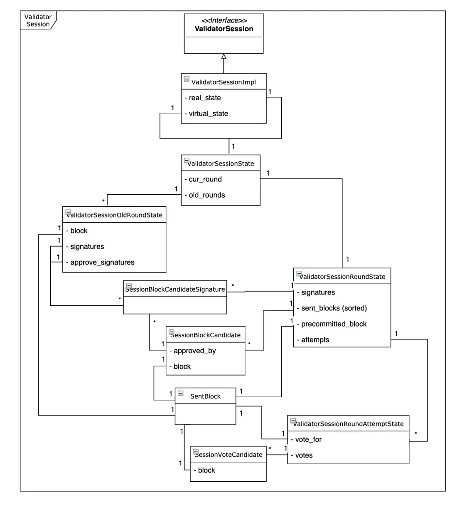

# Components

The consensus logic is implemented in three core components:
- catchain responsible for all communications and blocks delivery between validators;
- validator-session responsible for the consensus itself;
- validator responsible for a linkage between validator sessions and other Everscale components. In particular, this component verifies new blocks, interacts with collator nodes when block candidates are generated, commits blocks to the blockchain.

Components are linked on the basis of the dependency inversion principle. See further a detailed description of the **validator-session** component.

## Validator Session Component

### Consensus Algorithm Overview

To enable block validation, Everscale creates a list of validator nodes. This stage takes a fixed period of time configured in zerostate of blockchain. It is called validator session. This session is carried out in several rounds each aiming at generating a signed block.

The list of validators for each validation session is regulated by a specific smart contract that implements the elections logic. Such validation session is established for a number of rounds each of which ends with block committing or round skip. As a result of elections the list of nodes with their respective voting weights is created. The voting weight is in direct proportion to a node stake value, so the larger the stake, the larger its weight. Then the weight is applied in decision making. Validator nodes vote by signing a block candidate with their own private keys. If a block gets at least 2/3 of all the weights (cutoff weight), it automatically wins the particular voting round.

Every round has several stages:
- block candidate generation
- approval
- vote
- signing

A round ends once a new signed block appears. To prevent validator conflicts over a new block, each round includes a specific number of fixed-time attempts pre-configured in blockchain zerostate. If no consensus is achieved within the maximum number of attempts, the round is considered failed, the committed block is skipped and will not be written to a blockchain. In general case when validators fail to reach consensus for a few rounds, new validator election can resolve the deadlock.

Each validator node stores the validation session state and synchronizes it with other nodes after each modification (i.e. creates a snapshot). Synchronization is implemented through the Catchain protocol by message broadcasting (i.e. increments to the snapshot are made). The details of synchronization are described below in the Сatchain protocol overview. Note that post-modification synchronization is not applied to all nodes, but to neighbor nodes. This subset is non constant and periodically updated, so this allows to minimize traffic between Catchain nodes and to deliver the node state transitively to all of them. The state validity is controlled through signature verification. The state consists of the current round state and of a list of previous round states (history of previous rounds).

The round state, in turn, consists of the list of attempts and of signatures of the elected commit candidate block (pre-committed block). Finally, each round attempt includes the following steps:

- validator nodes exchange block candidates for approval;
- primary node for the current attempt sends the candidate block for voting to the rest of nodes (based on node priority computed for this attempt);
- validator nodes exchange votes.

It is noteworthy that to avoid deadlocks during voting and candidate generation, node priority is set depending on the number of nodes, round number, attempt number. So for each attempt priority changes and some validators gain privileges for the attempt. For example:

- priority to provide candidate blocks from a linked collator (only first `validatorSessionOptions::round_candidate` can propose a new candidate for approval);
- priority as ranging criteria for selecting candidates for approval process;
- priority to choose an approved block for voting (only one node can do it).

Also, priority is used to calculate delay in the course of approval process during the round attempt (minimum priority corresponds to smaller delays for approval).

Another evident and important point is that decision of each validator is checked by the rest of validators. Validator node public key is used for signature verification. At the start of each validator session each validator receives information about all other validators including:

- the list of validators pre-created by the smart contract so that nodes could be addressed by indexes during the session;
- public keys of each validator;
- validator weights according to their stakes. Each time a validator receives block candidates, approvals or votes from other validator nodes, it checks the signature (and in some cases priority as specified above) to make sure that:
- the sender is authorized to make the decision;
- the decision was actually made by the sender.

## Consensus Stages

The stages (slots) of a round are following:

The stages (slots) of a round are following:

1. **Block candidate generation**. Each node having block generation priority for the round generates a new block candidate which is requested from collator (see `validatorsession::ValidatorSession::Callback::on_generate_slot` for details). As soon as the candidate appears, it is sent to other validator nodes (`validatorSession.candidate` > `validatorSession.message.submittedBlock`).
2. **Block candidates approval**. Blocks from the previous stage are collected at each validator node and processed for approval. The approval process is not related to the consensus itself and is aimed at checking that blocks are not corrupted in terms of the bound data (see `validatorsession::ValidatorSession::Callback::on_candidate` of callback for details). As soon a block is approved, it is signed for approval by each validator. Then the `validatorSession.message.approvedBlock` message is broadcast with the round number and the ID of the approving node. So, each validator is aware which node has approved the sent block. The block is considered approved by a node when it receives 2/3 of approval messages.
3. **Voting attempts**. Several block voting attempts are carried out. Each attempt is time limited and validators are supposed to fit into the slot. While votes for the current candidate are still **accepted** past the attempt deadline, it can cause a situation when two attempts result in different votes for multiple candidates, the case is considered further. The block candidate for voting is selected by the attempt’s main validator node and other nodes are notified by `validatorSession.message.voteFor` message (see `ValidatorSessionRoundState::generate_vote_for` for details; the main validator node which proposes the block for the attempt is provided by `ValidatorSessionDescriptionImpl::get_vote_for_author` method). The block selection involves two aspects: a) the node ranges approved blocks by nodes priority for the current attempt, so in each attempt the list is reordered, and b) the main validator node randomly selects a block for voting from this list. Each validator node processes the above-mentioned message and selects a block to vote for. A validator does not have to vote for the proposed block and is free to select another one. So the proposed block is more of a tip to provide an aim and to accelerate voting. Voting implies two things: a) signing block to mark it is voted by a particular validator node, and b) broadcasting this information in a `validatorSession.message.vote` message to the rest of validators. As soon as any approved block gets at least 2/3 of total validator weights in the course of voting, it becomes the candidate for signing (*pre-commit block*). Chances are that votes are received after the attempt end. In this case the late votes are processed simultaneously with the new attempt. Generally, votes for each finished attempt may be accepted past deadline; constituting no logical error, it allows finishing the round faster. And, if any of previous attempts ends up getting 2/3 of total weights or more even past its deadline, it still yields a new pre-commit candidate. In case of a conflict where two attempts propose different pre-commit blocks, the latest prevails. It is noteworthy that for performance reasons, a block vote obtained in one attempt is reused on the rest of attempts automatically.
4. **Block committing**. As soon as a round attempt yields a pre-committed block, the signing process starts. The validator that gets a pre-committed block in the current round signs it and broadcasts to other validators using a `validatorSession_message_commit`message (see `ValidatorSessionImpl::check_sign_slot` and related logic in `ValidatorSessionImpl::process_blocks` for details). All other validators receive the broadcast, check the sender signature and update their state (see `ValidatorSessionRoundState::action(…, validatorSession_message_commit` for details). At some moment, a particular validator gets not less than 2/3 signatures from other validators (in terms of validator weights). This leads to a) switching to a new round (increasing the round sequence number by 1), and b) committing the signed block to the blockchain (see `validatorsession::ValidatorSession::Callback::on_block_committed` for details).

In case of failure to get a signed block during the configured number of attempts (`ValidatorSessionOptions::max_round_attempts`), a new round starts and the failed one is marked as skipped (see `validatorsession::ValidatorSession::Callback::on_block_skipped`).

## Validator Session Protocol Messages & Structures

Validator session protocol consists of:

- incoming events: `validatorSession.round.Message` **(which may be one of following sub-types:** `validatorSession.message.submittedBlock`**,** `validatorSession.message.approvedBlock`**,** `validatorSession.message.rejectedBlock`**,** `validatorSession.message.voteFor`**,** `validatorSession.message.vote`**,** `validatorSession.message.precommit`**,** `validatorSession.message.commit`**,** `validatorSession.message.empty`)**,** `validatorSession.blockUpdate`**,** `validatorSession.candidate`;
- required outgoing query `validatorSession.downloadCandidate` **(with** `validatorSession.candidate` **as an event in subsequent event);**
- internal structures which may be used in events and queries above.

Main flows:

1. Consensus stages
2. Block candidate generation
3. Round priority validator proposes block candidates using `validatorSession.message.submittedBlock` message.
4. Each validator with block-candidate proposal priority can propose block within a limited time slot after the round starts. Blocks proposed outside of the time slot are ignored.
5. Block candidates approval
6. After receiving `validatorSession.message.submittedBlock` each validator starts checking the block for approval. In case of approval validator generates `validatorSession.message.approvedBlock`, in case of rejection — `validatorSession.message.rejectedBlock`.
7. Voting attempts
8. Validator with a priority to propose block for voting (“vote-for” block) chooses a random block for voting from the list of approved blocks and generates the `validatorSession.message.voteFor` message.
9. Validator which receives `validatorSession.message.voteFor` checks if this message is generated by a validator with "vote-for" block proposing priority. If so, uses the proposed "vote-for" block as a priority block for voting.
10. In the first voting attempt validator votes on a block which has been received in a `validatorSession.message.voteFor` message. This is the fastest way of consensus decision-making. Same voting on a block received in the `validatorSession.message.voteFor` message is carried out after the max number voting attempts. As a result `validatorSession.message.vote` is generated with a vote on a specific block.
11. If the attempt is not first and is less than maximum number of voting attempts, a validator chooses a block to vote proposed by another validator with min priority for the round. As a result `validatorSession.message.vote` is generated with a vote on specific block.
12. If a validator voted on a block in one of previous round attempts, the validator generates `validatorSession.message.vote` with the same vote.
13. When a validator receives the `validatorSession.message.vote`message, it checks whether at least 2/3 of voting weights are received for the block in question. If so, the validator generates `validatorSession.message.precommit` with a block selected as a candidate for committing.
14. Block committing
15. When a validator receives the `validatorSession.message.precommit` message, it checks whether at least 2/3 of voting weights are received for the precommit block proposed in the `validatorSession.message.precommit` message. If so, the `validatorSession.message.commit` message is generated with a block for commit and the relevant validator signature.
16. When a validator receives the `validatorSession.message.commit` message, it checks whether least 2/3 of voting weights are received to commit the proposed block. If so, block is committed and a new round is started.
17. If during the maximum number of attempts no block is committed, the round marked as skipped and a new round is started.
18. Block candidate downloading

- To speed up consensus processing there is the validatorSession.downloadCandidate query that can be sent by a validator via broadcast to request a round block-candidate with a specific identifier. A validator makes this query when it has no block candidate for further consensus processing.

II. Internal structures:

1. **validatorSession.config.** This structure is configured in the zerostate and contains consensus configuration parameters shared by all validators.
- `catchain_idle_timeout` : `double` - timeout between consensus iterations calls; each consensus iteration may result with new catchain block generation;
- `catchain_max_deps` : `int` - maximum number of catchain blocks for merging during consensus iteration;
- `round_candidates` : `int` - number of block candidates per round of the Block candidate generation stage;
- `next_candidate_delay` : `double` - delay between block candidate proposing;
- `round_attempt_duration` : `int` - round attempt duration in milliseconds;
- `max_round_attempts` : `int` - maximum number of attempts per round;
- `max_block_size` : `int` - max block size;
- `max_collated_data_size` : `int` - max size of collated data of the block.
1. **validatorSession.candidateId** : ****is a part of the `validatorSession.downloadCandidate` query and contains block-candidate hashes.
- `src` : `int256` - hash of a public key of the validator that generated the block-candidate;
- `root_hash` : `int256` - block root hash;
- `file_hash` : `int256` - block file hash;
- `collated_data_file_hash` : `int256` - block's collated data hash.

III. Events: 

1. **validatorSession.round.Message**
- **validatorSession.message.submittedBlock** message is related to the Block candidate generation stage. It informs that a validator generated a new block-candidate and submitted it to Catchain. Each validator has a limited time slot for block-candidate generation (and proposing). This slot is computed according to the node priority which depends on round and current time. During the block generation stage there may be up to `round_candidates`block-candidates. A new candidate may be generated if the current consensus round is not finished (new block is not committed) during `round_attempt_duration`. The message has the following structure:
- `round` : `int` - number of the round when new block-candidate appears;
- `root_hash` : `int256` - block-candidate root hash;
- `file_hash` : `int256` - block-candidate file hash;
- `collated_data_file_hash` : `int256` - block-candidate data hash.
- Actions: this message has to be generated when a validator generates new block-candidate
- **validatorSession.message.approvedBlock** message is related to the Block candidate approval stage. It informs that a validator approved the block `candidate` in a specific `round`. Each validator chooses a list of blocks for approval sorted by node priority. Only blocks that were not approved before are included in the list. The approval itself is performed by a validator (as opposed to a validator session). The block is approved only from specific time (`CandidateDecision::ok_from`) computed by a validator. Block approval is initiated immediately after block candidate verification and signing. The message has the following structure:
- `round`: `int` - number of the round when `candidate` block was approved;
- `candidate` : `int256` - hash of block-candidate;
- `signature` : `bytes` - validator signature.
- Actions: this message has to be generated when validator approves one or several block candidates.
- **validatorSession.message.rejectedBlock** message is related to Block candidate approval stage. The message informs that validator has checked the block `candidate` and rejects it. This message is ignored by consensus itself (has no side effects except of logging if the message has been received by a validator). The message has following structure:
- `round`: `int` - number of the round when `candidate` block has been rejected;
- `candidate` : `int256` - hash of block-candidate;
- `reason` : `bytes` - rejection reason (validator specific).
- Actions: this message is generated when block verification is failed. The message is not transitive, and should be sent only if the current validator rejects the block-candidate.
- **validatorSession.message.voteFor** message is related to the Voting attempts stage. The message can be sent only by a validator with priority to generate an attempt “vote-for” candidate. The “vote-for” block is selected at random from approved blocks by a validator with a “vote-for” priority for the current attempt.
- `round` : `int` - number of the round;
- `attempt` : `int` - number of an attempt where `candidate` block will be chosen as "vote-for" block;
- `candidate` : `int256` - block-candidate hash.
- Actions: this message has to be generated if:
- a) node has “vote-for” block generation priority for this attempt;
- b) node has at least one approved block;
- c) node has has no precommitted block;
- d) node sent no `validatorSession.message.voteFor` during this attempt.
- **validatorSession.message.vote** message is related to the Voting attempts stage. The message is sent to inform that a validator votes for a candidate. The message has following structure:
- `round` : `int` - number of the round;
- `attempt` : `int` - number of an attempt where validator voted for `candidate` block;
- `candidate` : `int256` - block-candidate hash.
- A validator votes for block in one of the following case (the logical OR):
- a) a block was voted in one of previous attempts during the round;
- b) a block was proposed by a validator with min priority for the round if current attempt is not first one and the maximum number of round attempts was not reached;
- c) a block was proposed in `validatorSession.message.voteFor`message by a validator with "vote-for" generation priority if attempt is the first or the max attempt number is exceeded (opposite to the case (b) above).
- Actions: this message has to be generated if there is no precommitted block during the current attempt and one of validator voting cases triggered.
- **validatorSession.message.precommit** message is related to the Voting attempts stage. The message is sent by each validator to notify that the validator has selected voted block as a precommitted. The precommitted block has to be voted by at lease 2/3 of total validators weight. Note, for some reason telegram’s consensus ignores the case when node precommit block is not equal to candidate for this round and only prints warning to log about such case. The message has the following structure:
- `round` : `int` - number of the round;
- `attempt` : `int` - number of an attempt where validator chose `candidate` block as a block for precommit;
- `candidate` : `int256` - block-candidate hash.
- Actions: this message has to be generated when all conditions below are met:
- a) node has not sent `validatorSession.message.precommit` in this attempt;
- b) there is a block with 2/3 of total validators weight.
- **validatorSession.message.commit** message is related to the Block committing stage. This message informs that validator signed the block `candidate` as a block to be committed for a round. The message has the following structure:
- `round`: `int` - number of the round
- `candidate` : `int256` - block-candidate hash;
- `signature` : `bytes` - signature of the validator.
- **validatorSession.message.empty** a special message which is used as a marker to stop generation of messages during synchronization from internal validator state to the list of incremental messages which will be sent to other validators. The message has following structure:
- `round` : `int` - number of the round where synchronizations takes place;
- `attempt` : `int` - number of an attempt where synchronization takes place.
- Actions: this message has to be generated to indicate there is no additional messages to sync state (in attempt and round).

**b**. **validatorSession.blockUpdate** message is the root message for validator session blocks update. It is packed to a payload of `catchain.block.data.vector`. This message is generated after each consensus iteration and has the following structure:

- `ts` : `long` - timestamp for block's update generation (unix time, global);
- `actions` : `vector validatorSession.round.Message` - list of `validatorSession.round.Message` with incremental updates for consensus state synchronization on other validators;
- `state` : `int` - state hash after action is applied; it is used like a checksum for sanity checks (computed recursively for session state; not a trivial linear hash of the buffer with actions).

**c. validatorSession.candidate** message is sent to Catchain as a broadcast when new candidate block appears (after validator `on_generate_slot` callback). Also, it may be sent at a start of Catchain execution on each validator for all blocks approved this validator approved as candidates to Catchain (from validator `get_blocks_approved_by` and `get_approved_candidate`). This message initiates blocks approval if received in a broadcast and has the following structure:

- `src` : `int256` - validator which has generated a block-candidate;
- `round` : `int` - number of a round where block-candidate appears;
- `root_hash` : `int256` - root hash of block-candidate;
- `data` : `bytes` - block-candidate data;
- `collated_data` : `bytes` - block-candidate collated data.

IV. Queries: 

1. **validatorSession.downloadCandidate** messages is used as broadcast to request a round block-candidate with a specific identifier. A validator generates it, if it has no block candidate for further consensus processing.

Request:

- `round` : `int` - number of the round where block-candidate appears;
- `id` : `validatorSession.candidateId` - block-candidate identifier.

Side effect:

- `validatorSession.candidate` - block-candidate is sent as an event during the request processing.