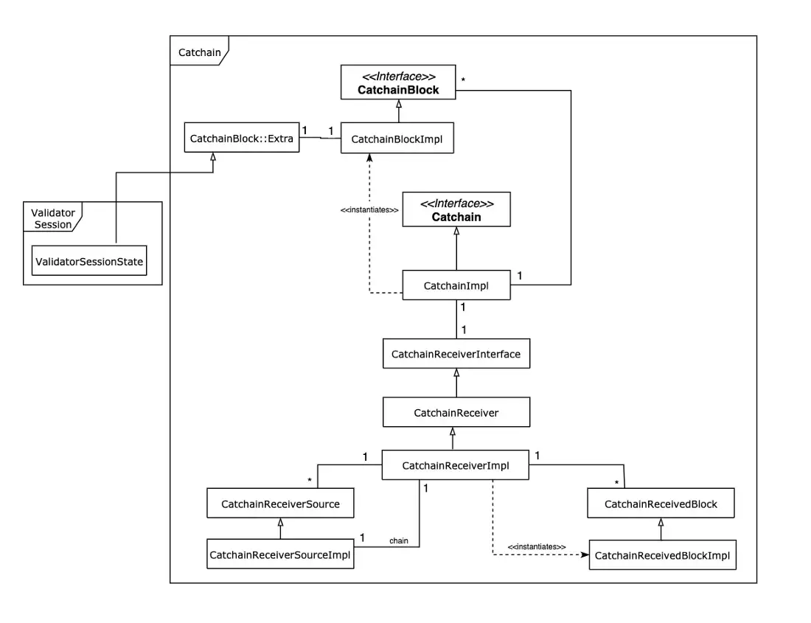

# Catchain Overview

Catchain is a communication protocol between validators. It does not execute the consensus algorithm itself but prepares data required for the decision-making of a higher-level component: **validator-session**. Essential catchain tasks are:

- setting up a network overlay on the top of ADNL ensuring communication between validators;
- setting up and updating a list of neighbor nodes for direct communications inside the overlay;
- receiving blocks from other validators and sending back decisions of the current validator;
- controlling blocks dependencies;
- managing an internal database holding current catchain session results
- restoring catchain session state after a validator restart;
- detecting forks and blaming validators;
- maintaining the consensus algorithm.

In general, catchain component provide an operational framework for other elements of the validator-session consensus.

## Node Catchain Initialization

Catchain session begins with the creation of the `CatchainImpl` and the `CatChainReceiverImpl` objects. The `CatChainReceiverImpl` configures the ADNL overlay upholding the communication with other validators.

Next step is `CatChainReceiverImpl` restoring previously received blocks from a RocksDB database instance (see `CatChainReceiverImpl::read_db_from` and `CatChainReceiverImpl::read_block_from_db` for the details).

On top, there is always a block with hash=0 acting as a starter block for downloading block predecessors and dependencies. The central processing loops starts after the database reading stage is complete (see `CatChainImpl::on_receiver_started` and `CatChainImpl::send_process` for the details). The consensus algorithm initiates new block candidates generation for further approval — the block transfers to the catchain when a new candidate appears. In case there are no blocks, validator awaits for blocks from other validators on the catchain.

## Scheduled Actions

Each validator sends results of its work only to several neighbors (currently set to 5) minimizing traffic. Neighborhood randomly changes every 60–120 seconds. Every 2–3 seconds, the system randomly picks a validator from the overall validator list for synchronization. This synchronization is bi-directional:

- The validator-initiator sends a list containing delivered blocks heights (including vector timestamps, according to “Catchain Consensus: An Outline”). The validator expects to either receive absent blocks or a fork event notification in response. In the case of confirmed forking, consensus will blame the validator and discard all messages. Only the current validator can verify forking. Validator compares it’s own block heights list with the received list and sends the difference, if any, to the requester. Such a process optimizes network traffic and reduces the average height of delivered blocks while limiting the count of outgoing response messages to 100.
- The validator-initiator requests the delivery of all absent dependent blocks generated by a validator-answerer.
- Invoking consensus algorithm iteration (will be described below). Each synchronization adds information about states of other validators, making the next consensus iteration possible on the validator.

## Blocks Processing

There are several types of blocks in the catchain:

- blocks written to a blockchain;
- catchain blocks with a state of the particular validator (`CatchainReceivedBlock`). They are the messages with source validator number identification, consensus algorithm iteration number (height) and consensus increment messages; `CatchainReceivedBlock` are the temporal sources for consensus blocks creation (`CatchainBlock`);
- `CatchainBlock` blocks built from several `CatchainReceivedBlock` blocks(`CatchainBlock` consists of `CatchainReceivedBlock` blocks states with maximal known height for a validator ).

The `CatchainReceivedBlock` block consists of the following:

- catchain session identifier (to exclude the case when blocks from the previous catchain session are processed);
- number of the block origin source validator;
- block height (it is equal to the consensus algorithm iteration number for a particular validator);
- fork number (if several forks from the same validator are detected, the chain of blocks is invalidated and the validator is blamed);
- previous block sent to other validators (outgoing block);
- dependent blocks received by other validators (incoming blocks); note, that an incoming block cannot depend on two blocks from the same source validator; in general, this is a DAG.

The dependent blocks graph allows for:

- recursively downloading of all blocks required for the full state of the processed block;
- recursively marking a subgraph of blocks as an invalid if forks are detected from a particular source validator.

Each validator contains a list of states of other validators. Each of them stores `CatchainReceivedBlock` blocks that came from them. Every new incoming `CatchainReceivedBlock` block is checked regardless of which data channel it came from (directly from the validator or transitively, see `CatChainReceiverImpl::validate_block_sync`). If the block signature does not match the expected signature of the sender validator, or if the block is invalid, the block is ignored.

The validator checks each catchain validator for forks. Only one fork per validator is allowed. In case when the same validator sends two different blocks with the same height, it is marked as a blamed and all `CatChainReceivedBlockImpl` corresponding to this validator are invalidated. The validator itself ignore till the end of the current catchain session.

After the `CatChainReceivedBlockImpl` block is received, its processing is initiated (see `CatChainReceiverImpl::receive_block`). Then it is recorded to the database. The processing procedure downloads all dependents for the block and further adding the block to a queue of blocks ready to be run. This download procedure is done each 2-3 seconds by synchronization with other validators which are being asked for absent `CatChainReceivedBlockImpl` blocks.

When any data updates are received (from the database during initialization, when new blocks are received, and while adding new blocks after the work of the consensus algorithm (see `CatChainImpl::processing_block`)), the `CatChainReceivedBlockImpl` block execution procedure is launched.

Each validator contains state lists for other validators. Each of them stores `CatchainReceivedBlock` blocks received from others. Every new incoming `CatchainReceivedBlock` block is checked regardless of which data channel it came from (directly from the validator or transitively, see `CatChainReceiverImpl::validate_block_sync`). Validator ignores the block if the block signature does not match the expected signature of the sender validator or if the block is invalid.

The active validator checks each catchain validator for forks. Only one fork per validator is allowed. In case the same validator sends two different blocks with the same height, catchain marks it as blamed and all `CatChainReceivedBlockImpl` blocks corresponding to this validator are invalidated. Consensus mechanics then ignore the validator itself until the end of the current catchain session.

Receiving the `CatChainReceivedBlockImpl` block initiates the processing (see `CatChainReceiverImpl::receive_block`) and creates a database entry. The processing procedure downloads all dependents for the block. At the next step, it adds the block to a queue of blocks ready to be run. The download procedure is done every 2-3 seconds through synchronization with other validators required to provide absent `CatChainReceivedBlockImpl` blocks.

The `CatChainReceivedBlockImpl` block execution procedure initiates whenever any data updates are received (from the database during initialization, when new blocks are received, and while adding new blocks after the work of the consensus algorithm (see `CatChainImpl::processing_block`)).

Block execution includes:

- creating a fork from the existing previous block (in this case, blame procedure initialization is possible if the fork already exists);
- preliminary procedures for processing the block (pre_deliver);
- processing of the block.

Pre-processing of a CatChainReceivedBlockImpl includes checking forks (see `CatChainReceivedBlockImpl::pre_deliver`).

Block processing (see `CatChainReceivedBlockImpl::delivery`) includes the following:

- deliver_block — notification that the block is ready for this validator. This notification consists of:
1. Notifying all neighbors about the appearance of a new `CatChainReceivedBlockImpl` block;
2. Generating a new CatchainBlock block and placing it on the top of the chain from the validator that sent the corresponding CatChainReceivedBlockImpl block. The CatchainBlock block used in the consensus algorithm is a copy (snapshot) of the corresponding CatChainReceivedBlockImpl block excluding the data used for dependencies downloading process;
- dep_delivered — all dependent `CatChainReceivedBlockImpl` blocks (outgoing dependency) notification. This places dependents into a queue of blocks ready to be run;
- block_delivered — internal data update on validator-initiator (CatchainReceivedBlockImpl sender) sent blocks.

`CatchainBlock` blocks received from the validator are the input for the consensus algorithm. Structurally, this block is very similar to the `CatChainReceivedBlockImpl` block. However, it contains all the data necessary for further processing (unlike `CatChainReceivedBlockImpl`, where some data may be missing). Catchain stores a list of the `CatchainBlock` top blocks — one for each validator — and runs the consensus algorithm periodically by the timer at the beginning of work and on-demand (see `CatChainImpl::send_process` for the details). The consensus iteration identification for each validator is the height of a block that the consensus algorithm generated. Thus, a pair (`validator number, block height`) uniquely identifies the block for a particular validator.

Processing consensus results of one validator on another validator might result in two different blocks with the same height and validator numbers. This will result in fork appearance and identification key will extend to (`validator number, block height, fork number`). However, since catchain does not allow forks, the source validator where forked block originated will be blamed. So the fork number may be skipped and `CatchainBlock` may be identified identification may using (`validator number, block height`).

The consensus iteration begins by selecting a random subset from the list of `CatchainBlock` top blocks (no more than max_dept=4) and passing them to the consensus algorithm described above (see `ValidatorSessionImpl::process_blocks`). Note that a separate validator sent each such block and there can’t be two blocks from a single validator. These blocks merge within the consensus algorithm, and a new CatchainBlock appears on their basis. Catchain reports this block appearance (see `CatchainImpl::processed_block`). Adding a new block leads to writing it into the database and creating a `CatChainReceivedBlockImpl` block from it, further sent to neighbors.

