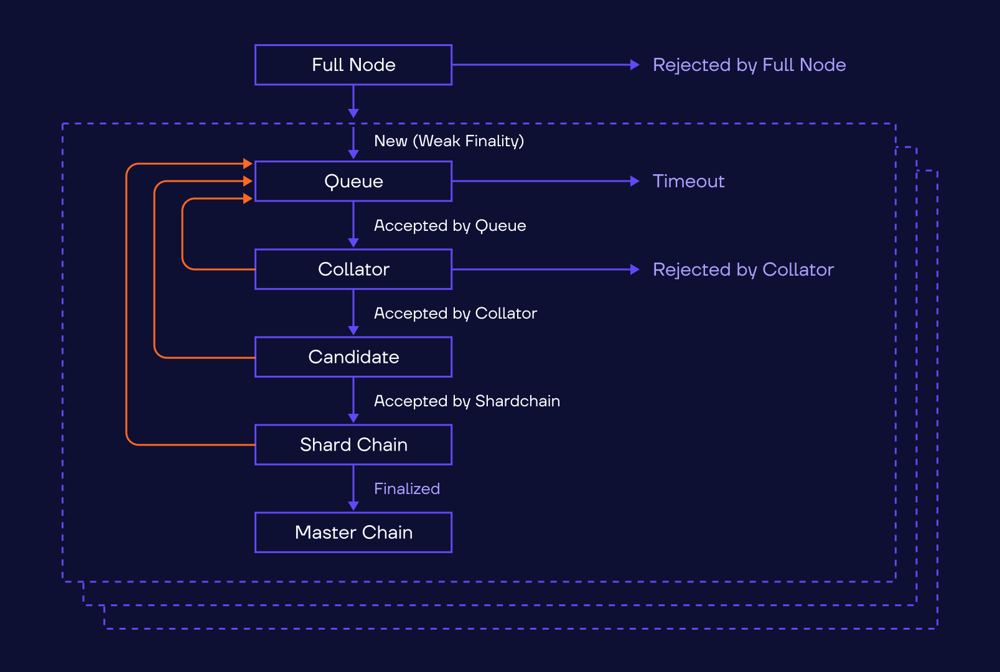

# Reliable External Messaging Protocol

## Introduction

Reliable External Messaging Protocol (REMP) is a protocol that adds some additional guarantees/features for external messages processing:

**1. Replay protection**

   If a message is processed and added into an accepted block, then the same message **(that is, the message with the same hash)** will not be collated for some time period. If the message has some expiration time (corresponding to the time period), then this effectively makes efficient replay protection.

**2. No messages are lost**

You only need to send the message once. If there will be a possibility to accept it and add it to a block, then it will be done. Message loss may occur only for blockchain overloading reasons.

**3. One can trace the message processing.**

There are several checkpoints on the message processing path (when validators received the message, when message was added to a block, when the block was finalized, etc). Upon reaching certain checkpoints one can predict that the message will be successfully processed with a high accuracy - most messages can be considered to be processed when validators acknowledge that they were received (this happens in 100-200 ms; after that it’s highly unlikely that the message is declined). Thus, depending on the message importance one may trade efficiency for reliability in the software, choosing not to trace further processing results. On the other hand, if a transaction is really important, then you can wait till the block with the transaction result is issued.

## General description

REMP is a set of protocols and data structures that are designed to keep trace of incoming external messages. Message flow in REMP can be seen on the following diagram:



A message from the user application is sent to a REMP Client (e.g., it could be some Full Node; also the user application may implement the necessary protocol by itself). The client in turn sends the message to its shard validators. The validators, aside from processing the message, gather info about message validation status and send it back to the REMP Client and then further to the user (such messages are called “receipts”).

### REMP Catchain

The validators exchange info between them using a special REMP Catchain protocol. Each validator Catchain session (protocol/data structures used for controlling consensus on block candidates) is accompanied by a REMP Catchain session (Reliable Message Queue, RMQ), which is used to store incoming messages. When validator Catchain sessions are started/stopped/split/merged/etc, the same happens with related REMP Catchain session. When the validator session expires, all messages being processed are transferred to the next REMP Catchain session. 

There is some significant difference between validation and REMP Catchain sessions. Validator Catchain session is shared among validators that are currently validating the given shard. REMP Catchain session is shared among validators that are currently validating the given shard and validators that validated this shard in the previous session. So number of participants in REMP Catchain session is about two times bigger than in validator Catchain session. The reason for this is the necessity to pass RMQ data between sessions with respect to practical network bandwidth. So each newly created REMP Catchain session will contain validators from previous validator Catchain session that will provide reliable RMQ data handover for validators from current validator Catchain session.

### REMP Client

Besides the REMP Catchain protocol, there is a communication between outer world of blockchain and shard validators that is provided by REMP Client protocol. REMP Client can be run as a part of some blockchain node and provides following:

- reception of external messages from outer world
- pre-evaluation of received message against current state of destination shard (to filter out invalid messages)
- transfer of messages to each current validator of given shard to include it into their REMP Catchain
- reception of status updates from shard validators for all previously transferred messages
- report of messages status to outer world

If at least 1/3 + 1 of validators receive the message via REMP Client protocol, then at least one “good” validator processes it — and resends it to all other validators via REMP Catchain session. Thus it is not necessary to send the message to all validators in shard.

### Message life cycle

The message lifetime is counted according to master catchain sequence numbers: if a message is received when master catchain N was in action, then it becomes obsolete at master catchain N+2. Such message is not copied to new catchains anymore.

Each validator tries to collate the message until its collator rejects the attempt. 

So, the message processing may result in three outcomes:

- **accepted by collator** - and then validated - and included into shard block - and the block is included into masterchain (accept, finalized)
- **rejected by fullnode before processing** - or by all collators (reject)
- **timeout** - its collation/validation attempts were fruitless, and the message became obsolete.

This gives hard replay protection guarantees (if message has expiration mechanism included — making the message obsolete before two catchains are switched), and soft processing guarantees (message collation/validation attempts may be fruitless if the message is wrong, or if the blockchain is overloaded).

### Replay protection in more detail

Traditional approaches to replay protection in Everscale usually require some mutable structures in the contract: sequence counter (updated each time the message is sent), previous messages’ hash table, or something similar. REMP keeps track of all messages accepted by the Blockchain and avoids repeated collation, even if the message is sent several times — thus REMP replay protection mechanism is similar to hash table method, although it is transparent for user and does not consume any gas. 

A bit more detail about the mechanism.

- All messages from accepted blocks are parsed and their id’s are kept in Message Cache on each node (think of this as about some extended Shard State).
- Collator requests the Cache for each message proposed for collation (and, of course, messages’ collation is refused if they were already included into some accepted block).
- After each session all old messages (that is, messages which were added two master sessions earlier or more) are removed from the Cache.

Thus, expiration time must be specified in messages, so that the messages removed from the Cache should be already invalid by that moment.

And a bit more about expiration time fine-tuning.

- The session lifetime is specified in Blockchain config parameter 28 (field `mc_catchain_lifetime`), traditional value for this config is 250 seconds, current value should be checked in network configuration.
- The message is tracked by Remp during two consecutive master sessions — the session the message arrived, and the next one (exception: when master sessions are shorter than specified in config, then the message is remembered longer, until total session lifetime exceeds twice of `mc_catchain_lifetime`; such shorter sessions can happen, for example, when a keyblock is issued).
- Sessions switch according to their own schedule. So, it is quite possible that the message arrives just seconds before the first session ends.
    
    
    
    As shown on the diagram above, Message 1 arrives in the beginning of the first session, and Message 3 arrives just moments before session switching. So, actual time of message tracking in Remp is between `mc_catchain_lifetime` and `mc_catchain_lifteme*2`, and expiration time should not exceed `mc_catchain_lifetime`
    
- On another hand, according to testing on real networks, it is unreasonable to have expiration time smaller than 40 seconds (or a minute), since a message may expire too soon, before it receives a second chance for collation. The message can easily miss its first collation due to blockchain overfilling, session switching, etc.

### Message statuses

During validation, a message processing passes through several stages (that is, changes some statuses), and validator sends receipts about that. Some of them are given on the diagram below (as inscriptions near arrows). The statuses that are “final” (that is, nothing is happening after it) are shown in blue. 


Since message is validated by several validators simultaneously, the statuses are reported by the validators separately, so some of them can be reported several times. E.g., one validator may decide that the message should be rejected, but other validators may decide just the opposite — so the user may receive “Rejected” and then “Finalized” for its message.

### Performance

REMP performance toll may be split into network and processor performance toll.

Processor performance influence is very limited (and may even reduce processor overloading), since a message is not processed by REMP, it only keeps track of messages. Moreover, replay protection may even reduce processor load, since messages are rejected before collation if they are processed already (thus removing necessity to execute replay protection code in contracts)

Network performance, on another hand, is burdened by Catchains (remember, each Catchain is doubled), which can be expensive from network load perspective. The real performance toll depends on the contracts’ details, and needs measurement in real-life conditions.

## Data structures & REMP-SDK interop

**REMP message flow**

### Send REMP message

External messages are sent the same way, as before. Use GraphQL API's postRequests mutation for it. See [this guide](https://docs.evercloud.dev/samples/graphql-samples/send-message) for more info 

### Receive message status

**REMP message statuses**

While REMP message is being processed, it passes through multiple phases (that is, REMP messages have different statuses). Message can be in some statuses multiple times. Possible statuses:

- **SentToValidators** - message was read from kafka and successfully sent to validators
- **RejectedByNode** - message was rejected by full node before sending to validators; it’s a final decision, message will not be resent again.
- **PutIntoQueue** - message was received by validator and included into special REMP catchain — waiting for collation
- **RejectedByCollator** - message was rejected by collator, and will not be tried again by this particular validator. All validators must reject the message before it is finally rejected. A message, rejected by one node, may be successfully included into a block by another node later (reasons: bugs in software, change of state — e.g. money suddenly arrived to the account, etc)
- **IncludedIntoBlock** - message was successfully included into block candidate.
- **IncludedIntoAcceptedBlock -** the block candidate was accepted by shard's validators.
- **Finalized** -  ****the block candidate's hash (or its descendant) was committed into master chain.

Each stage contains

- **message_id -** root hash of message boc
- **timestamp -** unix time in milliseconds
- **source id** - who generated information about stage (for example it is full node for SentToValidators stage, or collator for RejectedByCollator stage)
- **signature -** record about the stage is signed by source
- special fields (see below)

All possible REMP massage stages with all data fields:

```json
{
    {
        "kind": "SentToValidators",
				"message_id": "16923245c4bd57762330e454926a81dcb45626b433121c51804075b3cc26984e", // 32 bytes hex
        "timestamp": 1632750383000, // 64 bits, unix time in milliseconds
        "source_id": "1692345dc4bd57762330e454926a81dcb45626b433121c51804075b3cc26984e", // 32 bytes hex
        "signature": "1692345dc4bd57762330e454926a81dcb45626b433121c51804075b3cc26984e", // 32 bytes hex,
        
        "sent_to": 4, // number of validators message was successfully sent to
        "total_validators": 5
    },
    {
        "kind": "RejectedByFullnode",
				"message_id": "16923245c4bd57762330e454926a81dcb45626b433121c51804075b3cc26984e",
        "timestamp": 1632750383000,
        "source_id": "1692345dc4bd57762330e454926a81dcb45626b433121c51804075b3cc26984e", 
        "signature": "1692345dc4bd57762330e454926a81dcb45626b433121c51804075b3cc26984e",
        
        "error": "Can't deserialize message"

    },
    {
        "kind": "PutIntoQueue",
				"message_id": "16923245c4bd57762330e454926a81dcb45626b433121c51804075b3cc26984e",
        "timestamp": 1632750383000,
        "source_id": "1692345dc4bd57762330e454926a81dcb45626b433121c51804075b3cc26984e",
        "signature": "1692345dc4bd57762330e454926a81dcb45626b433121c51804075b3cc26984e",
    },
    {
        "kind": "RejectedByCollator",
				"message_id": "16923245c4bd57762330e454926a81dcb45626b433121c51804075b3cc26984e",
        "timestamp": 1632750383000,
        "source_id": "1692345dc4bd57762330e454926a81dcb45626b433121c51804075b3cc26984e",
        "signature": "1692345dc4bd57762330e454926a81dcb45626b433121c51804075b3cc26984e",
        
        "error": "Contract rejected message with error code 52"
    },
    {
        "kind": "IncludedIntoBlock",
				"message_id": "16923245c4bd57762330e454926a81dcb45626b433121c51804075b3cc26984e",
        "timestamp": 1632750383000,
        "source_id": "1692345dc4bd57762330e454926a81dcb45626b433121c51804075b3cc26984e",
        "signature": "1692345dc4bd57762330e454926a81dcb45626b433121c51804075b3cc26984e",

				// shard block the message was included to
        "block_id": "1692345dc4bd57762330e454926a81dcb45626b433121c51804075b3cc26984e",
				"block_file_hash": "00a2345dc4bd57762330e454926a81dcb45626b433121c51804075b3cc26984e",
        "block_seqno": 123,
        "shard": "3800000000000000",
        "wc": 0,
    },
    {
        "kind": "IncludedIntoAcceptedBlock",
				"message_id": "16923245c4bd57762330e454926a81dcb45626b433121c51804075b3cc26984e",
        "timestamp": 1632750383000,
        "source_id": "1692345dc4bd57762330e454926a81dcb45626b433121c51804075b3cc26984e",
        "signature": "1692345dc4bd57762330e454926a81dcb45626b433121c51804075b3cc26984e",
        
				// shard block the message was included to
        "block_id": "1692345dc4bd57762330e454926a81dcb45626b433121c51804075b3cc26984e",
				"block_file_hash": "00a2345dc4bd57762330e454926a81dcb45626b433121c51804075b3cc26984e",
        "block_seqno": 123,
        "shard": "3800000000000000",
        "wc": 0,
    },
    {
        "kind": "Finalized",
				"message_id": "16923245c4bd57762330e454926a81dcb45626b433121c51804075b3cc26984e",
        "timestamp": 1632750383000, // 64 bits
        "source_id": "1692345dc4bd57762330e454926a81dcb45626b433121c51804075b3cc26984e",
        "signature": "1692345dc4bd57762330e454926a81dcb45626b433121c51804075b3cc26984e",
        
        // master block where shard block with the message is commited to
        "mc_block_id": "1692345dc4bd57762330e454926a81dcb45626b433121c51804075b3cc26984e",
        "block_file_hash": "33b2345dc4bd57762330e454926a81dcb45626b433121c51804075b3cc269800",
        "mc_block_seqno": 234,
        
				// shard block the message was included to
        "block_id": "1692345dc4bd57762330e454926a81dcb45626b433121c51804075b3cc26984e",
				"block_file_hash": "00a2345dc4bd57762330e454926a81dcb45626b433121c51804075b3cc26984e",
        "block_seqno": 123,
        "shard": "3800000000000000",
        "wc": 0,
    }
}
```

You can receive REMP receipts via rempReceipts GraphQL subscription.

See [REMP subscription guide](https://docs.evercloud.dev/samples/graphql-samples/subscribe-for-remp-receipts) for more info.

```
subscription{
  rempReceipts(messageId: "082a5c2ab5b68b0ef9b8ced4fa865933ab19603f5171ec1190f3f45943214de0"){
    messageId
    timestamp
    json
    kind
  }
}
```

### Other statuses

The statuses listed above are the most common. However, in REMP, core statuses are pairs of two parameters: ”**level**” - the node component that processed the message and “**status**” - the outcome of the message processing. There are also some out-of-the-order statuses. In JSON, both level and status are combined into a “**kind**” field. The table below shows how each level and status mixes are called in JSON. The main statuses listed above are marked <font color="green">green</font>, while the statuses you can get in special situations are marked <font color="orange">orange</font>. The **empty cell** means you will never get such a mix of parameters. 

| ↓ status \| level → | Full node              | Quenue          | Collator                               | Shard chain               | Master chain         |
|:-------------------:|------------------------|-----------------|----------------------------------------|---------------------------|----------------------|
| Accepted            |                        |                 | <font color="green">IncludedIntoBlock(optimistic finality)</font>. | <font color="green">IncludedIntoAcceptedBlock</font> | <font color="blue">Finalized !!! +5-25s</font> |
| Ignored             |                        | <font color="orange">IgnoredByQueue</font>  | <font color="orange">IgnoredByCollator</font>                      | <font color="orange">IgnoredByShardchain</font>       | <font color="orange">IgnoredByMasterchain</font> |
| Rejected            | <font color="red">RejectedByFullnode +0s</font> |                 | <font color="orange">RejectedByCollator</font>                     | <font color="red">RejectedbyShardchain</font>      |                      |
| SentToValidators    | <font color="green">SentToValidators</font>       |                 |                                        |                           |                      |
| New                 |                        | <font color="green">PutIntoQueue</font>    |                                        |                           |                      |
| Duplicate           |                        | <font color="orange">Duplicate</font>       |                                        |                           |                      |
| Timeout             |                        | <font color="red">Timeout + 4 min</font> |                                        |                           |                      |
|                     |                        |                 |                                        |                           |                      |

- <font color="green">green</font> status means right sequence of events
- <font color="orange">orange</font> status means non critical errors or warnings
- <font color="red">red</font> status means critical error - the message will never be included into blockchain
- <font color="blue">blue</font> status means successful - the message was included into blockchain
- Optimistic finality is <font color="green">IncludedIntoBlock</font>.

When a message is sent via REMP, it passes through several software components, operating on different computers. Each component has a name (a level of message processing), each level has a number assigned.

1. **Full node - level 0** - messages are accepted by the full node and checked there.
2. **Queue - level 1** - messages are sent to validator nodes. Seven or more validator nodes per thread, depending on the blockchain config. Accepted by the Queue.
3. **Collator - level 2** - messages are added to block candidates - collated. Each validator node has its own collator component. Accepted by the collator.
4. **Shardchain - level 3** - block candidates are validated. A node collated a block candidate and reports about its success. A successfully validated candidate becomes a shardblock.
5. **Masterchain - level 4** - the shard blocks are added to the masterchain. 

Due to byzantine nature of the blockchain algorithms, Queue, Collator and Shardchain stages are executed in parallel on each validator node separately, and each validator node reports about its message copy success on its own. That is, some statuses (from Fullnode level and Masterchain level) are returned once, and all other statuses (from Queue, Collator and Shardchain levels) are returned in many (7 or more, depending on the blockchain config) copies.

Unless a message is failed on all its parallel ways, one cannot consider that the message is failed.

### Statuses - general picture

Almost all statuses may be separated into three categories: Accepted, Rejected and Ignored.
Each “**Accepted**” means that the message is processed and transferred to the next component. It adds 1 to the level.      
Each “**Ignored**” means that the message was lost (didn’t fit into the block, etc), so it returns the message to the Queue level.      
Each ”**Rejected**” means that the message will not be processed further by the particular node.

Also, there are some additional statuses not fitting into the general scheme:

**“Duplicate”** returns/keeps the message at the Queue level.          
**“New”** (”PutIntoQueue”) is sent when the message first enters the Queue level. “SentToValidators” may be thought of as Accepted for level 0.

Full node level and Finalized status originated from Full node (one instance). All other statuses are multithread. One thread per thread validator, usually seven instances. Each “New” status will be followed by a series of other statuses, with **“Reject”/”Timeout”** at the end in case of failure.

### The main sequence - the message is sent and accepted

The message is accepted at all levels: Full node, Queue, Collator, Shardchain, and Masterchain.

**“SentToValidators”** (Accepted by the Full node) → “PutIntoQueue” (New) → (Accepted by the Queue — internal status, not sent from the full nodes ) → **“IncludedIntoBlock”** (Accepted by a Collator) → **“IncudedIntoAcceptedBlock”** (Accepted by Shardchain) → **“Finalized”** (Accepted by the Masterchain).

### Rejection sequences

1. A message may be rejected by the full node before processing. For instance, when it’s incompatible with its current state.       
**“RejectedByFullnode”**        
No more messages from that full node will follow. It’s a final state.
2. A message may be rejected by a collator. For instance, in case the message becomes incompatible with the new state.      
**“RejectedByCollator”**        
It’s a final state for each validator from the validator set. However, other validators may validate the message. One should wait for 2/3 rejects for a highly probable reject and for all rejects for a guaranteed reject. After that, nobody will try to collate the message.
3. Messages may be repeatedly ignored until a timeout happens (after 4 mins)        
**“Timeout”**       
It’s a final state for each validator from the validator set. However, other validators may manage to successfully include the message in the block. One should wait for all timeouts. All validators must reply with timeout.

In 2 and 3 cases **(rejects/timeouts)**, one should consider that all **“New”** messages must be answered with a corresponding **“Reject”** or **“Timeout”**. Unless you have a pair for each “New” message, you cannot be sure that the message is finally declined.

### Possible flow variations

A message may be ignored by a Collator, Shardchain or Masterchain. This means that the message didn’t fit into the block, the block didn’t fit into the masterchain, etc. The message will then return to the collator queue and will be included into the next available block candidate.

A message may be switched between Collator and Queue levels several times: SentToValidators, New, PutIntoQueue, IncludedIntoBlock, PutIntoQueue, IncludedIntoBlock, IncudedIntoAcceptedBlock, Finalized. It also may be switched in more elaborate ways, returning to Queue level several times — and finally either Finalizing or falling into Timeout/Reject.

### Message statuses in kafka

Each status is produced into a kafka topic. The **key** is a message ID while **value** is a json with one status.

### Checking the signature of the status

To check a signature status, you need to convert it into binary format and then check your signature using a key you can get from the validator set. The full node’s key will go another way **(it will be described later).**

```rust
// parse json
let json: serde_json::Value = serde_json::from_slice(receipt)?;

// convert json -> binary struct
let (receipt, signature) = ton_block_json::parse_remp_status(
    json.as_object().ok_or_else(|| error!("Can't parse remp status json as a map"))?
)?;

// serialize binary struct
let receipt_bytes = adnl::common::serialize(&receipt)?;

// find pub key in validator set
// validator_set: ton_block::ValidatorSet
let mut pub_key = None;
for v in validator_set.list() {
    let k = adnl::common::KeyOption::from_type_and_public_key(
        KeyOption::KEY_ED25519, v.public_key.key_bytes());
    if k.id().data() == receipt.source_id().as_slice() {
        pub_key = Some(k);
        break;
    }
}

// check signature
if let Some(pub_key) = pub_key {
    pub_key.verify(&receipt_bytes, &signature)?;
}
```

