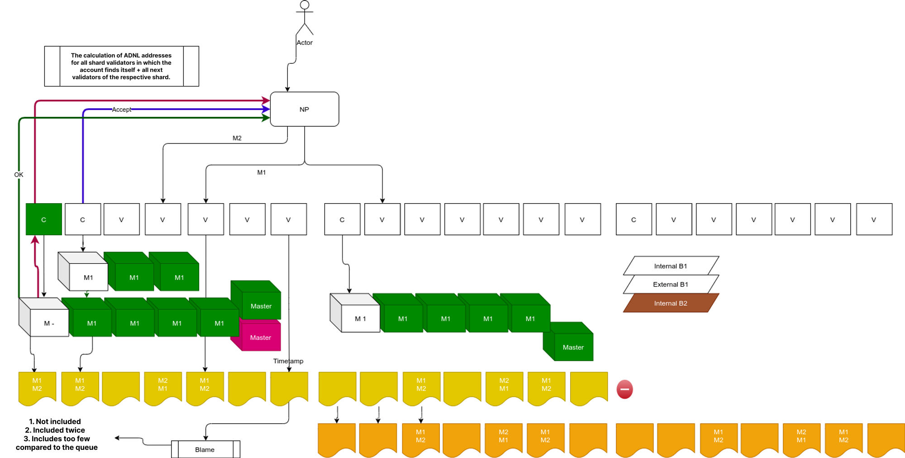

# REMP

## Overview



REMP is a set of protocols and data structures designed to trace incoming **external messages**. Its main purpose is to guarantee that messages are delivered from any network participant in a particular order in less than a second. That is to say, when a message is sent to the network, it gets accepted by current validators and included in the message queue catchain **(MQC)** with a timestamp. The validators send a confirmation to the user about the message receipt. Afterwards, the message is guaranteed to be included in the block. Even if the block production fails **(an extremely rare situation)**, the message will be included in the same order it was received in the next block. In case the message fails to be included in the block, all validators are punished by the means of stake reduction. 

REMP also provides some vital security mechanisms for external message processing:

**1. Replay protection**

If a message is processed and it is included in a newly created block, then the same message **(that is, the message with the same hash)** will not be collated for some time period. This makes the replay protection efficient.

**2. A message may be sent only once**

If there is the possibility to accept it and include it in a block, then it will be done. No messages are lost — except for blockchain overloading reasons.

**3. Message processing tracing**

There are three checkpoints on the message processing route: validators receive the message, the message is added to a block, the block is created.  

Depending on the message importance, one may trade efficiency for reliability in the software. Most messages can be considered processed when validators acknowledge that they were received **(100-200 ms)**. After that, it’s highly unlikely that the message will be declined. On the other hand, if a transaction is really important, then its better to wait till the block with the transaction result is created.

**There is a significant difference between validation and REMP Catchain sessions.**

The validation catchain session is conducted among validators currently validating a given shard. The REMP catchain session, in turn, is conducted among validators of a given shard and validators that validated this shard in the previous session. That is, the number of participants in the REMP catchain session is twice compared with the validation session. The reason for this is the necessity to pass **RMQ** data between sessions with respect to current network bandwidth. So, each newly created REMP catchain session includes validators from the previous validation catchain session that provide reliable RMQ data for validators from the current validation catchain session.

Besides the REMP Catchain protocol, there is communication between the outer world of the blockchain and shard validators. It is provided by **REMP Client protocol**. The protocol can run as part of some blockchain node. 

It provides the following:
- Reception of external messages from the outer world
- Pre-evaluation of received messages against the current state of the destination shard **(to filter out invalid messages)**
- Transfer of messages to each current validator of a given shard to include it in their REMP catchain
- Reception of status updates from shard validators for all previously transferred messages
- Reporting message statuses to the outer world

If at least 1/3 + 1 validators receive the message via the REMP Client protocol, then at least one “good” validator processes it and re-sends it to all other validators via the REMP catchain session.

The message life-time is counted according to the master catchain sequence numbers. If a message is received when the master catchain N is in action, then it becomes obsolete for master catchain N+2. Such messages are not transmitted to new catchain sessions anymore.

Each validator tries to collate the message until its collator rejects the attempt.

Therefore, the message processing may result in three outcomes:
- **Accepted by the validator** - it is validated and included into a shard block
- **Rejected by the full node** - or by all validators 
- **Futile validation attempts** - the message becomes obsolete 

This provides for hard replay protection guarantees. Namely, if the message has an expiration mechanism included, it makes the message obsolete before two catchain sessions switch. Thus, the soft processing guarantees in the form of **(collation/validation)** attempts may be futile if the message is wrong or if the blockchain is overloaded.

**Performance**

REMP performance may be split into two: network and processor. The impact of processor performance is very limited. This is due to messages not being processed by REMP itself. It only keeps track of all external messages. Moreover, replay protection may even reduce processor load. That’s due to messages being rejected before collation if they are already processed. It thus removes the necessity to execute contracts’ replay protection code.

Network performance, on the other hand, is impacted by catchain sessions **(remember, each catchain session is doubled)**. It can be expensive from the network load perspective. Thus, in theory, it may delay the network up to 50%. Of course, real-life delays will be much smaller. The real performance depends on the contracts’ details, and some other factors.

## REMP Messages

There are three types of messages between nodes in REMP. 

**New messages**

New messages are generated by full nodes at the request of network users. 

Let us say that the network is configured to have N validators per shard.

1. The full node informs validators about the new REMP message. It sends the message to each validator in the current shard, or to each validator in the current shard and to each validator in the next shard **(in case of session switching)**. This results in N or 2N messages.
2. Each validator informs other validators about the new message it received. This results in N^2 messages.

**The first step** is needed to guarantee that at least one of the validators will re-transmit the message **(the full node does not trust validators)**. It is possible to limit their set by N/3+1 random validators **(since we suppose that at most N/3 validators are invalid)**. However, our main optimization goal is to get rid of N^2 in the second step.

**The second step** is needed to guarantee that all validators really received the message. We cannot rely on full node accuracy **(validators do not trust the full node)**.

**Reject/accept messages**

A node informs other nodes that the message is rejected or accepted by the collator. This is necessary for proper ordering of messages in final blocks. Accepted messages should be collated first, while those rejected by 2/3 of collators should not be collated further.

There can be up to N^2 of these messages per external message.

**Forward messages**

Forward messages are generated at the session's end. All validators inform the next validator set about the following messages:

1. The messages that were processed by the validators in the current session **(for replay protection purposes)**
2. The messages that are received but not processed yet

There are N^2 messages in catchain per external message. 

**Proposals for speeding up**

Let us first concentrate on new messages. To reduce traffic, let’s do the following:

1. The full node sends messages sequentially, one by one, with small pauses between them **(100-200 ms)**
2. Validators do not retransmit messages received from the catchain. The catchain guarantees delivery of the messages to all clients. Thus, if at least one node sends the message to the catchain, then everyone will eventually have it.
3. However, if the validator receives the message from the full node and hasn’t received it from the catchain yet, it re-transmits the message to the catchain.

This algorithm guarantees that each network participant will receive the message. The full node sends it to everybody and the nodes retransmit it to others if necessary. However, if the messages are delivered properly, then all nodes, except for the first one, will receive the message from the catchain and will not retransmit it further. So, we have N messages from the full node and one pack of messages re-transmitted via the catchain - 2N..3N messages in total.

Forward messages also have some room for optimization:

1. We need just one forward message in the catchain. Thus, do not forward a message if it is received via the catchain.
2. Only currently processed messages should be delivered in full. Replay protection just needs a hash. The node can send a relatively small pack of hash IDs of other **(processed)** messages.

Reject/accept messages may be removed or limited without any great damage to the protocol if they create too much extra traffic.

## Data structures & REMP-SDK interop

|          Status          |                                                                   Meaning                                                                   |              Who discovers             |                  Flow                  |
|:------------------------:|:-------------------------------------------------------------------------------------------------------------------------------------------:|:--------------------------------------:|:--------------------------------------:|
| New                      | This status is posted after the message was put into RMQ                                                                                    | Each node                              | Put into RMQ, sent to fullnode         |
| AddedToBlock             | This status appears when message was included into one of the block candidates. Each node may have different block candidate for a message. | Node that added the message.           | Sent to fullnode.                      |
| AddedToShardchain        | This status appears, when collated block containing the message is approved by validators and included into shardchain.                     | Each node                              | Sent to fullnode (everybody sends it?) |
| AddedToMasterchain       | The message finally accepted by the blockchain                                                                                              | Each node                              | Sent to fullnode (everybody sends it?) |
| RejectedByCollator       | The message rejected by collator. If 5 of 7 validators reject the message, then the message is ignored                                      | Node that tried to collate the message | Put into RMQ, sent to fullnode.        |
| SkippedAsDuplicate       | The message collated into some other block by other node                                                                                    | Each node                              | sent to fullnode                       |
| BlockIgnoredByShardchain | The block candidate with the message was not rejected, but was not included into block.                                                     |                                        |                                        |

**REMP message flow**

REMP external messages have absolutely the same structure as regular external messages. They send requests using existing kafka topics. 

**REMP message statuses**

While a REMP message is processed, it passes through multiple phases. That is, REMP messages have different statuses. The messages can be in some statuses multiple times. 

All possible statuses:
- **SentToValidators** - the message was read by kafka and successfully sent to validators
- **RejectedByNode** - the message was rejected by the full node before being sent to validators. It’s a final decision. The message will not be re-sent again.
- **PutIntoQueue** - the message was received by the validator and included in a special REMP catchain session - waiting for collation.
- **RejectedByCollator** - the message was rejected by the collator. It will not be tried again by this particular validator. All validators must reject the message before it is finally rejected. A message, rejected by one node, may be successfully included into a block by another node later. The reasons being are: bugs in software or changes in the state. For instance, money suddenly arrives in the account. 
- **IncludedIntoBlock** - the message was successfully included into a block candidate.
- **IncludedIntoAcceptedBlock** - the block candidate was accepted by shard's validators.
- **Finalized** -  the hash of the block candidate or its descendant was committed into the masterchain.

Each stage includes:
- **message_id** - the root hash of the message boc
- **timestamp** - unix time in milliseconds
- **source id** - the entity that generated the information about the stage. For example, it is the full node for SentToValidators stage and collator for RejectedByCollator stage.
- **signature** - the record about the stage is signed by the source. 
- **special fields** - (see below)

All possible REMP massage stages with all data fields:

```json
{
    {
        "kind": "SentToValidators",
				"message_id": "16923245c4bd57762330e454926a81dcb45626b433121c51804075b3cc26984e", // 32 bytes hex
        "timestamp": 1632750383000, // 64 bits, unix time in milliseconds
        "source_id": "1692345dc4bd57762330e454926a81dcb45626b433121c51804075b3cc26984e", // 32 bytes hex
        "signature": "1692345dc4bd57762330e454926a81dcb45626b433121c51804075b3cc26984e", // 32 bytes hex,
        
        "sent_to": 4, // number of validators message was successfully sent to
        "total_validators": 5
    },
    {
        "kind": "RejectedByFullnode",
				"message_id": "16923245c4bd57762330e454926a81dcb45626b433121c51804075b3cc26984e",
        "timestamp": 1632750383000,
        "source_id": "1692345dc4bd57762330e454926a81dcb45626b433121c51804075b3cc26984e", 
        "signature": "1692345dc4bd57762330e454926a81dcb45626b433121c51804075b3cc26984e",
        
        "error": "Can't deserialize message"

    },
    {
        "kind": "PutIntoQueue",
				"message_id": "16923245c4bd57762330e454926a81dcb45626b433121c51804075b3cc26984e",
        "timestamp": 1632750383000,
        "source_id": "1692345dc4bd57762330e454926a81dcb45626b433121c51804075b3cc26984e",
        "signature": "1692345dc4bd57762330e454926a81dcb45626b433121c51804075b3cc26984e",
    },
    {
        "kind": "RejectedByCollator",
				"message_id": "16923245c4bd57762330e454926a81dcb45626b433121c51804075b3cc26984e",
        "timestamp": 1632750383000,
        "source_id": "1692345dc4bd57762330e454926a81dcb45626b433121c51804075b3cc26984e",
        "signature": "1692345dc4bd57762330e454926a81dcb45626b433121c51804075b3cc26984e",
        
        "error": "Contract rejected message with error code 52"
    },
    {
        "kind": "IncludedIntoBlock",
				"message_id": "16923245c4bd57762330e454926a81dcb45626b433121c51804075b3cc26984e",
        "timestamp": 1632750383000,
        "source_id": "1692345dc4bd57762330e454926a81dcb45626b433121c51804075b3cc26984e",
        "signature": "1692345dc4bd57762330e454926a81dcb45626b433121c51804075b3cc26984e",

				// shard block the message was included to
        "block_id": "1692345dc4bd57762330e454926a81dcb45626b433121c51804075b3cc26984e",
				"block_file_hash": "00a2345dc4bd57762330e454926a81dcb45626b433121c51804075b3cc26984e",
        "block_seqno": 123,
        "shard": "3800000000000000",
        "wc": 0,
    },
    {
        "kind": "IncludedIntoAcceptedBlock",
				"message_id": "16923245c4bd57762330e454926a81dcb45626b433121c51804075b3cc26984e",
        "timestamp": 1632750383000,
        "source_id": "1692345dc4bd57762330e454926a81dcb45626b433121c51804075b3cc26984e",
        "signature": "1692345dc4bd57762330e454926a81dcb45626b433121c51804075b3cc26984e",
        
				// shard block the message was included to
        "block_id": "1692345dc4bd57762330e454926a81dcb45626b433121c51804075b3cc26984e",
				"block_file_hash": "00a2345dc4bd57762330e454926a81dcb45626b433121c51804075b3cc26984e",
        "block_seqno": 123,
        "shard": "3800000000000000",
        "wc": 0,
    },
    {
        "kind": "Finalized",
				"message_id": "16923245c4bd57762330e454926a81dcb45626b433121c51804075b3cc26984e",
        "timestamp": 1632750383000, // 64 bits
        "source_id": "1692345dc4bd57762330e454926a81dcb45626b433121c51804075b3cc26984e",
        "signature": "1692345dc4bd57762330e454926a81dcb45626b433121c51804075b3cc26984e",
        
        // master block where shard block with the message is commited to
        "mc_block_id": "1692345dc4bd57762330e454926a81dcb45626b433121c51804075b3cc26984e",
        "block_file_hash": "33b2345dc4bd57762330e454926a81dcb45626b433121c51804075b3cc269800",
        "mc_block_seqno": 234,
        
				// shard block the message was included to
        "block_id": "1692345dc4bd57762330e454926a81dcb45626b433121c51804075b3cc26984e",
				"block_file_hash": "00a2345dc4bd57762330e454926a81dcb45626b433121c51804075b3cc26984e",
        "block_seqno": 123,
        "shard": "3800000000000000",
        "wc": 0,
    }
}
```

**Other statuses**

The statuses listed above are the most common. However, in REMP, core statuses are pairs of two parameters: ”**level**” - the node component that processed the message and “**status**” - the outcome of the message processing. There are also some out-of-the-order statuses. In JSON, both level and status are combined into a “**kind**” field. The table below shows how each level and status mixes are called in JSON. The main statuses listed above are marked <font color="green">green</font>, while the statuses you can get in special situations are marked <font color="orange">orange</font>. The **empty cell** means you will never get such a mix of parameters. 

| ↓ status \| level → | Full node              | Quenue          | Collator                               | Shard chain               | Master chain         |
|:-------------------:|------------------------|-----------------|----------------------------------------|---------------------------|----------------------|
| Accepted            |                        |                 | <font color="green">IncludedIntoBlock(optimistic finality)</font>. | <font color="green">IncludedIntoAcceptedBlock</font> | <font color="blue">Finalized !!! +5-25s</font> |
| Ignored             |                        | <font color="orange">IgnoredByQueue</font>  | <font color="orange">IgnoredByCollator</font>                      | <font color="orange">IgnoredByShardchain</font>       | <font color="orange">IgnoredByMasterchain</font> |
| Rejected            | <font color="red">RejectedByFullnode +0s</font> |                 | <font color="orange">RejectedByCollator</font>                     | <font color="red">RejectedbyShardchain</font>      |                      |
| SentToValidators    | <font color="green">SentToValidators</font>       |                 |                                        |                           |                      |
| New                 |                        | <font color="green">PutIntoQueue</font>    |                                        |                           |                      |
| Duplicate           |                        | <font color="orange">Duplicate</font>       |                                        |                           |                      |
| Timeout             |                        | <font color="red">Timeout + 4 min</font> |                                        |                           |                      |
|                     |                        |                 |                                        |                           |                      |

- <font color="green">green</font> status means right sequence of events
- <font color="orange">orange</font> status means non critical errors or warnings
- <font color="red">red</font> status means critical error - the message will never be included into blockchain
- <font color="blue">blue</font> status means successful - the message was included into blockchain
- Optimistic finality is <font color="green">IncludedIntoBlock</font>.

When a message is sent via REMP, it passes through several software components, performing on different computers. Each component has a level of message processing and each level has a number assigned to it.

1. **Full node - level 0** - messages are accepted by the full node and checked there.
2. **Queue - level 1** - messages are sent to validator nodes. Seven or more validator nodes per thread, depending on the blockchain config. Accepted by the Queue.
3. **Collator - level 2** - messages are added to block candidates - collated. Each validator node has its own collator component. Accepted by the collator.
4. **Shardchain - level 3** - block candidates are validated. A node collated a block candidate and reports about its success. A successfully validated candidate becomes a shardblock.
5. **Masterchain - level 4** - the shard blocks are added to the masterchain. 

Due to the byzantine nature of the blockchain algorithms, Queue, Collator and Shardchain stages are executed in parallel on each validator node separately. Each validator node reports about its message copy success on its own. That is, some statuses, from full node and masterchain levels are returned once. All other statuses from Queue, Collator and Shardchain levels are returned many times. Seven or more, depending on the blockchain config copies. Unless a message is failed in all its parallel ways, one cannot consider that the message is failed.

**Statuses - general picture**

Almost all statuses may be separated into three categories: Accepted, Rejected and Ignored.
Each “**Accepted**” means that the message is processed and transferred to the next component. It adds 1 to the level.      
Each “**Ignored**” means that the message was lost (didn’t fit into the block, etc), so it returns the message to the Queue level.      
Each ”**Rejected**” means that the message will not be processed further by the particular node.

Also, there are some additional statuses not fitting into the general scheme:

**“Duplicate”** returns/keeps the message at the Queue level.          
**“New”** (”PutIntoQueue”) is sent when the message first enters the Queue level. “SentToValidators” may be thought of as Accepted for level 0.

Full node level and Finalized status originated from Full node (one instance). All other statuses are multithread. One thread per thread validator, usually seven instances. Each “New” status will be followed by a series of other statuses, with **“Reject”/”Timeout”** at the end in case of failure.

**The main sequence - the message is sent and accepted**

The message is accepted at all levels: Full node, Queue, Collator, Shardchain, and Masterchain.

**“SentToValidators”** (Accepted by the Full node) → “PutIntoQueue” (New) → (Accepted by the Queue — internal status, not sent from the full nodes ) → **“IncludedIntoBlock”** (Accepted by a Collator) → **“IncudedIntoAcceptedBlock”** (Accepted by Shardchain) → **“Finalized”** (Accepted by the Masterchain).

**Rejection sequences**

1. A message may be rejected by the full node before processing. For instance, when it’s incompatible with its current state.       
**“RejectedByFullnode”**        
No more messages from that full node will follow. It’s a final state.
2. A message may be rejected by a collator. For instance, in case the message becomes incompatible with the new state.      
**“RejectedByCollator”**        
It’s a final state for each validator from the validator set. However, other validators may validate the message. One should wait for 2/3 rejects for a highly probable reject and for all rejects for a guaranteed reject. After that, nobody will try to collate the message.
3. Messages may be repeatedly ignored until a timeout happens (after 4 mins)        
**“Timeout”**       
It’s a final state for each validator from the validator set. However, other validators may manage to successfully include the message in the block. One should wait for all timeouts. All validators must reply with timeout.

In 2 and 3 cases **(rejects/timeouts)**, one should consider that all **“New”** messages must be answered with a corresponding **“Reject”** or **“Timeout”**. Unless you have a pair for each “New”message, you cannot be sure that the message is finally declined.

**Possible flow variations**

A message may be ignored by a Collator, Shardchain or Masterchain. This means that the message didn’t fit into the block, the block didn’t fit into the masterchain, etc. The message will then return to the collator queue and will be included into the next available block candidate.

A message may be switched between Collator and Queue levels several times: SentToValidators, New, PutIntoQueue, IncludedIntoBlock, PutIntoQueue, IncludedIntoBlock, IncudedIntoAcceptedBlock, Finalized. It also may be switched in more elaborate ways, returning to Queue level several times — and finally either

Finalizing or falling into Timeout/Reject.

**Message statuses in kafka**

Each status is produced into a kafka topic. The **key** is a message ID while **value** is a json with one status.

**Checking the signature of the status**

To check a signature status, you need to convert it into binary format and then check your signature using a key you can get from the validator set. The full node’s key will go another way **(it will be described later).**

```rust
// parse json
let json: serde_json::Value = serde_json::from_slice(receipt)?;

// convert json -> binary struct
let (receipt, signature) = ton_block_json::parse_remp_status(
    json.as_object().ok_or_else(|| error!("Can't parse remp status json as a map"))?
)?;

// serialize binary struct
let receipt_bytes = adnl::common::serialize(&receipt)?;

// find pub key in validator set
// validator_set: ton_block::ValidatorSet
let mut pub_key = None;
for v in validator_set.list() {
    let k = adnl::common::KeyOption::from_type_and_public_key(
        KeyOption::KEY_ED25519, v.public_key.key_bytes());
    if k.id().data() == receipt.source_id().as_slice() {
        pub_key = Some(k);
        break;
    }
}

// check signature
if let Some(pub_key) = pub_key {
    pub_key.verify(&receipt_bytes, &signature)?;
}
```

## Data structures and messages 

1. RMQ (Reliable Message Queue) — Catchain-based protocol, described separately
2. All REMP incoming messages from other nodes include the following info:
    1. Message body (```ton-block::Message```) - contains account's address
    2. Message Id - message's hash
    3. Source key (to know which node originated the message)
    4. timestamp
    5. signature(timestamp + source key + message id)
3. After processing, REMP asynchronously responds with processing receipts, containing the following info:
    1. Message Id
    2. Processing status
    3.  and timestamp
    4. signature(timestamp + message id + status)
    
    The message may receive several receipts after it was send (each collator may send its own receipt, also several different responses may follow for the same message).

### Message statuses

Here is the list of message statuses. Some of the statuses are for internal processing in REMP engine only, some others are sent to fullnode and written into RMQ.

Some of the statuses are technically equivalent (e.g. New and IgnoredAfterVoting) — however, their difference may be important for the user and they are important for debugging purposes.

Some of the statuses are final (their names are given in **bold**)

|          Status          |                                                                   Meaning                                                                   |              Who discovers             |                  Flow                  |
|:------------------------:|:-------------------------------------------------------------------------------------------------------------------------------------------:|:--------------------------------------:|:--------------------------------------:|
| New                      | This status is posted after the message was put into RMQ                                                                                    | Each node                              | Put into RMQ, sent to fullnode         |
| AddedToBlock             | This status appears when message was included into one of the block candidates. Each node may have different block candidate for a message. | Node that added the message.           | Sent to fullnode.                      |
| AddedToShardchain        | This status appears, when collated block containing the message is approved by validators and included into shardchain.                     | Each node                              | Sent to fullnode (everybody sends it?) |
| AddedToMasterchain       | The message finally accepted by the blockchain                                                                                              | Each node                              | Sent to fullnode (everybody sends it?) |
| RejectedByCollator       | The message rejected by collator. If 5 of 7 validators reject the message, then the message is ignored                                      | Node that tried to collate the message | Put into RMQ, sent to fullnode.        |
| SkippedAsDuplicate       | The message collated into some other block by other node                                                                                    | Each node                              | sent to fullnode                       |
| BlockIgnoredByShardchain | The block candidate with the message was not rejected, but was not included into block.                                                     |                                        |                                        |

Statuses flow:

New → AddedToBlock/RejectedAsDuplicate/**RejectedByCollator**/**RejectedAfterTimeout**

AddedToBlock → AddedToShardchain/BlockIgnoredByShardchain/BlockRejectedByValidator

SkippedAsDuplicate → BlockRejectedByValidator/BlockRejectedByMasterchain/BlockIgnoredByShardchain/BlockIgnoredByMasterchain

AddedToShardchain → **AddedToMasterchain**/BlockIgnoredByMasterchain/BlockRejectedByMasterchain

Equivalent to New:

These statuses mean that the message returned back into its initial "New" state and a new collation attempt should be handled:

BlockIgnoredByShardchain, BlockRejectedByValidator, BlockIgnoredByMasterchain, BlockRejectedByMasterchain

These statuses are assigned to messages in all non-final statuses.

### An alternative view of the statuses:

Levels: 0 (Queue), 1 (Collator), 2 (Shardchain), 3 (Masterchain)

|           Status           | Level |  Outcome |
|:--------------------------:|:-----:|:--------:|
| New                        | 1     | Waiting  |
| AddedIntoBlock             | 1     | Accepted |
| RejectedByCollator         | 1     | Rejected |
| RejectedAfterTimeout       | 1     | Rejected |
| SkippedAsDuplicate         | 1     | Waiting  |
| BlockIgnoredByShardchain   | 2     | Rejected |
| AddedIntoShardchain        | 2     | Accepted |
| BlockRejectedByShardchain  | 2     | Rejected |
| BlockIgnoredByMasterchain  | 3     | Rejected |
| BlockAcceptedByMasterchain | 3     | Accepted |
| BlockRejectedByMasterchain | 3     | Rejected |

Rejected at level 1 — final reject; Accepted at level 3 — final accept; Rejected at intermediate level — return to level 1 and waiting for next collation.

## RMQ implementation details 

**Reliable Message Queue Implementation Details**

At the core of the Reliable Message Queue is the Catchain protocol. It is responsible for storing the queue and distributing its data between participating nodes.

**Reliable Message Queue Initialization/Disposal**

1. Message Queue is created at the Shard initialization. The Catchain for Message Queue has two sets of nodes:
   1. All nodes of the current shard - seven or more, depending on the Catchain config. Let this number be S.
   2. All previous nodes for the shard. The number of previous nodes may change from 0, if this is the first block in the masterchain to 2*S, if a **Merge** takes place. It works as follows: Shard A joins Shard B, as a result a new Shard C is formed. Its predecessors were validators for Shard A + validators for Shard B.
   3. So, in total, this Catchain may have from S to 3*S nodes.
2. When the current Shard is terminated, it joins the catchain(s) for its heirs. It could have next two catchains if the Shard is split. It copies all current non-expired messages there and leaves the catchain.
3. This scheme with message copying is simpler than the scheme with parallel message copying. The messages are not sent to the next validators at Shard validator set termination. Instead, they are sent to the guessed future validator set.  
In case of **Split/Merge** the messages must be resent and has less bandwidth requirement. However, it gives an unbalanced load of the network (additional activity at validator set change), and in future it could be replaced/redesigned.

**Reliable Message Queue Processing**

1. Three kinds of values are kept in the queue: external message, message **"refusal receipt"** and **"successfully collated"** receipt. Each message has master catchain seqno its generation. Each message that is two or more master catchains old is called “expired” and it is not transferred to the next catchain session.
2. When a new message arrives to the validator from a full node, the validator places the message into the Message Queue Catchain. A message may exist in the Message Queue Catchain in several copies. However, the validator keeps track of the received messages and ignores all later copies.
3. Collators take the queue and process all new messages in it. Each message is checked for replay — whether it was already added to a block or declined. Each message should be declined by each node — so Collator checks for (1) messages added to blocks earlier and for (2) messages seen in the current session.
4. Validators do the same check: whether the message is already present in earlier blocks. If it does, then the block is declined.

**The communication with clients**

The client sends a message to the shardchain validator - the message is placed in the queue. Then, validators give back numerous receipts, showing the message processing history. Among them:

- Queue placement (receive receipt)
- Processing receipt - either **"refusal"** or **"successfully collated"**
- Shard block receipt - when the message was successfully placed into a shard block.

**The communication between nodes**

All nodes participating in the message queue create a separate overlay for communication. It's implementation is very similar to that of Catchain of the Validator session.

The overlay ID is generated from the **MessageQueueID**. It is supplied by node participants in a similar style to the ID generated from **ValidatorSessionID**.

**Data Structures**

1. Catchain-backed message queue
2. The Hashmap for all messages from the message queue **(Message Cache)**. The Hashmap keeps the statuses for each queue message. The Hashmap is garbage-collected at each shard session switch. All messages older than two masterchain catchain seq numbers are removed.

When the validator analyses a proposed block, it checks each message in it. If the message was processed by some node and accepted, then the current block is declined. When the collator generates a new block, it takes the oldest messages from the hashmap. If the collator declines the message, it adds the **"refusal receipt"** to the catchain and modifies the hashmap. When the Catchain-backed message queue receives a new message, it updates the hashmap. When a node receives a new shard block, it checks all messages in the shard block and modifies their status in the hashmap. The same happens in the candidate block. When the node knows that the shard block is approved by the masterchain, it upgrades its messages' status. When the node knows that a shard block is declined by the masterchain, it downgrades the status of all accepted messages from that block.

## Lifecycle of messages in classes

```bash
kafka_consumer::process_message -> remp_client::process_remp_message
 - checking remp message on full_node. The message is read from kafka
if not ok:
    remp_client::new_processing_status
     - sending to kafka the answer
if ok:
    remp_client::process_remp_message_impl -> remp_client::send_remp_message
     - sending the message to the validators + sending the answer to kafka
    
before_collation -> reliable_message_queue::collect_messages_for_collation -> read message_cache::messages + reliable_message_queue::pending_collation_order -> reliable_message_queue::send_message_to_collator -> write ext_messages::messages -> read ext_messages::messages -> collator
 - messages reading by collators. 
Before calling the message collation procedure from message_cache::messages in the order reliable_message_queue::pending_collation_order are transferred to ext_messages::messages, where at the moment of collation they read entirely, sorted and used in collation. The order in pending_collation_order is not used yet, since the messages are read all at once anyway

reliable_message_queue::send_response_to_fullnode -> reliable_message_queue::response_sender 
 - sending the status to the full node
 
validator_session_listener::process_validation_queue -> reliable_message_queue::poll -> read remp_catchain::rmq_catchain_receiver -> write message_cache::messages + (if ignored or new) reliable_message_queue::add_pending_collation -> write reliable_message_queue::pending_collation_order + reliable_message_queue::send_response_to_fullnode
 - adding the message to pending_collation_order and message_cache::messages.    
For each validation event, for example, collation checking) the messages are transferred from 
 
catchain::notify_preprocess_block -> remp_catchain::unpack_payload -> write (if ignored or new) remp_catchain::rmq_catchain_sender
 - adding messages to rmq_catchain. 
The messages are received from the catchain.  
Here, it turns out that remp_catchain::rmq_catchain - is an abstraction level. Without it, it would have been possible to put messages directly in pending_collation_order and message_cache::messages


remp_catchain::process_blocks -> read remp_catchain::pending_messages_queue_receiver -> catchain::processed_block
 - sending messages to catchain from pending_messages_queue 

When does this happen?
 
validator_session_listener::process_validation_queue -> reliable_message_queue::poll -> remp_manager::poll -> read remp_manager::pending_messages | remp_manager::RempQueueDispatcher::queue -> reliable_message_queue::put_message_to_rmq -> remp_catchain::pending_messages_queue_sender
reliable_message_queue::process_collation_result -> reliable_message_queue::process_one_deque_remp_message_status -> remp_manager::poll -> read remp_manager::pending_messages | remp_manager::RempQueueDispatcher::queue -> reliable_message_queue::put_to_catchain -> remp_catchain::pending_messages_queue_sender
validator_group::stop(catchain_session) -> reliable_message_queue::forward_messages -> read reliable_message_queue::pending_collation_order -> remp_catchain::pending_messages_queue_sender
 -  filling pending_messages_queue_sender
   In the first case, the messages are taken from remp_manager::pending_messages, if there are any, or from remp_manager::RempQueueDispatcher::queue (described in 0). 
It occurs for each validation event.
   In the second case, according to the same scheme, messages are transferred after the collation.
    In the third case, when the catchain is changed, all messages are transferred from reliable_message_queue::pending_collation_order

0) remp_manager::poll -> remp_manager::RempQueueDispatcher::queue -> remp_manager::pending_messages
 - filling remp_manager::pending_messages из remp_manager::RempQueueDispatcher::queue
 
1) dht_lib::try_consume_query -> remp::try_consume_query -> remp_service::new_remp_message -> remp_manager::process_incoming_message -> write remp_manager::RempQueueDispatcher::queue
 - receiving the message from the network and adding it to remp_manager::RempQueueDispatcher::queue.
 Check 2)
 
2) remp_manager::receive_message -> read ext_messages::statuses_queue -> remp_manager::poll
 - filling the message chain from remp_manager::RempQueueDispatcher::queue. 
Check 1) The filling takes place with collation results

collator::finalize_block -> engine_operations::finalize_remp_messages -> ext_messages::finalize_messages -> write ext_messages::messages + ext_messages::statuses_queue
 - after collation, updating the array ext_messages::messages 
and the addition of statuses ext_messages::statuses_queue
```