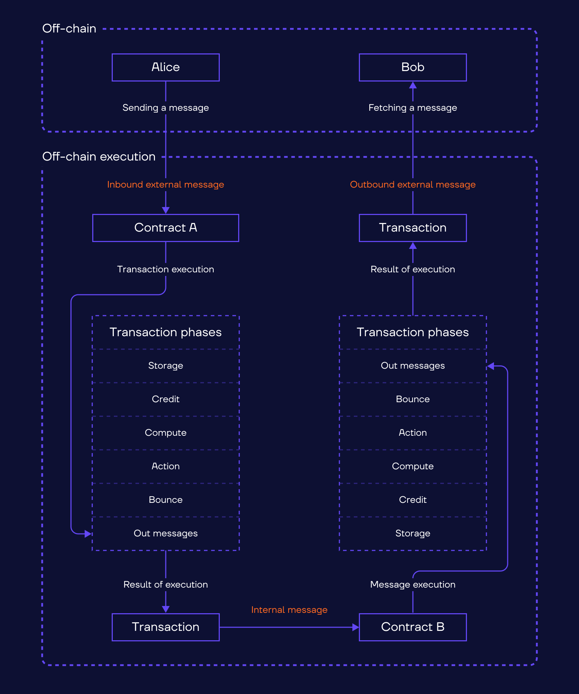

# Transactions

Let’s once again recall that all interactions on Evercale network are performed via messages. Messages, in turn, create transactions that modify the account's state. 

## Transaction​

A transaction is the result of an inbound message processing by a recipient account code. That is, when an account receives an inbound message, it leads to the computation of the account's new state and the possibility of generating one or more outbound messages with the account serving as the source. The inbound message and the previous state of the account serve as inputs for the transaction, while the generated outbound messages and the next state of the account serve as outputs. This relationship can be represented as a Directed Acyclic Graph (DAG).

## Transaction phases

A transaction is composed of several phases. Each phase may either complete successfully or result in an error. In case of error, the next stage is not completed.

**Storage phase** - is for the collection of storage payments for the account state (smart contract code and data). Throughout this phase, the smart contract may be frozen if its balance is insufficient to pay the storage fee. It is worth mentioning that there is no storage phase if the transaction is sent to deploy a new smart contract.

**Credit phase** - adding the value of the internal message received to the account's balance.

**Computing phase** - starts when the smart contract code is invoked inside an instance of TVM with appropriate parameters, including the inbound message and the account's persistent data. The result of this phase is an exit code, new persistent data, and an action list, which includes outbound messages to be sent. Also, it may end up creating a new account, uninitialized or active, or activating a previously uninitialized or frozen account. The gas fee for computation is deducted from the account balance.

**Action phase** - starts when the actions from the actions list are performed if the smart contract is executed successfully (with exit code 0 or 1). Suppose, it is impossible to perform all the actions. For example, because of insufficient funds to transfer with an outbound message. In that case, the transaction is terminated, and the account state is rolled back.

**Bounce phase** - starts when a transaction is terminated. That is, the inbound message has its bounce flag set. Respectively, there is an automatically generated outbound message, with the bounce flag clear, transferring the funds back to the sender. It takes the value of the original inbound message, deducts gas and forwarding fees and transfers the resulting amount to the newly generated message. 

## Specification

Read more about transactions execution in [Transaction executor Specification](../spec/executor.md#transaction)

## How to determine a successful transaction?

It depends on the account state before and after the transaction (fields `orig_status` and `end_status`):

- If the account was already deployed, i.e. if `(tx.orig_status == tx.end_status == active)` then you can use `tx.aborted` field. If it is `true`, then the transaction is not successful.

- If the account was not yet deployed then

  -  if `(orig_status == nonExist && end_status == uninit && aborted == true)` then transaction is successful.

        All the transactions executed on non-deployed accounts are aborted by definition but if we see the state has changed to `uninit`, it means that the transfer was successfully received.

  - if `(orig_status == uninit && end_status == uninit && aborted == true && in_message.bounce==false)`then transaction is successful.

       Non-bounced messages are successfully received by non-deployed accounts, though the transaction status is aborted.

       Instead of checking `tx.in_message.bounce==false` you can check if `tx.bounce.bounce_type<2` (tx.bounce.bounce_type==2(Ok) is equal to in_message.bounce==true)