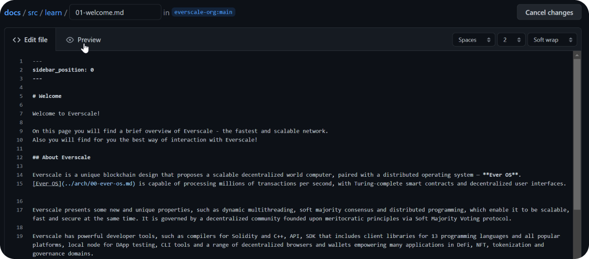
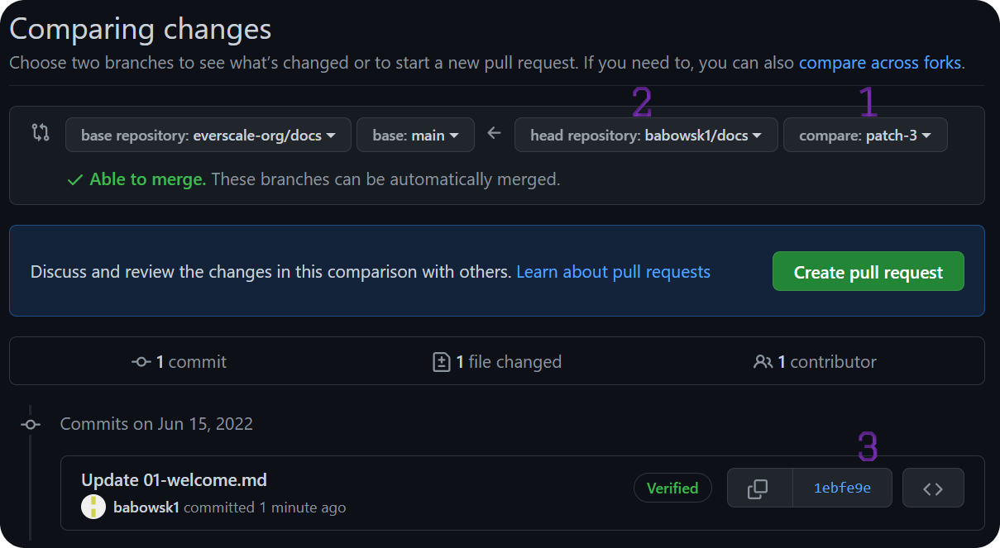
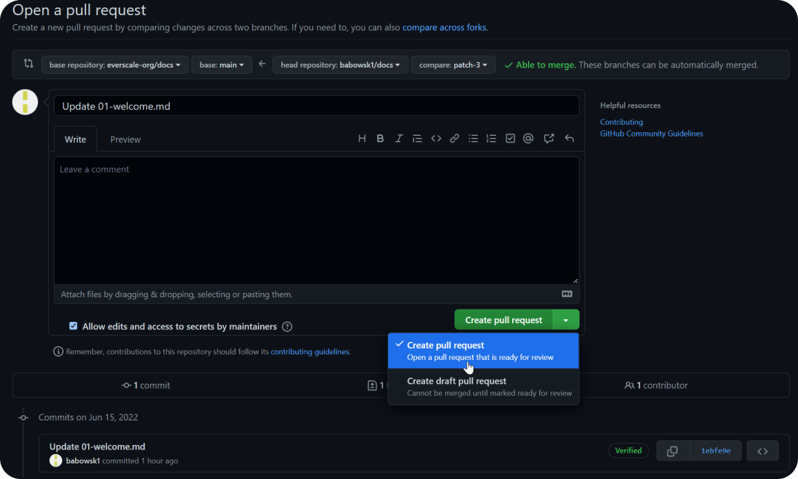
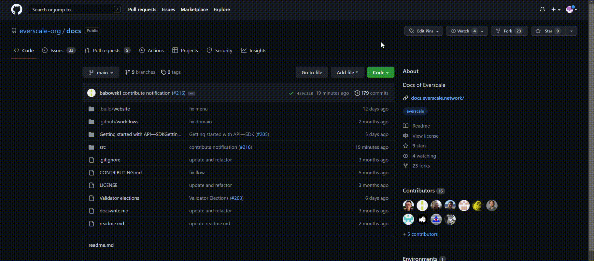
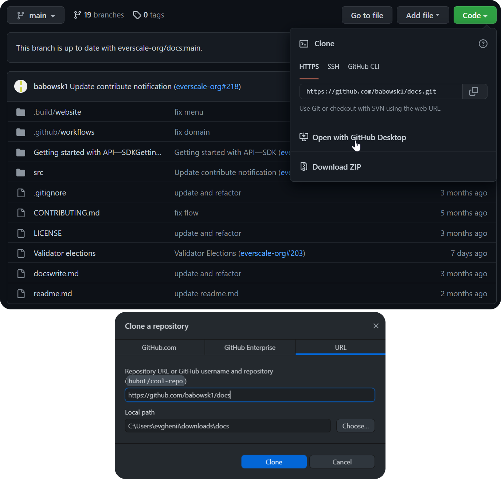
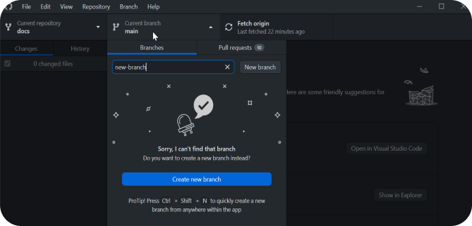
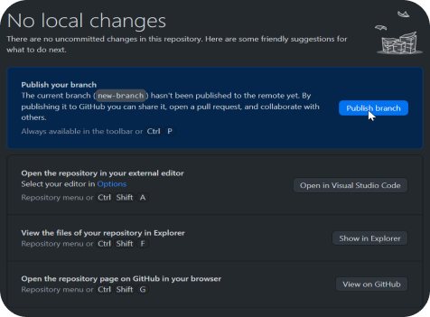
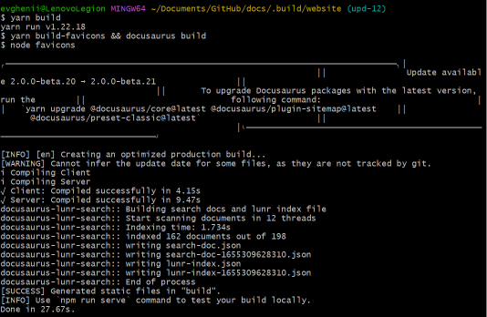
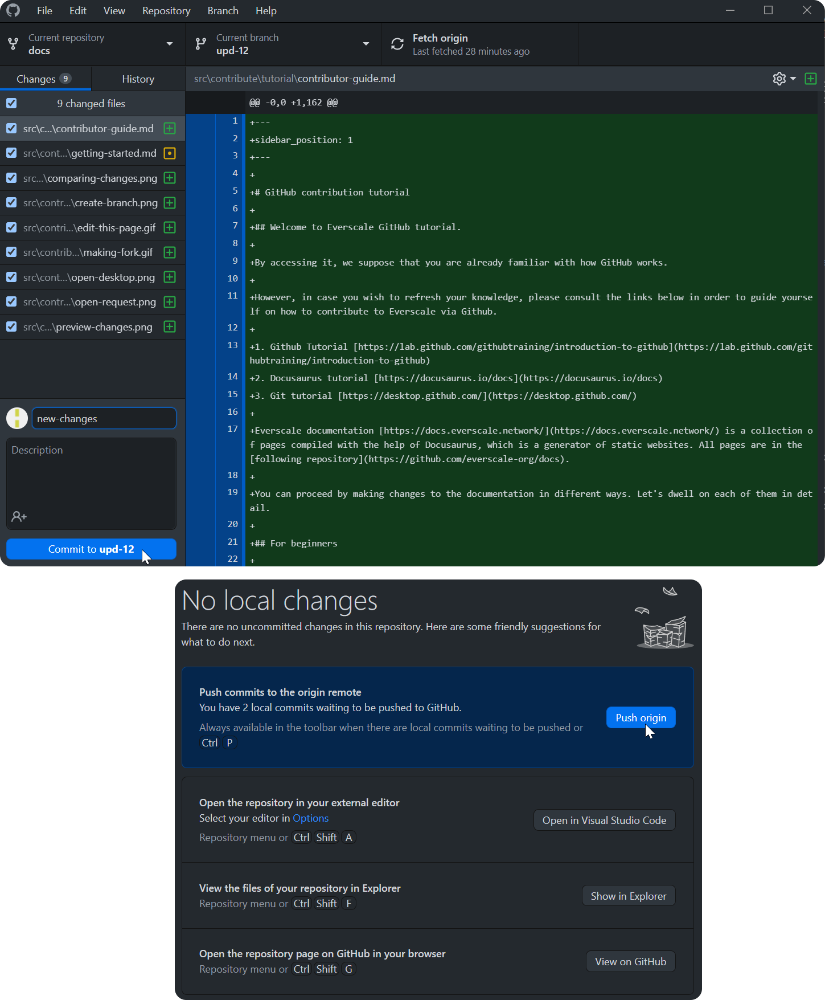
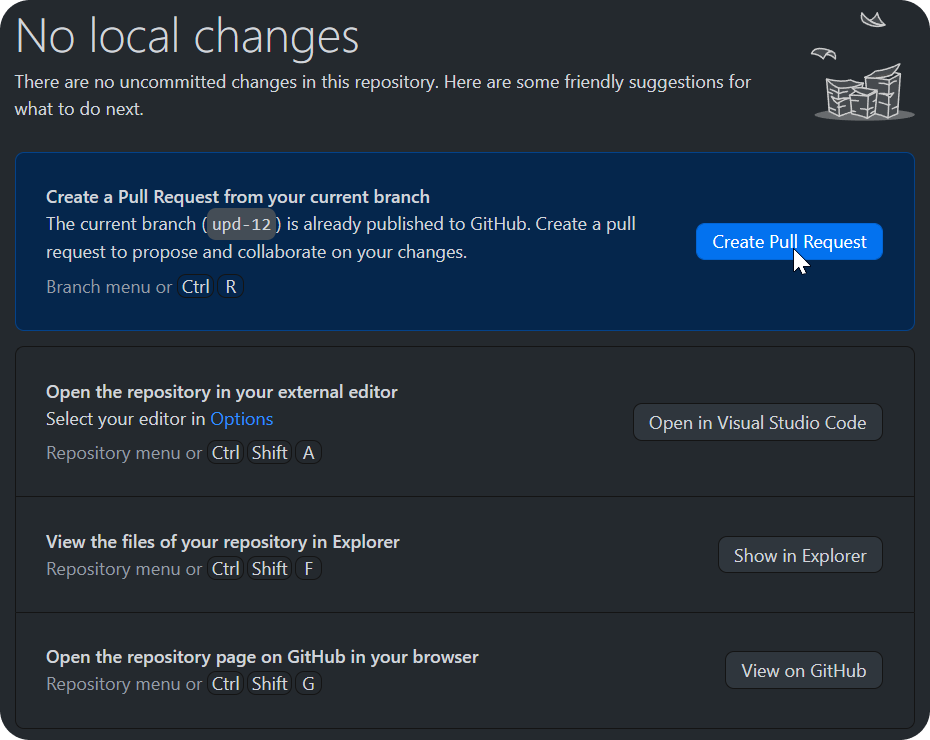

# GitHub contribution tutorial

## Welcome to Everscale GitHub tutorial.

By accessing it, we suppose that you are already familiar with how GitHub works.

However, in case you wish to refresh your knowledge, please consult the links below in order to guide yourself on how to contribute to Everscale via Github.

1. Github Tutorial [https://lab.github.com/githubtraining/introduction-to-github](https://lab.github.com/githubtraining/introduction-to-github)
2. Docusaurus tutorial [https://docusaurus.io/docs](https://docusaurus.io/docs)
3. Git tutorial [https://desktop.github.com/](https://desktop.github.com/)

Everscale documentation [https://docs.everscale.network/](https://docs.everscale.network/) is a collection of pages compiled with the help of Docusaurus, which is a generator of static websites. All pages are in the [following repository](https://github.com/everscale-org/docs).

You can proceed by making changes to the documentation in different ways. Let's dwell on each of them in detail.

## For beginners

This method does not require installing any applications. However, it should be noted that due to this, it is less convenient and effective.

We recommend using this method only in case of minor changes to the documentation.

Let's examine this method in detail.

### Making changes

At the bottom of most [https://docs.everscale.network/](https://docs.everscale.network/) pages, you can find a hyperlink with the text "Edit this page". Clicking on it will take you to that file's page in the documentation repository.

Here you can make all the necessary changes directly to the file and take a look at the visualization of your changes by clicking the *Preview* button.

After you have made all the necessary changes, click *Propose Changes*.

At this point, a fork2 (copy) of the main repository of everscale/docs will be created and a branch1 with the commit3 with changes that you made.

You can freely make changes to this branch, it being a copy of the main repository.   

### Create pull request

After making all necessary changes, you can create a Pull Request to the main branch of the repository by clicking ***Create Pull Request***.

Please note that you can choose from several types of requests, including creating a ***Draft***.  
It allows you to finish it at any time and then create a full request.

## Advanced

This method allows you:

1. To effectively work with the repository and all files by using an application
2. To conduct local checks identical to Github's tests
3. To raise a local assembly (copy) of the website and evaluate the changes made in real time.

### Preparation

#### Required Applications:

To use this method, you will need to install the following software on your device:

1. [GitHub Desktop](https://desktop.github.com/) 
2. VSCode or other source code editor 
3. [GitBash](https://git-scm.com/downloads) 
4. [Node.js](https://nodejs.org/)

#### Useful links

Check out the information on the pages below if you're having issues understanding how Git, Docusaurus, or Markdown work.

1. [https://lab.github.com/githubtraining/introduction-to-github](https://lab.github.com/githubtraining/introduction-to-github) - GitHub Tutorial.
2. [https://docusaurus.io/docs](https://docusaurus.io/docs) — Instructions for working with Docusaurus and designing Markdown pages.
3. [https://docs.github.com/en/desktop](https://docs.github.com/en/desktop) - GitHub Desktop guides.

### Making changes

#### Creating a Fork

The first thing you need to do is to create a Fork (copy) of the main repository, which will later be administered by you, and all changes will be sent to the “parent” repository via Pull Requests.

Go to the [**Everscale documentation repository**](https://github.com/everscale-org/docs) and click Fork in the top right corner.

Select the name of the repository, make a description and click ***Create fork***.

#### Create branch

Go to your Fork page, click ***Code*** and then ***open it with GitHub Desktop***.  
Choose a local name for this repository and a path to save it.
Then click ***Clone***.

After that, go to the Branch section and create a new one by entering its name and pressing Enter.

Since we created the Branch locally, you can upload the Branch to GitHub directly if you wish, by clicking Publish Branch at the top of the screen.

Now you can contribute to a local copy of the repository.

We recommend creating a new Branch for every update you want to make to the documentation, as any Pull Request will contain the changes we made to that specific Branch.  
Thus, each Pull Request will have its own copy of the repository behind it.

<u>Don't make changes directly to the <b>main Branch</b> of your repository!  
You can update your Fork with everscale/docs by clicking <b><a href="https://docs.github.com/en/pull-requests/collaborating-with-pull-requests/working-with-forks/syncing-a-fork">Fetch Upstream</a></b>.
Don't forget to do this before creating a new Branch.</u>

#### Conducting tests

When creating a pull request, GitHub will automatically run a series of checks from the Actions tab. These checks allow you to detect build errors, broken links, and so on.  
Without successfully passing all these tests, you will not be able to upload your changes to the documentation.

You have the ability to run all tests locally without having to create a Pull Request, which can save you a lot of time and effort.

1. Select your repository from GitHub Desktop and right click on it. Then select *Open in Explorer*.
2. Go to the *.build* folder, right click on the *Website* folder and select *GitBash here*. This is the easiest way to open a folder in GitBash.
3. In the window that opens, write `$ yarn`
4. Once the process is complete, type `$ yarn build`, in order to start the testing process.

After the testing is done, you will see either a series of errors and their description, or a notification about a successful build.  
With the second option, you can safely upload changes to GitHub and, if you wish, create a Pull request.

Always check your repository for errors before making a Commit!

#### Start local build

1. Select your repository from GitHub Desktop and right click on it. Then select *Open in Explorer*.
2. Go to the *.build* folder, right click on the *Website* folder and select *GitBash here*. This is the easiest way to open a folder in GitBash.
3. In the window that opens, write `$ yarn`
4. Once the process is complete, type `$ yarn start` to begin the process of building a local copy of the site.

This will open a local copy of the site at [http://localhost:3000/](http://localhost:3000/) in your default browser.

Any local changes you make will be displayed here. You don't need to restart the process with every new change.

#### Saving changes

After making the changes to a local copy of your Branch, you need to upload the respective changes to GitHub.  
To do this, open GitHub Desktop and select the files you want to commit to GitHub.

Commits show the history of your repository. They include a lot of metadata in addition to the content, such as author, timestamp, etc.

1. Choose a name for this Commit and click ***Commit to*** `commit name`.
2. To publish a Commit, click ***Push Origin***.

### Create a Pool Request

After you have published all the Commits in our repository, you can create a Pool Request.

1. Navigate to the appropriate section in your repository and select Create Pool Request.
2. If you wish, you can create a Draft Pool Request and complete it later.

When you create a "regular" request for a vote, ***reviewers*** are selected that take into account the changes you make.

Reviewers may accept your changes in case they don't find any errors. However, if they have comments, then you will need to make the appropriate changes, and then re-request the approval by clicking on the appropriate button.

You need to get confirmation from **at least one reviewer** so that changes can be deployed.