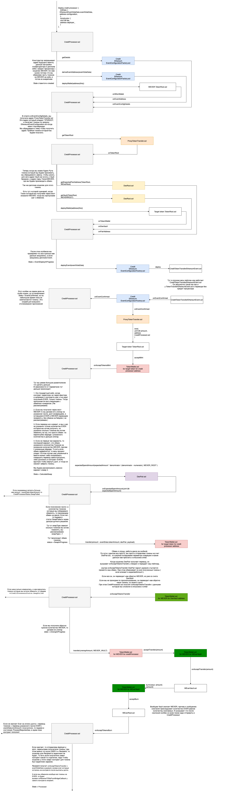

# EVM → Everscale Transactions Using The Credit Processor Contract

Credit Process is a special smart contract that exchanges part of the tokens for EVERs to pay for gas, and automatically completes transactions on the Everscale network. It is quite complex, and in order to use it in complex cases, it is advisable to independently study it. This tutorial does not cover all possible cases. 

**The transaction pipeline is as follows:**

Before proceeding, please be informed that this guide will examine transactions of liquid tokens with the exception of WEVER. For WEVER, the swap will be skipped and there will simply be the uwrap.       

The beginning is the same as for a regular transaction. Values for `deposit type = credit` are taken [from the list](https://raw.githubusercontent.com/broxus/bridge-assets/master/main.json).

The Vault in EVM will most likely be the same, but there will be other values for `ethereumConfigurationAddress`.


The credit processor has its own implementation of the configuration contract. It issues tokens to the processor and not to the user, and sends the processor a callback `onEventConfirmed`.

All limits should be checked and the amount determined. It is important to mention that transactions are possible only with tokens for which there is a `TOKEN/WEVER` pair with sufficient liquidity on FlatQube.

Next, it is needed to decide on the scenarios and parameters that will be transferred to the processor.

To call the deposit, the following is used `depositToFactory function(uint128 amount, int8 wid, uint256 user, uint256 creditor, uint256 recipient, uint128 tokenAmount, uint128 tonAmount, uint8 swapType, uint128 slippageNumerator, uint128 slippageDenominator, bytes memory level3)`, where: 

- `Amount` - how many tokens are transferred to Everscale and how much the credit the processor will receive for the exchange\release. ERC20 decimals!       
- `User` - is the control address. It can process a stuck transaction if, for example, tokens could not be 
exchanged for gas, because at the moment the price went beyond the limits of the slippage set. 

It can also cancel the transaction and unwrap. Pay the debt manually and pick up all the tokens.    
With correctly selected transaction parameters, it is used extremely rarely.    
Usually, this is just the user's wallet address, and if the user transfers tokens to himself, then it coincides with the recipient.     
In case tokens are transferred to a Strategy, it is better to specify the user's wallet address, even if it is not initialized.

Creditor - the address of the `CreditFactory.sol` contract, which will create the `CreditProcessor.sol` contract itself.    
By default, you can use Broxus factory.     
The address of the current Factory and the number of tokens that will need to be returned are to be taken [from here](https://github.com/broxus/bridge-assets/blob/master/credit.json).

Any account can deploy a contract via the Factory. The admin of the Factory can try to push the stuck `CreditProcessor`, and change the slippage, but with all parameters set correctly, this should not affect the result.

There is no binding to the `CreditFactory.sol` contract code, so you can create your own Factory, but `CreditProcessor.sol` cannot be changed, or deploy your own Factory.

- `Recipient` - the address that will receive tokens + native EVERs. In a normal scenario, this is just the user's wallet address, but it can also be a smart contract. There are two options depending on the logic:
1. If all tokens on the account balance are exchanged for EVERs, then the Credit Processor will trigger the receiving contract `onReceiveTONsFromBridgeCallback(EventData)` where all EVERs will be transferred. `onbounce: EventData.user != EventData.recipient`. That is, if the receiving contract is not the same as the user's, then it must be set up in advance or the tokens will be returned.
2. If we have to swap Tokens + EVERs, then the contract will simply transfer tokens to this address along with EVERs, and the contract/wallet will receive a call to `onAcceptTokensTransfer`. The data of the transfer will also be in the payload.

- `tonAmount` is the minimum amount of EVERs together with the tokens that should be received by the recipient, TIP 3 WEVER decimals = 9. 
- `tokenAmount` is the minimum amount of tokens that should be received by the recipient. Already in **TIP 3 decimals`!
- `swapType` – that's according to what algorithm the contract will try to make the transaction. Generally, 
by correctly combining `swapType / tokenAmount /tonAmount`, you can come up with different use cases of the Credit Processor. After receiving the tokens, the Processor asks the DEX how many tokens it will cost to buy WEVER (tonAmount + debt) + Slippage. That is, if the debt is 6, the number of tokens is 4, and the slippage is 10%, then it will be 11.

The DEX returns `expectedSpentAmount` and if it is `≤ amount tokenAmount`, then it will continue to try 
to make an exchange according to `swapType`, and if `expectedSpentAmount` is > `amount` -
`tokenAmount`, the contract will end up in the `SwapFailed` status and will wait for further actions from 
the user or lender.

1. 0 - the contract will try to exchange tokens for WEVER for an amount equal to `expectedSpentAmount`, but no more than amount - `tokenAmoun`.
2. 1 - The contract will change to EVERs the exact amount - `tokenAmount`.

`slippageNumerator/slippageDenominator` are the parameters of slippage during the exchange.

- `level3` is the payload. It must be a valid TvmCell. If a non-valid cell is passed, then an empty cell te6ccgEBAQEAAgAAAA will come to Everscale. 

Accordingly, before the transfer, we need to calculate which parameters to transfer to `depositToFactory`, and these calculations strongly depend on what kind of use case we have.        

Let's see how to make the calculations when we want to transfer tokens, and change some of them for 
gas using `swapType 0`:

Upload `creditBody` + Factory fee, this is `dept`. `creditBody` and we take it [from the same place](https://github.com/broxus/bridge-assets/blob/master/credit.json) as the address of the factory.

The fee is taken from the contract.

```
const {fee: factoryFee} = (
    await factoryContract.methods
        .getDetails({
            answerId: 0,
        })
        .call()
).value0;
```

The user enters the amount of tokens that is to be transferred, and either enters how much `tonAmount` he/she wants to receive, or the application displays how much is needed for it to process the transfer.

Then, we calculate how many tokens `tonAmount` + `dept` will cost. However, please note that the price of Token/Ever pair may change. In the contract below, there will be 1% slippage. However, the count will be like for 10%. Why is this the case? 

The Credit Processor will not be completed successfully without meeting the requirements for `tonAmount` and `tokenAmount`.     
At the same time, before the exchange, it checks how much it will cost to buy (`dept` + `tonAmount`) * `slippage`, and buys exactly this amount of tokens. If the value of this amount is greater than the `amount` - `tokenAmount`, then it will fail and wait for further actions from the user or Factory, because it cannot fulfill the requirements.

If we just count `tokenAmount` = `amount` - ((`dept` + `tonAmount`) * 1.01), and transfer such an amount to the contract, then this transfer will fail if the price of EVER increases by at least a bit during the transfer.

Therefore, we transfer tokenAmount = amount - ((`dept` + `tonAmount`) * 1.1) to the contract, and show this number to the user as the number of tokens that is guaranteed to be received. The slippage set for the contract is not 10% but 1%. The contract will try to exchange with 1% slippage. It can make several attempts, and the transaction will be completed successfully if the price has diverged by no more than 10%. It is done to minimize the likelihood of manual actions in case of price volatility. 

In case that everything runs well and the market is calm, then we will get more `tokenAmount` than indicated in `deposit To Factory`. Additionally, you can show to the user how many tokens he/she will receive if the price does not change.

(`dept` + `tonAmount`) * `slippage`

```
const tonAmount = new BigNumber(0); 
const dept = new BigNumber(CREDIT_BODY).plus(fee);
const defaultNumerator = '1';
const maximumNumerator = '10';
const denumenator = '100';

const minEvers = tonAmount.plus(dept);
const minEversWithSlippage = minEvers
		.times(denumenator)
		.div(new BigNumber(denumenator).minus(maximumNumerator))
		.dp(0, BigNumber.ROUND_UP);

const dexRootContract = new rpc.Contract(DexAbi.Root, DexRootAddress);
const pairAddress = (await dexRootContract.methods
											      .getExpectedPairAddress({
											          answerId: 0,
											          left_root: new Address(fromToken),
											          right_root: new Address(WEVERAddress),
											      })
											      .call({})).value0;
															
const pairContract = new rpc.Contract(DexAbi.Pair, pairAddress);
const isActive = (await pairContract.methods
											      .isActive({
											          answerId: 0,
											      })
											      .call()).value0;
if (!isActive)
	throw new Error('Pair not active);

const expectedAmount = (await pairContract.methods
                            .expectedSpendAmount({
                                answerId: 0,
                                receive_amount: minEversWithSlippage.toFixed(),
                                receive_token_root: WEVERRootAddress,
                            })
                            .call()
                    ).expected_amoun
```

In the example above, we saw expectedAmount. This is the maximum amount of tokens that will cost to exchange for `dept` + `tonAmounts`. Note that this is in decimals already on Everscale in order to see how many tokens this is in EVM.

```
const minTransferAmount = new BigNumber(expectedAmount)
                		.plus(1)
                		.shiftedBy(evm_decimals - tip3_decimals)
                		.dp(0, BigNumber.ROUND_DOWN);
```

Accordingly, the parameters for `depositToFactory`:

```
const user  = '0:0000000000000000000000000000000000000000000000000000000000000000';


const minTokensToRecieve = 
		amount.shiftedBy(tip3_decimals - evm_decimals) // tip3 decimals
		.minus(necessaryAmountForSwap);

depositToFactory(
    amount.toFixed(),
    user.split(':')[0], // wid
    user.split(':')[1], // address
    `0x${CreditFactoryAddress.toString().split(':')[1]}`, // creditor
    user.split(':')[1], //recipient
    minTokensToRecieve.toFixed(),
    tonAmount.toFixed(),
    '0', // swap type
    defaultNumerator,
    defaultDenominator,
    `0x${Buffer.from('te6ccgEBAQEAAgAAAA==', 'base64').toString('hex')}`,
)
```

After a successful deposit, wait for the Credit Processor contract, and monitor its status. To do this, we  need to get the transaction recipe from Web3 for transaction data (the address of the Credit Processor contract depends on them). Please see how to do it in the frontend demo via following [this link](https://github.com/mnill/octus-bridge-integration-sample).

It can also be accessed on the open-source frontend of the bridge via following [this link](https://github.com/broxus/octusbridge-frontend):

It works as follows:

```
const eventABI = '';

const decodedLogs = decodeLogs(txReceipt?.logs || []);
const depositLog =
    txReceipt.logs[
        decodedLogs.findIndex(
            (log: any) => log !== undefined && log.name === 'FactoryDeposit',
        )
    ];

const eventData = mapEthBytesIntoTonCell(
    Buffer.from(pipeline.eventABI, 'base64').toString(),
    depositLog.data,
); 

const eventVoteData = {
	eventBlock: txReceipt.blockHash,
	eventBlockNumber: txReceipt.blockNumber.toString(),
  eventTransaction: txReceipt.transactionHash,
  eventData: eventData,
  eventIndex: depositLog.logIndex.toString(),
}

const factoryContract = new rpc.Contract(TokenAbi.CreditFactory, CreditFactoryAddress);

const creditProcessorAddress = await factoryContract.methods
                    .getCreditProcessorAddress({
                        answerId: 0,
                        eventVoteData,
                        configuration: EthereumEventConfigurationAddress,
                    })
                    .call()

const creditProcessorContract = new rpc.Contract(TokenAbi.CreditProcessor, creditProcessorAddress);

const currentState = (await creditProcessorContract.methods
                        .getDetails({
                            answerId: 0,
                        })
                        .call()).value0.state;
```

If everything runs well, then wait for the `Processed` status.

**What you need to pay attention to:**

In case of more complicated cases than just transferring tokens across the bridge, it is needed to study the Credit Processor contract in detail in order to understand the mechanics of Tokens transferring. 

It is not recommended exchanging a large amount of tokens for EVER on a credit processor (`minTonAmount`), sooner or later you will be sandwiched. 

**Please always remember about different decimals for the same tokens in different networks.**

The approximate scheme of the Credit Processor contract below does not include all possible scenarios 
where it could fail. It is given only for general understanding.



This is the main part of this guide. It doesn't look so scary. But in reality, of course, there is quite a lot of 
code.

**Some transactions may end up in a waiting queue. It can happen for several reasons:**

- Firstly, there may not be enough liquidity in the Vault. When your transaction is initiated, someone could have sent a transaction a little earlier than you or with a larger amount of gas and take the liquidity before you.
- Your withdrawal has exceeded the limit for a single transaction, or the daily limit has been exceeded. In this case, the transaction will not just get into the queue, but will also have to wait until your withdrawal is confirmed by governance or guardian.
- At the same time, if you withdraw money to the account of a smart contract and not a wallet, and, for example, check at the end of the transaction that your balance has increased by a certain amount, you are not immune from getting into the queue, because any wallet can complete the transfer, not just the one to which it is intended.
- To get out of the queue, you will need to make another transaction.

You can also assign a reward to the one who comes and completes your withdrawal in the form of tokens.

If you want to integrate the bridge into your website, then it is already very difficult to get into a queue using the UI, but you can always send the user to the frontend of the bridge tosolve any issues that may have arisen. 

When withdrawing tokens from Everscale, the Event contract does not automatically send the change. In order to get the remaining gas, you need to call Close method from the wallet that transferred tokens. Carefully, **DO NOT** call this method in the “`Initializing`” state. Otherwise, the transaction may fail. 

- The contract `EverscaleConfiguration.sol` is not permanent, and can be replaced by another. So check the `endTimestamp` parameter if the bridge is integrated into the frontend, and take the configuration address from Proxy.sol if you transfer from the contract. Also, check that the proxy is not on pause.         
After going through the technical aspects of transactions please follow [this page](tokenomics.md) to see the pros and cons of the Octus Bridge.