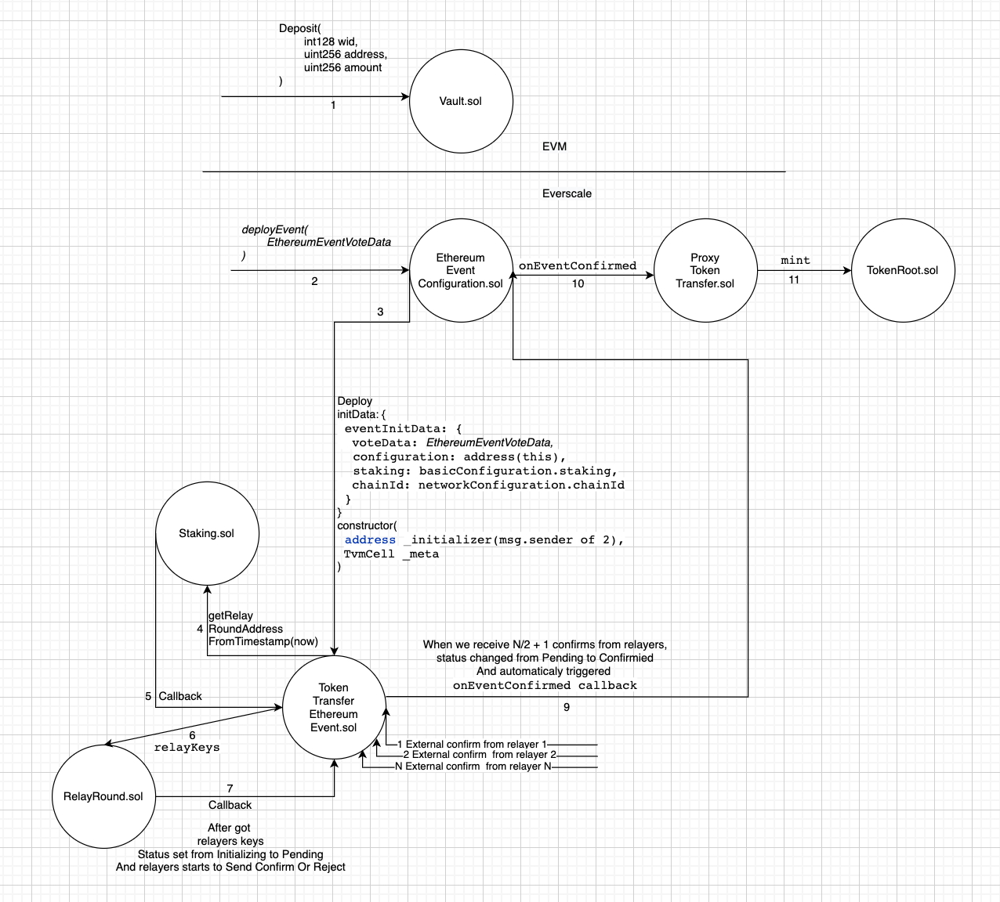

# EVM → Everscale transactions of liquid tokens without the credit processor

The simplest integration option are EVM → Everscale transactions of liquid tokens when the user 
already has an Everscale wallet with some amount of EVERs on the balance, and, therefore, can 
complete the transaction.

**The transaction pipeline is as follows:**

In order to get tokens in Everscale, they, firstly, have to be transferred to the bridge storage (`Vault.sol`) 
in the EVM network.

Each token has its own Vault. The list of currently available tokens can be viewed via following [this link](https://raw.githubusercontent.com/broxus/bridge-assets/master/main.json).

They can also be taken from the network.    
To proceed, select the desired token, and choose the Vault for the desired network (chain id), then choose `depositType` - default.

It is downloaded from `Vault.sol availableDepositLimit`.    
That's how many tokens the Vault can accept (the limits were described above).  
Also, it should be checked that `depositFee = 0` and the Vault is not turned off.

Next, it's needed to call `Vault.deposit(int128 recieverWorkchainId, uint256 recieverAddress, uint256 amount)`.

Thanks to the previously installed `Approve`, it will transfer the required amount from the user's account to its own, and create the Event `emit Deposit(amount, recieverWorkchainId, recieverAddress);`

The address should be taken from the [following file](https://raw.githubusercontent.com/broxus/bridge-assets/master/main%20.json).

`ethereumConfiguration`. This is the address of the sample contact. `EthereumEventConfiguration.sol`, with which we will continue to work.

It is needed to wait for N confirmations in EVM (how long to wait can be found in `EthereumEventConfiguration.sol` `_networkConfiguratin.eventBlocksToConfirm`), Afterwards, it is needed to create an Event of this transfer in Everscale.

The Event is the sample of `TokenTransferEthereumEvent.sol`, which is created using the contract `EthereumEventConfiguration.sol`   
It is the contract that deploys Events and contains the Event settings. It is different for each Vault.     
The required address is taken from the [following file](https://raw.githubusercontent.com/broxus/bridge-assets/master/main.json).

It can also be taken from the network.

For the contract `EthereumEventConfiguration.sol` we call `deployEvent(EthereumEventVoteData eventVoteData) method`. 

`EthereumEventVoteData` - the structure which describes the emit Deposit event that is received when 
replenishing the Vault.

```
struct EthereumEventVoteData {
        uint eventTransaction; 
        uint32 eventIndex;  
        TvmCell eventData; 
        uint32 eventBlockNumber;
        uint eventBlock; 
}
```

`deployEvent` will create a contract `TokenTransferEthereumEvent.sol`, which in turn will start loading into the constructor, calling the Staking contract. It will approach the current Round. 
The work of relayers is divided into rounds. With each new round, relayers can be added or subtracted, and then referring to the current Round, it will load the public keys of the relayers.       
The relayers will check that the deposit was really made. Then, they will sign it.      
`TokenTransferEthereumEvent.sol`

The relayers sign the translation with external messages. That is, they do not pay for adding their signatures, the contract pays for everything. Thus, there are no extra transaction costs for the relayers.

At the same time, due to the uniquely generated address, it is impossible to create a second copy of the 
contract for the same transaction. That's an Everscale feature.

When there are 2/3 + 1 signatures, the Event will call `onEventConfirmed`, firstly in `EthereumEventConfiguration` that is in `ProxyTokenTransfer`, which will actually issue the necessary tokens.

**What you need to pay attention to:**

When initiating transactions, the user's wallet address is specified (`SetCodeMultisig`, `BridgeMultisig`, etc.), and not the TIP 3 wallet address. The TIP 3 wallet address will be generated automatically, and the remaining EVERs will be transferred to the address that trigerred the `deployEvent` (This may not be the address to which the tokens are to be transferred).

Do not forget that decimals are different for different tokens, and one token may have different prices on different networks. 

This is important when showing how many converted tokens the user will receive. It is also necessary to check the input after the point, we have min(`tip3_decimals, evm_decimals`).

The number of tokens that can be deposited on the Vault is not equal to `Limit - Balance`, because some tokens may still be blocked in Strategies. The View method is to be used `availableDepositLimit`.

After the user called the `Valut.deposit()` method, it is advisable to remember the TX hash so that if the user refreshes the page, to be able to return to the incomplete transaction.

In `deployEvent` it is necessary to transfer more EVERs than the amount set in `BasicConfiguration basicConfiguration` of the contract.

Event sends callbacks about the status change to the contract that should receive tokens, see `notifyEventStatusChanged`.

There are 4 transaction statuses: `Initializing, Pending, Confirmed, Rejected`.

These statuses can also be viewed from the frontend to show users the progress of transactions. 

Currently, there are no fees for deposits and withdrawals. However, they could be introduced in the near future. Anyway, the fees will not be greater than the set maximum.

Please see the schematic image of how this type of transfer works at the contract level. The user only needs to perform actions 1 and 2, and then monitor the status of `TokenTransferEthereumEvent.sol`



Please follow [this page](everscale-evm.md) in order to go through the details of Everscale –
EVM transactions.
