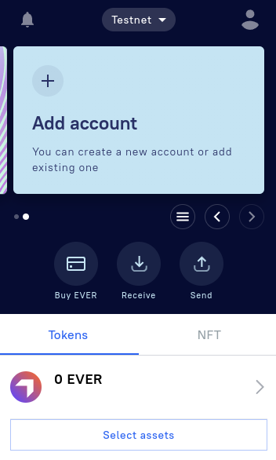
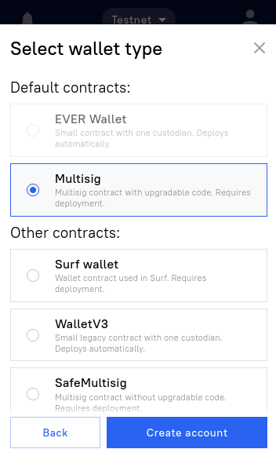
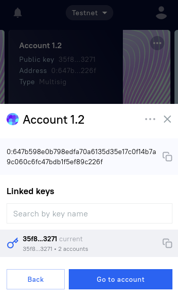

# TIP3 Integration Guide

This guide will explain how to integrate TIP3.2 tokens into your app with the help of Ever SDK. It is useful if you are you are a token holder, and need to make transfers, or you are a token creator and need to mint tokens.

## Glossary

`Owner wallet` - wallet with Ever tokens which is the creator of TokenRoot and can mint TIP3.2 tokens.

`Holder wallet` -  wallet with Ever tokens which is the owner of a TIP 3.2 Wallet. For example, a MultisigV2 can be a holder wallet. It alone can govern the TIP3.2 wallet.

`TIP 3.2 Wallet` - account which contains TIP3.2 tokens belonging to the holder.

Additional documentation: [https://github.com/broxus/tip3/blob/c857c077b4e3eacc941c7af2b53f1afe5e6d338b/contracts/abstract/TokenWalletBase.tsol#L81](https://github.com/broxus/tip3/blob/c857c077b4e3eacc941c7af2b53f1afe5e6d338b/contracts/abstract/TokenWalletBase.tsol#L81) 

## Prepare your keys

First, you need to get a key pair which will be used to govern your token operations.

 Here we will use Ever Wallet keys for mint operations.

1. Create an account in [Ever Wallet](https://everwallet.net/) app. Save seed phrase to a file.
2.  Add a new account and choose Multisig wallet option. Transfer 10 tokens to it. Then transfer one token to any other account - the wallet will be fully deployed after the outgoing transfer. The balance will be uneven, since fees will be deducted.
    
    
    
    
    
3. Save  multisig wallet address.
    
    
    
4. Save the ABI of Ever Wallet to your project: [https://github.com/broxus/ever-wallet-contract/blob/master/dist/Wallet.abi.json](https://github.com/broxus/ever-wallet-contract/blob/master/dist/Wallet.abi.json)
5. Get the wallet key pair from the seed phrase:
    
    ```jsx
    let phrase = "word1 word2 word3 word4 ... (12 words)";
    const ownerKeyPair = await client.crypto.mnemonic_derive_sign_keys({phrase});
    ```
    

## How to mint TIP3.2 tokens

1. Encode body of internal message from owner wallet to TokenRoot which calls the `mint` method. It will be sent through an owner wallet call. 
    
    Use the `abi.encode_message_body` function and the ABI of the receiving TokenRoot contract (`mint` function) for it.
    
    ```jsx
    const call_mint_payload = (await client.abi.encode_message_body({
            abi: {
                type: 'Contract',
                value: TokenRoot.abi,
            },
            call_set: {
                function_name: "mint",
                input: {
                    amount: your-token-ammount,
                    recipient: recipient-holder-address
                    deployWalletValue: 5000000000 // 5 evers for deploy
                    remainingGasTo: multisigOwnerAddress,
                    notify: false
                    payload: "te6ccgEBAQEAAgAAAA==" // empty cell
                },
            },
            is_internal: true,
            signer: signerNone(), // internal messages have no signature
        })).body;
    ```
    
2. Call Owner Wallet (wallet which is the creator of TokenRoot), passing in call parameters payload of internal call, Owner Wallet ABI and TokenRoot address:
    
    ```jsx
    // Prepare input parameter for 'submitTransaction' method of multisig wallet
    const sendTransactionParams = {
        dest: TokenRootAddress,
        value: more-than-5-evers, // because we will use 5 evers for token wallet deploy
        bounce: true,
        flags: 3,
        payload: call_mint_payload,
    };
    
    const process_message_params = {
          send_events: false,
          message_encode_params: {
              token_owner_wallet_address,
              abi: token_owner_wallet.abi, // multisig abi, for example
              call_set: {
                  function_name: "submitTransaction",
                  input: submitTransactionParams,
              },
              signer: {
                type: 'Keys'
                keys: ownerKeyPair
              }
          },
    };
    // Call `submitTransaction` function
    const sentTransactionInfo = await client.processing.process_message(params);
    ```
    

## How to get total TIP3.2 token supply

To get total token supply, you can download `tokenRoot` account state. It is a `boc` or bag of cells - native blockchain data layout. Account's boc contains full account state (code and data) that
you will need to execute get methods and get the required information.

```jsx
    const query = `
        query {
          blockchain {
            account(
              address: "${address}"
            ) {
               info {
                balance(format: DEC)
                boc
              }
            }
          }
        }`
    const {result}  = await client.net.query({query})
		const accountState = result.data.blockchain.account.info.boc

// Encoding message for local execution of get method. Get methods do not require
// signature so we use signer None
const { message } = await client.abi.encode_message({
  abi: {
      type: 'Contract',
      value: TokenRoot.abi,
  },
  address,	// token root address
  call_set: {
      function_name: totalSupply,
      input: {
        answerId: 0
      },
  },
  signer: { type: 'None' },
});

// Run get method
const tvm_response = await client.tvm.run_tvm({
  message,
  account: accountState,
  abi: {
      type: 'Contract',
      value: TokenRoot.abi,
  },
});
const getMethodResult = tvm_response.decoded.output;
```

## How to deploy a TIP 3.2 wallet

You can deploy token wallet via `tokenRoot` contract via `deployWallet` function.

It can be called from any token Holder wallet. In this example multisig V2 is used.

```jsx
const deploy_payload = (await client.abi.encode_message_body({
        abi: {
            type: 'Contract',
            value: TokenRoot.abi,
        },
        call_set: {
            function_name: "deployWallet",
            input: {
              answer_id: 0,
              walletOwner: holder-wallet-address
              deployWalletValue: deploy-value 
            },
        },
        is_internal: true,
        signer: signerNone(), // internal messages have no signature
    })).body;
```

```tsx

// Prepare input parameter for 'submitTransaction' method of multisig wallet
const sendTransactionParams = {
    dest: tip3-2-root,
    value: deployWalletValue+ a bit more, // because we will use 0.5 evers for token  transfer
    bounce: true,
    flags: 3,
    payload: deploy_payload, //information about transfer and recipient is contained here
};

const process_message_params = {
      send_events: false,
      message_encode_params: {
          address: holder_wallet_address,
          abi: holder_wallet.abi, // multisigV2 abi, for example
          call_set: {
              function_name: "submitTransaction",
              input: submitTransactionParams,
          },
          keys: {
            type: 'keyPair',
            keys: ownerKeyPair
          }
      },
};
// Call `submitTransaction` function
const sentTransactionInfo = await client.processing.process_message(params);
```

## How to get TIP3.2 wallet address knowing holder address

If you need to get the address of the TIP 3 wallet belonging to a certain holder account, the address of which you know, use the `walletOf` get method of TokenRoot, passing the holder address to it:  [https://github.com/broxus/tip3/blob/master/build/TokenRoot.abi.json#L162](https://github.com/broxus/tip3/blob/master/build/TokenRoot.abi.json#L162)

```jsx
// Download tokenRoot account state 
// `boc` or bag of cells - native blockchain data layout. 
// Account's boc contains full account state (code and data) that
// we will  need to execute get methods.
    const query = `
        query {
          blockchain {
            account(
              address: "${address}"
            ) {
               info {
                balance(format: DEC)
                boc
              }
            }
          }
        }`
    const {result}  = await client.net.query({query})
    const accountState = result.data.blockchain.account.info.boc

// Encoding message for local execution of get method. Get methods do not require
// signature so we use signer None
const { message } = await client.abi.encode_message({
  abi: {
      type: 'Contract',
      value: TokenRoot.abi,
  },
  address, // token root address
  call_set: {
      function_name: walletOf,
      input: {
        answerId: 0,
        walletOwner: ownerMultisigAddress
      },
  },
  signer: { type: 'None' },
});

// Run get method
const tvm_response = await client.tvm.run_tvm({
  message,
  account: accountState,
  abi: {
      type: 'Contract',
      value: TokenRoot.abi,
  },
});
const getMethodResult = tvm_response.decoded.output;
```

## How to get TIP3.2 wallet balance

To get TIP3.2 wallet balance, download `tokenWallet` account state. It is a`boc` or bag of cells - native blockchain data layout.Account's boc contains full account state (code and data) that
you will need to execute get methods and get the required information.

```jsx
    const query = `
        query {
          blockchain {
            account(
              address: "${address}"
            ) {
               info {
                balance(format: DEC)
                boc
              }
            }
          }
        }`
    const {result}  = await client.net.query({query})
    const accountState = result.data.blockchain.account.info.boc

// Encoding message for local execution of get method. Get methods do not require
// signature so we use signer None
const { message } = await client.abi.encode_message({
  abi: {
      type: 'Contract',
      value: TokenWallet.abi,
  },
  address, // wallet address
  call_set: {
      function_name: balance,
      input: {
        answerId: 0
      },
  },
  signer: { type: 'None' },
});

// Run get method
const tvm_response = await client.tvm.run_tvm({
  message,
  account: accountState,
  abi: {
      type: 'Contract',
      value: TokenRoot.abi,
  },
});
const getMethodResult = tvm_response.decoded.output;
```

## How to make a TIP3.2 transfer

Call Holder Wallet of the sender, passing in call parameters payload with internal call parameters, Wallet ABI and address of the token holder (for example, multisig).

### To TIP3.2 wallet address

1. Encode body of the internal message with a call of the `transferToWallet` function of sender TIP3.2 wallet. 
    
    Use the `abi.encode_message_body` function and ABI of TokenWallet (`transferToWallet` function)  for this.
    
    ```jsx
    const transfer_payload = (await client.abi.encode_message_body({
            abi: {
                type: 'Contract',
                value: TokenWallet.abi,
            },
            call_set: {
                function_name: "transferToWallet",
                input: {
                  amount: amount-in-units,
                  recipientTokenWallet: recipient-tip3-2-wallet-address
                  remainingGasTo: holder-wallet-address // or tip32 wallet address
                  notify: false
                  payload: "te6ccgEBAQEAAgAAAA==" // empty cell
                },
            },
            is_internal: true,
            signer: signerNone(), // internal messages have no signature
        })).body;
    ```
    
2. Send message with the request to transfer funds from TIP3.2 wallet to Holder Wallet:
    
    ```jsx
    // Prepare input parameter for 'submitTransaction' method of multisig wallet
    const sendTransactionParams = {
        dest: tip3-2-wallet-address, // of the sender
        value: more-than-0.5-evers, // because we will use 0.5 evers for token  transfer
        bounce: true,
        flags: 3,
        payload: transfer_payload, //information about transfer and recipient is contained here
    };
    
    const process_message_params = {
          send_events: false,
          message_encode_params: {
              address: holder_wallet_address,
              abi: holder_wallet.abi, // multisigV2 abi, for example
              call_set: {
                  function_name: "submitTransaction",
                  input: submitTransactionParams,
              },
              keys: {
                type: 'keyPair',
                keys: ownerKeyPair
              }
          },
    };
    // Call `submitTransaction` function
    const sentTransactionInfo = await client.processing.process_message(params);
    ```
    

### To holder address

1. Encode body of the internal message with a call of the `transfer` function of sender TIP3.2 wallet. 
    
    Use the `abi.encode_message_body` function and ABI of TokenWallet (`transfer` function)  for this.
    
    ```jsx
    const transfer_payload = (await client.abi.encode_message_body({
            abi: {
                type: 'Contract',
                value: TokenWallet.abi,
            },
            call_set: {
                function_name: "transfer",
                input: {
                  amount: amount-in-units,
                  recipient: recipient-holder-address
                  deployWalletValue: deploy-value // >0, if you want to deploy recipient wallet
                  remainingGasTo: holder-wallet-address // or tip32 wallet address
                  notify: false
                  payload: "te6ccgEBAQEAAgAAAA==" // empty cell
                },
            },
            is_internal: true,
            signer: signerNone(), // internal messages have no signature
        })).body;
    ```
    
2. Send message with the request to transfer funds from TIP3.2 wallet to Holder Wallet:
    
    ```jsx
    // Prepare input parameter for 'submitTransaction' method of multisig wallet
    const sendTransactionParams = {
        dest: tip3-2-wallet-address, // of the sender
        value: more-than-0.5-evers, // because we will use 0.5 evers for token  transfer
        bounce: true,
        flags: 3,
        payload: transfer_payload, //information about transfer and recipient is contained here
    };
    
    const process_message_params = {
          send_events: false,
          message_encode_params: {
              holder_wallet_address,
              abi: holder_wallet.abi, // multisigV2 abi, for example
              call_set: {
                  function_name: "submitTransaction",
                  input: submitTransactionParams,
              },
              ownerKeyPair,
          },
    };
    // Call `submitTransaction` function
    const sentTransactionInfo = await client.processing.process_message(params);
    ```