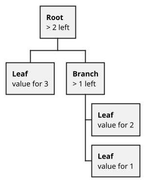

# Data structures

## TVM — Ton Virtual Machine.

Realized 1 to 1 just like in Nikolai Durov’s whitepaper: https://ton.org/tvm.pdf

What do you need to know about VM? It is just a virtual stacking machine, so when using it we are working with
information that is on the stack. (Operations that occur there are of the following sort: Combine the two topmost
numbers in the stack, or swap the 2nd position in the stack with the 10th). What is important:

## The TVM code is standard data

The code is simply stored on the chain and can be shared via messages and rewritten. There is a  `tvm.setcode(code)`
operation the will change your contract code for your subsequent transactions and even a `tvm.setCurrentCode(code)`
operation that will apply the new code to the current transaction you are making. There are nuances to consider when
updating a contract, for more on that see the "How to upgrade contracts" section of this tutorial.

## Messages and funds

In an asynchronous architecture, all communication between contracts occurs through sending messages.

The sequence is something like this (I am not going to delve into the questions of how exactly messages are delivered
here, there will be a separate chapter in the appendices that cover this):

1. The contract receives an _external message_ from the outside world, and if the contract agrees to pay for it, a
   transaction is launched. As a result of the transaction launching, the contract can create any number of outgoing
   internal messages. The outgoing message contains the address of the destination contract, the function that should be
   called there and what arguments are attached.
2. The destination contract receives an incoming internal message, and a transaction is started, as a result of which
   outgoing internal messages can be created.

External messages are simple. 10k of gas credit are allocated to external messages and if a contract does not agree to
supply the gas to pay for the transaction, then the message will simply be discarded and the transaction will not start.
But with internal messages, everything is more complicated. When a contract receives an internal message, a transaction
is started. Logically, in most cases the calling contract should pay for the gas for this transaction type, and not the
called contract. But at the same time, it is obvious that the calling contract must control exactly how much gas it is
willing to pay. What further complicates things is that contracts can find themselves in different shards, and one shard
cannot spend the money of another shard. Therefore, in ES, all outgoing messages are appended with value ( ever-s ).
When a contract receives a message, the gas is paid out of the money attached to this message, and if the money in the
message runs out and the contract does not want to continue paying, then the transaction will run out of gas. If, after
the transaction is completed, there is money left in the message, then it will be added to the contract’s account (or
the contract can send the change back). All internal messages have to carry some amount of money with them. Even if the
contract agrees to pay for the message, the message must have enough coins to pay for the download of the contract and
the initial checks (until it gets to `tvm.accept()`).

When you create a message, you have to show a flag which will determine where the money that gets attached to the
message will come from and how the creation of the message will be paid for. The money can come from the contract
account or be taken from money left over on the incoming message after the gas deduction.

From this document https://github.com/tonlabs/TON-Solidity-Compiler :

Regular money transfer:

value — this is the amount of money you want to transfer. (Essentially, this is just the amount of EVER we attach to an
internal message and it doesn’t matter that this is a regular money transfer or a call of some kind of method of a smart
contract.)
bounce — this is a flag that indicates whether we need to try to create a return message should an error occur during
the processing of the message or there is no contract deployed on the destination address. By default, the flag will be
true. If it is false, then, if there is an error, the money will just remain on the address. flag — flags indicate how,
from where and how much money is sent with a message. Read the description from the document below and I will provide
further explanation.

### Excerpt from the  TON Solidity compiler documentation:

> Possible values of parameter flag: @
> * **0** - message carries funds equal to the value parameter. Forward fee is subtracted from the value.
> * **128** - message carries all the remaining balance of the current smart contract. Parameter value is ignored. The contract's balance will be equal to zero after the message processing.
> * **64** - carries funds equal to the value parameter plus all the remaining value of the inbound message (that initiated the contract execution).
    > Parameter flag can also be modified:
> * **flag + 1** - means that the sender wants to pay transfer fees separately from contract's balance.
> * **flag + 2** - means that any errors arising while processing this message during the action phase should be ignored. But if the message has wrong format, then the transaction fails and + 2 has no effect.
> * **flag + 32** - means that the current account must be destroyed if its resulting balance is zero. For example, flag: 128 + 32 is used to send all balance and destroy the contract.


When messages are created, two things occur: payment for the creation of the actual message (payment for validators so
that they deliver the message), and payment of the value (funds) which will be attached to the message.

In most cases you will use the following flags: 0, 1, and 64.

0 and 1 you will use primarily when you start the transaction sequence yourself:

* 0 — this flag communicates that the creation of the message will be paid from the value that you attached to the
  message, meaning that a little less than the total value you attached will be sent. The value itself will be paid from
  the account of the contract (all of the money remaining with the message will be added to the account).
* 1 — the same thing as with 0, only the creation of the message will be paid from the contract account separately and
  the total amount attached to the message will be sent with it.

* 64 — This flag is used when processing an incoming internal message (when another contract calls you). You will most
  often use this flag with the value: 0. This indicates that for an outgoing message you have to attach the entire value
  that came with the incoming message, minus the spent gas. The creation of the outgoing message itself will also be
  paid for with the incoming money. This is a very important concept, in this paradigm other contracts do not spend
  money from your contract on calls. Below I will demonstrate a few simple examples.

Here are some examples of using flags. Contract A gets an Ext message from its owner and begins a message sequence,
calling B and attaching 0.5 EVER to the message.

```solidity
// Contract A
function updateOwnerOnChildren(
    address children,
    uint256 new_pubkey
) external {
    require(msg.pubkey() == tvm.pubkey(), AErrors.error_message_sender_is_not_my_owner);
    tvm.accept();
    
    // On the IB interface we call the setNewOnwer function
    // By default the flag will be 0, we don't have to change it.
    // So we send 0.5 ever and pay for the creation of the message 
    // from these 0.5 ever
    IB(children).setNewOnwer{value : 0.5 ever}(new_pubkey);
}
```

```solidity
// Contract B
function setNewOnwer(
    uint256 new_pubkey
) external {
    require(msg.sender == myRoot, BErrors.error_message_sender_is_not_my_root);

    // Here we won't call tvm.accept() because we don't want 
    // the incoming message to be able to spend money on the smart contract account. 
    tvm.setPubkey(new_pubkey);

    // We send the rest of the remaining value back to the sender.
    // value - 0, bounce - false, flag - 64
    msg.sender.transfer(0, false, 64);
}
```

This is the basic pattern according to which ES works. Even though the price of gas doesn’t fluctuate, we don’t
calculate down to the penny the exact amount you need to send to the contract so that you will have enough to cover the
transaction. We just send a a decent amount and then send the remainder back.  (We know that what we send will cover the
fees because the price of gas won’t rise). Doing this, we can create long chains, by putting the contract address that
initiated the whole chain in the call arguments and then returning the change to that address at the end.

### BoC. Now for the hard part :-)

All data in ES is stored and sent in a structure called the BoC (Bag of cell). This is a confusing structure invented by
Nikolai Durov, and it’s not very clear whether it was necessary in order to create the blockchain, or Nikolai
over-engineered here. In general, all data stored in the contract (not the code, the code is separate, but also the BoC
is stored in the contract :-)) is stored in one BoC, this is a given cell (TVMCell) with links to subcells. The TVMCell
is a structure that has 1023 Bits of data and 4 references to its child cells. A cell reference is the HASH of that
cell. With ES have have a singly connected graph, where each node can have 4 descendants. And we need to pack all smart
contract data or messages into a cell with sub cells. Thank God, by using Ton Solidty and knowing the interfaces of
contracts, you don’t have to manually pack and unpack cells. The compiler will do everything for you. However, there are
rare cases when you will have to do it yourself. In order to do this, there are special primitives in Solidity. When
this is necessary, you simply declare state variables in Solidity and read and write to them as usual. The compiler will
pack and unpack everything in the BoC for you.

Some BoC properties to understand. BoC is an acyclic graph. The link to a cell c is a hash of its data and its hash
links to subcells. So we cannot create a cycle. (Because if we add a link from the parent cell to the child cell, then,
by doing so, we recalculate all hashes from the changed cell to the root cell and the link to the parent cell changes).
The entire state of the contract is BoC. This is one cell with as many child cells as you like. Ton Solidity takes care
of work with states for us, but you need to understand that, because of ES’s tree structure, we normally don’t write
contracts with a lot of data. In order to illustrate how it works, consider (schematically) how a dictionary could be
implemented in BoC.



Each circle in the picture is a separate cell. To get the value by key 2, TVM needs to load a cell of depth 0, then depth 1 and then depth 2. We have to pay gas for each time a cell is loaded. And if we change the value by key two, we will need to recalculate all references from the cell with the value of the root cell because the cell reference is a hash (cell.data + cell.refs).

So, links to all cells along the way will change and we will need to change them from bottom to top. So, the more elements our dictionary has, the deeper the cell will be and the more expensive it will be to work with. For a dictionary, the cost of gas will increase to O(log n) in a worst case scenario. (In reality, everything would be more complicated but O (log n) can be useful to look at as a worst case scenario).

Now, if we are creating an ERC20 token, then the more owners this token has, the more expensive the gas will be to use this contract (the size of the owner-number map will grow). And although O(Log n) doesn’t sound scary at all, and the cost of working with the map will increase very, very slowly after the first hundred elements, and then even slower after that, in ES there we have a storage fee that grows linearly.

If you have accounts in your ERC-20 token that contain pennies, then the fees for holding these accounts will greatly exceed the value of these accounts over the years. Therefore, in ES it is customary to make separate contracts for separate accounts, which themselves pay for their storage. We will look at how the [TIP-3](../../../standard/TIP-3) standard (a distributed replacement for ERC-20) works in the next chapter.

Fun fact: this entire overcomplicated data storage scheme helps to scale the network, so that the validator can quickly execute smart contracts. Validators do not need to store the entire current state of the blockchain in Ram, because loading the smart contract state from the disk will be fast, since all smart contracts are small. Additionally, since all contracts are small, they are evenly distributed across all shards.

>  The documentation in Everscale repository is a community effort. Therefore, everyone can contribute with proposals for new topics, suggest new content elements, participate in editing, and provide ideas that will be of great help for network development.
Please be informed that our documentation can be [edited via GitHub](https://github.com/everscale-org/docs/issues).  
  Also please make sure to consult our rules and rewards policy via [this link](https://docs.everscale.network/contribute/hot-streams/documentations).  
  Feel free to join [Everscale Documentation Development Telegram chat](https://t.me/+C2IpQXWZtCwxYzEy) and [Everscale Developers Onboarding Telegram chat](https://t.me/+Vca1Gs6uPzIyNWVi)!