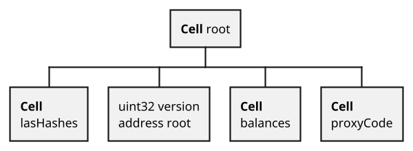
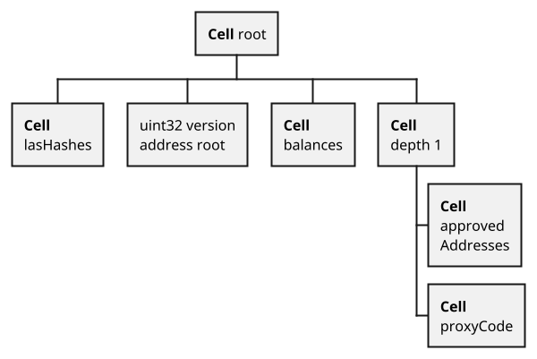

# How to upgrade contracts

There are two complications with upgrading contracts.

The first complication with upgrading:

We have `tvm.setCode()` and we can change the contract code at any time. But the problem is in contract storage. We have all the variables in one `BoC`, and `Solidity` simply uses the mapping to these cells, which is created at compiling time. If your state variables do not change, then you can simply do `tvm.setCode()` and complete the transaction as in this [example](https://github.com/tonlabs/samples/blob/master/solidity/12_BadContract.sol).

But we want to be able to change the storage structure.

Let’s say that prior to the upgrade we had the following state variables:

```solidity
TvmCell proxyCode;
mapping (address => uint128) balances;
uint32 version;
address root;
uint256[] lastHashes;
```

The Solidity compiler somehow distributes them into cells (you can see how storage is arranged in the chapter on `BoC`). For example, like this (this is just an example, in reality it is more complicated).



And after tvm.setCode we will have more variables:
```solidity
TvmCell proxyCode;
mapping (address => uint128) balances;
mapping (address => uint128) approvedAddresses;
uint32 version;
address root;
uint256[] lastHashes;
```

And the compiler will map them to contract storage in a different way, for example, like this:



Solidity expects a different mapping of state variables to storage, but we have the old storage mapping. Unfortunately, there is currently no way to automatically migrate from the old representation to the new one. After changing the code, you need to do tvm.resetStorage() and manually migrate the old data to the new storage. Below I will describe an example of how to do this in practice.


We have contract A version 1 and we want to be able to upgrade it to version 2 in the future.

In the version 1 contract, we implement the codeUpgrade function:

```solidity
function codeUpgrade(TvmCell _code, uint32 _newVersion) override public onlyRoot {
    // If a new version
    if (version != _newVersion) {
        TvmBuilder data;
    
        // We pack old the data from the old version into TvmCell
        data.store(_newVersion);
    
        TvmBuilder prevStateData;
        prevStateData.store(proxyCode);
        prevStateData.store(balances);
        prevStateData.store(lastHashes);
    
        data.storeRef(stateData);
    
        // Import the new code.
        // For the following transactions
        tvm.setcode(_code);
        // Establish the new code with the CURRENT code
        // Already in the framework of the current code (shock)
        tvm.setCurrentCode(_code);
    
        // Transfer to the onCodeUpgrade function the new code 
        // With all the data we want to keep from the old contract
        onCodeUpgrade(data.toCell());
    }
}
```

In the new version 2 contract, we implement the onCodeUpgrade function (this utility function can only be called after onCodeUpgrade).

```solidity
function onCodeUpgrade(TvmCell _data) private {

    // We erase contract storage to 0, because we have changed
    // the storage strcuture. This call will not affect  
    // _pubkey, _constructorFlag or _replayTs variables.
    tvm.resetStorage(); 

    //We decode TvmCell and rewrite it in the new storage structure
    TvmSlice s = _data.toSlice();
    version = s.decode(uint32);

    TvmSlice params = s.loadRefAsSlice();
    (proxyCode, balances, lastHashes) = params.decodeFunctionParams(prevVersionParams);
}

function prevVersionParams(
	TvmCell _proxyCode,
	mapping (address => uint128) _balances,
  uint256[] _lastHashes
) public {}
```

By doing that we have essentially upgraded the contract.

But then we run into complication number 2:

As you already understand from the chapter on distributed programming, in many use cases in ES it is very important to have a computed contract address. The address is hash(code + static variables), `tvm.setCode()` does not change the contract address, the contract address is calculated at the time of deployment.

What should we do if we have a Root contract that first deployed the `v1` contract, and then we told it to deploy the updated contracts, and the old ones were updated? Contract addresses `v1` and `v2` will be calculated differently.

To do this, we use a Proxy contract. The whole point of this contract is to be the starting point of the address. With it, we untie the contract address from the real code, and use the `Proxy.sol` code to calculate the address.

In the constructor of this contract, we pass the Real code, and the data of the constructor, and it will immediately upgrade to the new code and call `onCodeUpgrade()`.


```solidity
pragma ton-solidity >= 0.52.0;

contract Proxy {
    address static root; // Root contract
    TvmCell static initialData;

    modifier onlyRoot {
        require(msg.sender == root, 100);
        _;
    }

    constructor(TvmCell _code, TvmCell _params) public onlyRoot {
        TvmBuilder builder;

        builder.store(uint32(0));    // Upgraded from version 0
        builder.store(root);         // Root address. Address depends on this data

        builder.store(initialData);  // Static data. Address depends on this data
        builder.store(_params);      // Dynamic params. Address does not depend on these params.

        //Set code for next transactions.
        tvm.setcode(_code);
        //Set new code right now for current transaction
        tvm.setCurrentCode(_code);

        // call onCodeUpgrade from new code
        onCodeUpgrade(builder.toCell());
    }

    function onCodeUpgrade(TvmCell _data) private {}
}
```

We always deploy `Proxy.sol` from `Root.sol`, and immediately call for the migration to a new version of the code. And if the code changes, then we will still deploy `Proxy.sol` just with a different version, and the addresses will be considered the same for `v1` and `v2` (because they are calculated from the `Proxy.sol` code)

You can find a fully-functional example [here](https://github.com/mnill/everscale-contract-upgrade-example).


