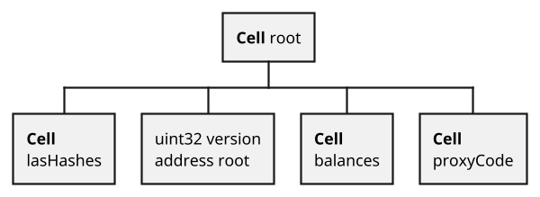

# Magic and overheads of Solidity compilers

There are some nuances to the TON Solidity compiler.

How does responsible work? Under the hood, one more variable has to be added, which points to the id of the function that should be called in the return message. You need to understand that when you receive a response to responsible, there is no magic check that will verify that you really called responsible. You yourself need to check everything here (that you really made this call and that the answer came from the correct contract).

```solidity
function owner() override external responsible returns (address) {
    return { value: 0, flag: 64, bounce: false }owner_;
}

// This will be compiled in something like this:
function owner(uint32 asnwerID) override external returns (address) {
    msg.sender.call({
        value: 0,
        flag: 64
        bounce: false,
        functionToCall: asnwerID,
        values: owner_
    });
}
```

There are three utility variables solidity compiler add under the hood:

- `_pubkey` — this is just a static variable taken out separately, and it serves for the `tvm.pubkey()` and verification of the signature of the incoming external message;
- `_constructorFlag` — this is a constructor call flag. In general, due to the peculiarities of the blockchain, the internal work constructor in TON Solidity was implemented in a tricky way. When we deploy a contract, we can specify one function that we want to call after the deployment of the contract and its arguments. If we call the constructor, then, if its execution was successful, at the end the `_constructorFlag` will be set to true. All other functions check before their execution that the constructor has been called, if not, an error will occur. But since we can deploy a contract and not call the constructor, it is possible that the contract will get deployed, but its constructor will not be called. We must keep this in mind;
- `_timestamp` — this is the time of the last external call, used in the [protection against replay attacks described above](30-replay-attacks-protection.md).

There is also an interesting feature with state variables. At compilation time, Solidity will allocate all state variables to cells in the contract storage, like this:



Storage for contracts in TVM is register `c4`, this is a `BoC`. There is a service register for temporary data `c7` - but this is a tuple and it is always cleared at the end of a transaction. So, every time a transaction begins processing, Solidity unpacks variables from `c4` to `c7`, so that it is easier to work with them in the code by register indexes, and at the end of the work it repacks them back to `c4`. You can draw your own conclusions, but it is undeniable that the more variables you have, the greater the overhead for unpacking/packing.

> The documentation in Everscale repository is a community effort. Therefore, everyone can contribute with proposals for new topics, suggest new content elements, participate in editing, and provide ideas that will be of great help for network development. Please be informed that our documentation can be edited via GitHub. It can be found [**here**](https://docs.everscale.network/). 
Please make sure to consult our rules and rewards policy via [**this link**](https://docs.everscale.network/contribute/hot-streams/documentations).  
Also, for any questions that may arise, you can text via this [**Telegram chat**](https://t.me/+C2IpQXWZtCwxYzEy).