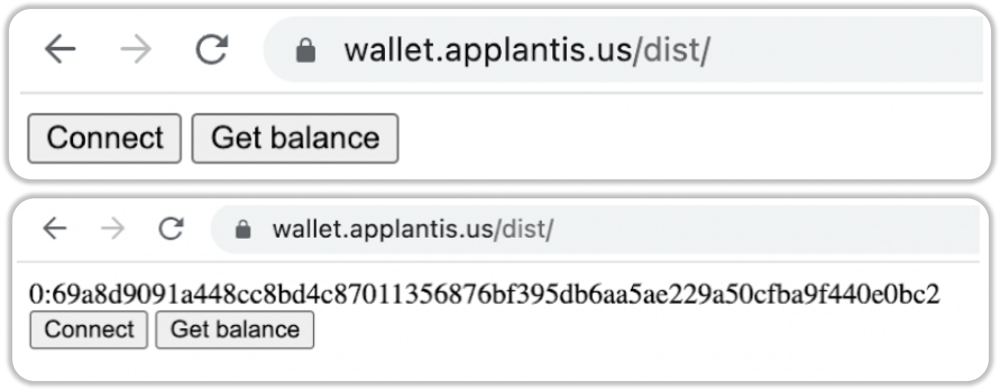
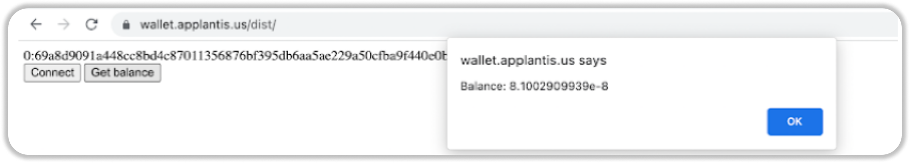

# Ever Wallet Guide

## Requirements

- [NodeJS](https://nodejs.org/)
- [WebPack](https://webpack.js.org/guides/installation/)
- [npm](https://www.npmjs.com/)

## Installation

`npm install --save everscale-inpage-provider`

```shell
npm install --save everscale-inpage-provider

added 166 packages, and audited 167 packages in 10s

21 packages are looking for funding
  run `npm fund` for details

found 0 vulnerabilities
```

Clone the repository via the following link: [https://github.com/broxus/everscale-inpage-provider](https://github.com/broxus/everscale-inpage-provider)

```shell
git clone https://github.com/broxus/everscale-inpage-provider
Cloning into 'everscale-inpage-provider'...
remote: Enumerating objects: 8313, done.
remote: Counting objects: 100% (951/951), done.
remote: Compressing objects: 100% (179/179), done.
remote: Total 8313 (delta 914), reused 790 (delta 768), pack-reused 7362
Receiving objects: 100% (8313/8313), 3.36 MiB | 4.16 MiB/s, done.
Resolving deltas: 100% (7429/7429), done.
```

Proceed to the repository that you just cloned.

We have the following structure:

- [src/api.ts](https://github.com/broxus/everscale-inpage-provider/blob/master/src/api.ts) - RPC interface description
- [src/models.ts](https://github.com/broxus/everscale-inpage-provider/blob/master/src/models.ts) - general models used in RPC interface
- [src/contract.ts](https://github.com/broxus/everscale-inpage-provider/blob/master/src/contract.ts) - typed contracts wrapper
- [src/stream.ts](https://github.com/broxus/everscale-inpage-provider/blob/master/src/stream.ts) - user-friendly API for streams
- [src/utils.ts](https://github.com/broxus/everscale-inpage-provider/blob/master/src/utils.ts) - some useful stuff

## Build

Let's move further and build our project.       
To do this please perform the following:

1. `npm install`
2. `npm run build`

```shell
everscale-inpage-provider> npm install

added 146 packages, and audited 147 packages in 20s

34 packages are looking for funding
  run `npm fund` for details

found 0 vulnerabilities

everscale-inpage-provider> npm run build

> everscale-inpage-provider@0.3.43 build
> tsc
```

In the `dist` folder we see the result of the build execution:

`dist/api.js`:

```js
"use strict";
Object.defineProperty(exports, "__esModule", { value: true });
```

Now we need to assemble the project.        
For this we will use **webpack.**

Please follow [this link](https://github.com/ultrasp/ever-js/blob/main/webpack.config.js) for the config of the webpack.

```js
const path = require('path');

module.exports = {
  entry: './dist/index.js',
  output: {
    filename: 'main.js',
    path: path.resolve(__dirname, 'dist'),
  },
};
```

`npx webpack --config webpack.config.js`

```shell
everscale-inpage-provider> npx webpack --config webpack.config.js
asset main.js 34.5 KiB [emitted] [minimized] (name: main)
./dist/index.js 28.8 KiB [built] [code generated]
./dist/models.js 5.16 KiB [built] [code generated]
./dist/utils.js 7.21 KiB [built] [code generated]
./dist/stream.js 25.6 KiB [built] [code generated]
./dist/contract.js 20.4 KiB [built] [code generated]
./dist/api.js 79 bytes [built] [code generated]

WARNING in configuration
The 'mode' option has not been set, webpack will fallback to 'production' for this value.
Set 'mode' option to 'development' or 'production' to enable defaults for each environment.
You can also set it to 'none' to disable any default behavior. Learn more: https://webpack.js.org/configuration/mode/

webpack 5.74.0 compiled with 1 warning in 1462 ms
```

We see the file main.js. it will be used for the purpose of our project.        
Let's create a simple page and connect our file to it:

`dist/index.html`:

```html
<!DOCTYPE html>
<html>
  <head>
    <meta charset="utf-8" />
    <title>Getting Started</title>
  </head>
  <body>
    <span id="Address"></span>
    <span id="Error"></span>
    <div>
      <button type="button" id="connect">Connect</button>
      <button type="button" id="getBalance">Get balance</button>
    </div>
    <span></span>
    <script src="main.js?ver=1"></script>
  </body>
</html>
```

In this article we will take [https://github.com/bogacheff/ever-js/blob/main/src/index.js](https://github.com/bogacheff/ever-js/blob/main/src/index.js)

Now we create a simple page where we initialize the Ever Wallet extension.      
Then, we check whether it is installed and display the wallet balance on the screen.

The **Connect** button initializes the wallet connection on our page.       
In the picture below you can see the address of our wallet.



The function responsible for this is **async**.         
It checks whether there is an extension in the browser and, if so, displays the wallet address on the screen.

`src/index.ts`:

```ts
connect: async function () {

    const ever = this.ever()
    if (!(await ever.hasProvider())) {
        this.connectInfo.errorMessage = 'Extension Ever is not installed';
      return this.connectInfo;
    }

    const { accountInteraction } = await ever.requestPermissions({
      permissions: ['basic', 'accountInteraction'],
    })

    if (accountInteraction == null) {
        this.connectInfo.errorMessage = 'Insufficient permissions'
      return this.connectInfo;
    }
    this.connectInfo.hasError = false;
    this.connectInfo.address = accountInteraction.address.toString()
    return this.connectInfo
  },
```

To conclude, let's try to initialize the `getBalance` method.

```ts
getBalance: async function () {    
    const ever = this.ever()
    if(this.connectInfo.hasError){
        return 0;
    }
    const { state } = await ever.getFullContractState({
      address: this.connectInfo.address,
    })
    let balance = state ? parseFloat(utils.formatUnits(state.balance)) : 0
    alert('Balance: '+balance)
  },
}
```

Detailed documentation of the method can be found at [this link](https://broxus.github.io/everscale-inpage-provider/classes/ProviderRpcClient.html#getBalance).     
We see on the screen that we have received the balance of our wallet.



**Congratulations!**        
You have created the first application that works with web3 and the Ever Wallet extension.

Now you are capable of creating more difficult applications.

## Useful links

You can consult the documentation via the following link:
[https://broxus.github.io/everscale-inpage-provider/](https://broxus.github.io/everscale-inpage-provider/)

The repo with our project can be found via this link:
[https://github.com/bogacheff/ever-js/](https://github.com/bogacheff/ever-js/)

An example of a working application can be found via this link:
[https://wallet.applantis.us/dist/](https://wallet.applantis.us/dist/)