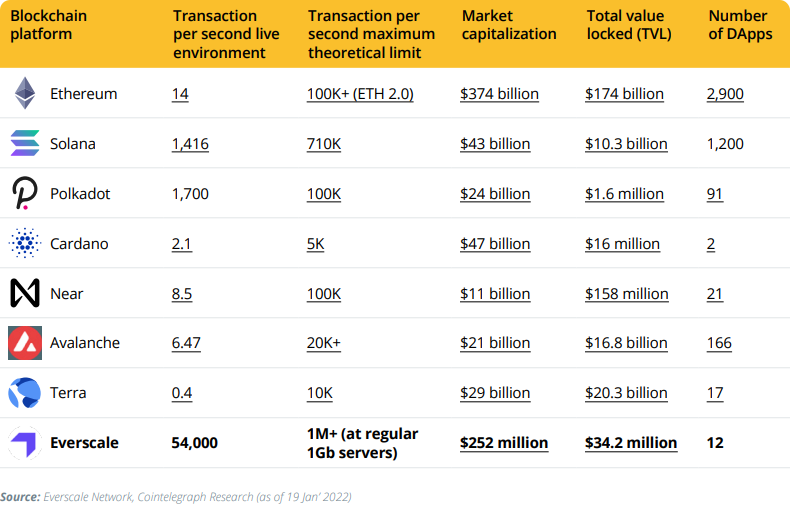

# Welcome

Welcome to Everscale!

On this page you will find a brief overview of Everscale - the fastest and scalable network.
Also you will find for you the best way of interaction with Everscale! 

## About Everscale

Everscale is a unique blockchain design that proposes a scalable decentralized world computer, paired with a distributed operating system — **Ever OS**.  
[Ever OS](../arch/06-ever-os.md) is capable of processing millions of transactions per second, with Turing-complete smart contracts and decentralized user interfaces.  

Everscale presents some new and unique properties, such as dynamic multithreading, soft majority consensus and distributed programming, which enable it to be scalable, fast and secure at the same time. It is governed by a decentralized community founded upon meritocratic principles via Soft Majority Voting protocol.  

Everscale has powerful developer tools, such as compilers for Solidity and C++, API, SDK that includes client libraries for 13 programming languages and all popular platforms, local node for DApp testing, CLI tools and a range of decentralized browsers and wallets empowering many applications in DeFi, NFT, tokenization and governance domains.

If you would like to learn more about Everscale, please visit the [Everscale Overview page](everscale-overview).

**Comparison with other networks**

## Everscale for you

Everscale is able to interest several types of users with their own interests by providing them with different features.

In this documentation we have created sections and tutorials for each type of user, so you can find key information for getting to know and immerse yourself in any part of Everscale:

**Users** ([Tutorial](tutorial/users.md)) - Everscale as an opportunity for storage and earnings (DeFi, NFT, etc.).

**Developers** ([Tutorial](tutorial/developers.md), [Section](../develop/)) - Development on Everscale and technical details.

**Validators** ([Tutorial](tutorial/validators.md), [Section](../validate/)) - Validating and staking. 

**Contributors** ([Tutorial](tutorial/contributors.md), [Section](../contribute/)) - Earning on partnership and benefiting the network.

**Intergators** ([Tutorial](../integrate/tutorial/), [Section](../integrate/)) - Integration of Everscale technologies, listing of tokens, etc.

## Key organizations

Many organizations have formed around Everscale to grow the network: recruiting new teams, DAOs, grants, etc.

Let's take a look at some of them:

[Everscale DeFi Alliance](https://everalliance.org/) - Everscale DeFi Alliance creates the necessary infrastructure to attract and maintain strong teams and projects, attract liquidity from another projects to Everscale and establish a partnerships with major companies with large amounts of liquidity and/or a large number of transactions.

[Everscale Grants](https://everscale.network/developers/grants) - Everscale Grants is a campaign that aims to attract promising IT projects that can contribute to the Everscale ecosystem's growth. 

[EVER DAO](https://everdao.net/governance) - EVER DAO is a platform where EVER token holders can make on-chain governance decisions for the whole Everscale Network.

Ever Foundation (the website is under construction) - The Ever Foundation shall become the primary entry point for all kinds of projects that want to develop and create their products and businesses on top of the Everscale.   
The Foundation provides grant support to projects that bring the greatest benefit to the network, and is also actively promoting them.
