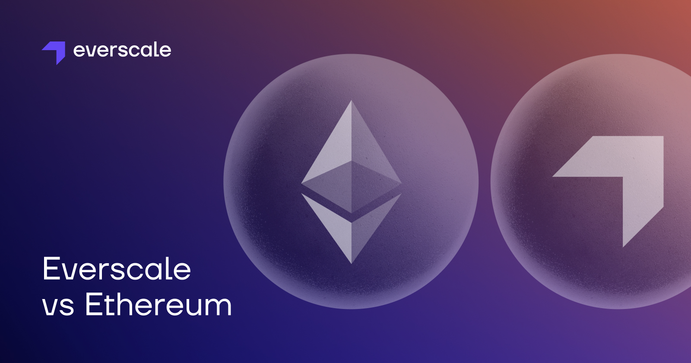

# Differences from EVM

Ethereum is a great blockchain construct that gave birth to smart contracts, which, in turn, opened the world for dApps. Unfortunately, it became hostage to its own success. Despite the fact that it was a revolution at the time of its inception, it subsequently went on a path of slow evolution, considerably hindering its advancement and losing competition with other blockchains.
Everscale, due to its later arrival and the time lag associated with it, was able to assess the mistakes made on Ethereum. Therefore, having the expert take, community devs put the right decisions into Everscale blockchain. This was possible, among others, due to the fact that, unlike many other blockchains, Everscale has never attempted to reduce costs for blockchain development.
In what follows we will outline some technical issues associated with Ethereum and the solutions developed by Everscale in order to overcome them. 

## Sharding

From the very beginning, Eth 2.0 planned to develop a genuine sharding protocol. It envisaged cross-shared transactions and hundreds of shards. Later, the number of shards was reduced to 32, and now the idea was completely abandoned **(at least for the near future)**. Instead, the decision was made in favor of rollups.

The arguments explaining why rollups are not the right solution due to their centralisation and low security are a topic for a separate article. Generally speaking, they are no more than different networks that rely on some security measures from L1. They are also extremely inconvenient for the end users.

It is very difficult to implement normal sharding in the Ethereum network due to its inherent synchronous architecture. Aslo, it is troublesome to make synchronous cross-chain transactions, and absolutely impossible to make it so that there is a large throughput. And if each shard exists independently, then this is not much better than rollups are.

In Everscale, the asynchronous architecture was designed from scratch. All contracts communicate with each other via messages. Therefore, the only thing needed for sharding to work is the synchronization of message queues between shards. At the same time, since Everscale was developed by blockchain maximalists, they went even further. That is to say, they developed not just a form of classical sharding, but **infinite sharding**.

## Modus operandi

Currently, Everscale is comprised of two global shards called workchains:

**Master-workchain** (masterchain) for synchronization and governance, and the **main workchain** for smart contracts. 

The main workchain can be partitioned into N shards (from 1 to 256 shards). Each shard has its own group of validators. This sub-group is responsible for executing transactions in its own shard. At the same time, it constantly downloads blocks from all other shards of its workchain. 

A block in Everscale is not just a list of transactions that need to be completed in order to achieve changes in the state. Instead, a block is:
- A list of messages for which transactions were executed, removing them from the incoming queue. 
- New messages that entered the outgoing queue after message processing.
- Changes in smart contract states that resulted from message processing.

That is, in order for the validator from shard X to maintain the current state of shard Y, it does not need to execute all the transactions that were in the block of shard Y. It simply downloads the block and rolls up the changes that have occurred in the message queue and smart contract states.

## Sharding in Everscale is not merely data sharding, but computational resources sharding

In case there are too many transactions in the last N block of some particular shard, then the shard is simply divided into two. This is done in accordance with the address range of smart contracts, with some transactions going to one shard while the rest to the other. The resulting shards, in turn, can also be divided into two more.

In order for this to work, Everscale also decided to abandon the idea of radical decentralization. The number of validators in the network will be in the number of thousands, not hundreds of thousands like on Ethereum network. Everscale validators are professional players with big stakes and expensive servers. Currently, the validator requirements are: 48 CPUs, 128 RAM and 1TB SDD + 1 GB network bandwidth.

Having such sharding capabilities, Everscale achieves a huge network throughput. Importantly, this is accomplished without any damages to customer satisfaction. That is to say, the customer does not have to switch between shards himself, or constantly transfer tokens from one rollup to another.

It is important to mention that there is also a big security issue arising. As the number of shards increases, there are fewer instruments to watch over each one of them. Therefore, in the event of a high block mining rate, it may lead to the collusion of the validators of a single shard. This, in turn, could end with someone creating the original message that carries the money not belonging to the originator of the contract.

A new consensus mechanism (SMFT) that is currently under development solves this issue. Basically, it takes advantage of the current architecture of Everscale where validators share computation among themselves. This way, all validators always have the data of all shards. It means that each newly issued block can be validated independently.  

**Let’s see how it actually works. Please note that the text below describes the principle of work, not the exact algorithm.**

- Each validator comes up with a random number and sends its hash to other validators.
- After all shards have created a block, but before the rest of the shards accept it, all validators must take the hash of this block, mix it with a random number, and if the remainder of dividing the resulting number by N is zero, then the validator must check this block, and send validators of -1 governance shard-chain a “yes” or “no”.
- If there is at least one ‘’no’’, then the verification of this block by the rest of the validators starts. In the case of an invalid block, not only the validators who created this block will be terminated, but also those who said “yes” or remained silent.
- Before creating the next block, everyone reveals their guessed number and guesses a new one.
- Thus, shard validators never know which and how many other validators will validate their block. **It is a very nice and elegant solution.**

## Large amount of data and its long tail issue

The original idea of blockchain was that there is a chain of blocks from the very beginning (genesis) to the latest block. And there is always the possibility to synchronize from the genesis block to the latest one, to check that everything runs well. However, already for a long time on Ethereum, full-nodes begin to synchronize with some kind of snapshot from the recent past, and not from the genesis block. 

Many Ethereum maximalists are still not ready to accept the idea that storing the entire history of blocks is wrong. They believe that history should be stored forever. It entails that there is a need for special protocols to allow users to always check some particular piece of information from history.

However, it can be argued that even the Ethereum dev team has abandoned this idea. In the Ethereum 2.0 roadmap, there is the section called “History expiry” stating that full-nodes should not store the history of blocks for more than a year.

The history of blocks is critically important for rollups. That is, if a rollup operator terminates its operation, then you need the entire history of its transactions in order to withdraw your money from it, on L1. This is one of the reasons why rollups are a questionable solution. Starting with Eth 2.0, we can only say that the history of blocks is probably stored at least somewhere. 

It is assumed that the history will be stored by blockchain explorers. The Ethereum devs team are also thinking about some new techniques for storing history. So far there are none. There is also an understanding that we can only choose from one of the following two options: **high throughput or storage history**.

To add, there is also a concept called "Log events". It was created to simplify the development of Web3 solutions. However, due to the fact that full-nodes or blockchain providers **(infura)** are as well required to store an infinitely increasing amount of information, the requests to them are very slow. This, too, has already been de facto recognized as a mistake.

**However, due to the large number of dApps already delivered by Ethereum, it will be difficult for them to refuse this concept.**

But that's only half the problem. There is also the issue of blockchain state growth. If someone recorded something on the blockchain, at least once, for example, buying a memcoin for 0.001. Then, even if the price of the memcoin goes to zero, the validators will still be required to store the information about your purchase forever. That is, you pay for the record once, but it will be stored forever. And here comes the interesting economics - blockchains are forced to limit the rate of recording transactions artificially so that the size of the blockchain state does not grow faster than data storage becomes cheaper. As a result, users are forced to compete with each other for the right to record data on the blockchain via an auction. Subsequently, it makes the transaction fees increase all the time.

This issue has also been de facto acknowledged by the Ethereum team, so that they introduced "State expiry” in the Ethereum 2.0 roadmap. But of course they can't completely solve this problem without breaking backwards compatibility. So far, it is proposed to remove contracts from the state that have not been accessed for N years (for example, 10), with the possibility of recovery.

Some other blockchains also explore ways to solve this issue. For example, in Near blockchain, the smart contract must lock N tokens each time it registers new information in the state. The issuer of the smart contract can set the conditions on it, so that the user can delete his information and receive the tokens back. This is definitely only a half-measure. Not all issuers of smart contracts set this condition, and even those who do, do not think about the mechanism of how to return tokens in case the cost of transactions changes in the future. Other blockchains simply remove smart contracts with fewer N tokens on the balance from the state.

**Everscale never looks for easy and uncostly ways to solve blockchain issues. Therefore, the highlighted problem was resolved with the maximum efficiency and accuracy possible. In the Everscale blockchain, each contract is required to pay rent for storing its data in the state. This rent corresponds to the size of the data. When the money runs out, the contract is deleted with the possibility of recovery, and then deleted completely.**

Thanks to this, Everscale achieves absolutely controlled behavior, when each smart contract decides for itself how long it will exist. Users do not have to compete with each other for the right to record data, and we get a huge throughput in terms of the number of transactions processed per second.

**Some other aspects distinguishing Everscale from Ethereum**

**On Everscale, in contrast to Ethereum:**     

- Calls between contracts are asynchronous and not atomic
- Contracts cannot run getter methods on other contracts
- Contract code is not immutable and can be updated
- The gas price is constant. Gas wars are impossible. However, transactions may take longer due to threads synchronization
- There are limits on data structure size per contract, for instance, token and NFT standards
- Everything is a smart contract, even a simple wallet. A single public key can correspond to a different wallets
- Data structures and memory model differences. Iterable mappings and other T-Sol specific types
