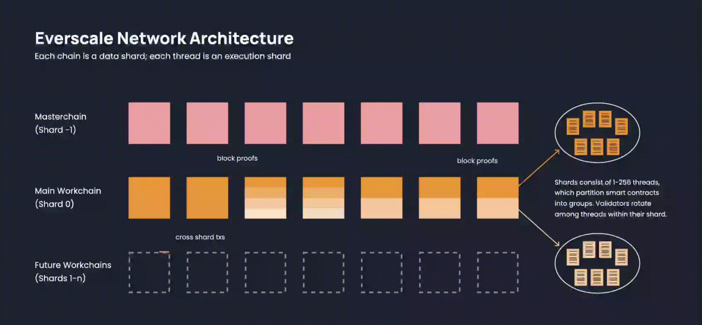

# Infinite scalability

Everscale’s infinite scalability has been envisioned in its architecture since inception. It is achieved by the means of dynamic sharding, described in detail in the [technical whitepaper](https://everscale.network/docs/everscale-whitepaper.pdf). The reason for scalability was primarily dictated by the blockchain's goal to accommodate a billion or even more users. Consequently, such a large customer base requires a high volume of transaction processing per second.

This approach comes in contrast to the one Ethereum took, resorting to scalability just recently. The decision to scale was triggered by capacity limitations and high transaction costs. However, despite strong efforts, Ethereum is not yet successful. There are many solutions being researched and tested, such as rollups and different sharding approaches. The results remain to be seen in practice. 

## The Approach to Infinite Scalability

:::info

Everscale scales the network via a combination of both data sharding (workchains) and execution sharding (threads).

:::

The Everscale network is split into data shards called workchains. Each election cycle, the global set of validators rotate and are assigned to a workchain. Validators store data and process transactions only for their assigned workchain. As long as validators download blocks of other workchains and update their state based on the changes that occurred, all workchains can run in conjunction.

As of now, Everscale is comprised of two global shards: the **masterchain** and the **main workchain**. Everscale’s architecture can potentially accommodate up to 232 workchains. Each newly created workchain can have its own configuration parameters, virtual machine and native currency,

The **masterchain** is for the synchronization of messages and transaction execution. That is to say, for a multi-chain network to securely operate, the nodes need to reach consensus. On Everscale, all workchain **block proofs** are posted to the masterchain. The blocks of the masterchain contain the latest block hashes of all other chains in the network. The **main workchain**, on the other hand, consists of smart contracts and is used for transactions. Each workchain, on its part, is split into execution shards called **threads**. Threads contain a chunk of the network’s total number of smart contracts. Validators rotate through the assigned threads and process the transactions only in their thread. The number of threads varies from 1 to 256, depending on the network activity. Such a multithreading approach allows for parallel execution of smart contracts by subgroups of validators that share the same data. 

The need to resort to such a technical solution was dictated by several constraints. Namely, the first one arises when there is a need to send a lot of messages between servers. At a certain point, the internet connection could run out. Although data sharding solves this issue, it leaves the second problem, the lack of processing power. For this reason, multithreading, in the form of parallel execution, is fundamental for network scalability. 

## Everscale’s threading in a nutshell.

- In case of a significant increase in the network load, some shards can be assigned to the neighboring validators.
- The shards (workchains) offer low transaction fees while at the same time providing the security of Everscale (masterchain).
- Each election cycle the global set of validators rotate and are assigned to a shard (workchain).
- In the near future, there will be the possibility to deploy multiple multi-threaded shards (workchains).

At the start of 2023, Everscale is still one of the few infinitely scalable blockchains. It is technically ready to process millions of transactions per second, far outpacing both centralized services, like Visa, and decentralized projects that still research different ways to increase their throughput. 
