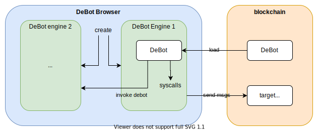
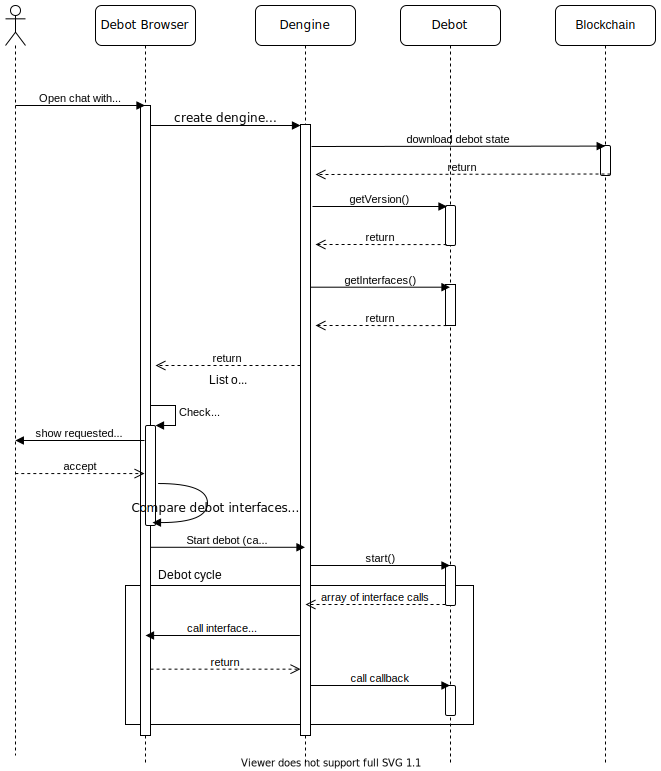

# DeBot Specifications

## Objective

Provide a **secure** and **convenient** environment to work with smart-contracts

- emulate calling smart-contract functions locally on the client;
- debug blockchain transactions;
- interact with smart-contracts deployed in the blockchain.

## Basic terms

- **DeBot** — a smart contract facilitating conversation-like flow communication with a target smart contract;
- **Target smart contract** — a smart contract for which DeBot is created. DeBot is an interface to this smart contract;
- **DeBot protocol** — a set of rules describing the communication between browser and DeBot: how to call DeBot
  functions and how to interpret its answers;
- **DeBot engine (DEngine)** — a program component that executes DeBot and parses its answer using DeBot protocol;
- **DeBot browser** — a program, which creates instances of DEngine for executed DeBot and renders the user interface.

## Architecture



DeBot platform consists of the following elements:

- DeBot smart contract;
- DeBot browser;
- Target smart contract(s).

One target smart contract can have several DeBot and vise versa. DeBot is deployed to the blockchain. DeBot browser
runs on client. It downloads DeBot code and runs it inside the DEngine.

## Proof of State

Transactions can be verified by running DeBot locally and comparing the result of execution to the account state in the
blockchain.

## DeBot Interfaces

### Motivation

DeBot is a smart contract and smart contracts are isolated from each other and from the blockchain, their capabilities
are limited by the commands of the virtual machine on which they are executed. But DeBot must have more possibilities.
DeBot need to:

- receive input from users;
- query info about other smart contracts;
- query transactions and messages;
- receive data from external subsystems (like file system) and external devices (like NFC, camera and so on);
- call external function libraries that allow to do operations that are not supported by VM. For example, work with
  json, convert numbers to string and vice versa, encrypt/decrypt/sign data.

To cover all these needs we should design different **DeBot Interfaces** (`DInterfaces`) which can be used in DeBot and
which must be supported in DeBot Browsers. These interfaces should match the requirements:

- **comprehensive** — interfaces should describe all types of communication accessible on modern devices;
- **universal** — interfaces should be abstract from certain OS and hardware;
- **atomic** — every communication channel should be separately described in the interface for further flexible resource
  access management;
- **convenient** — even low-skilled developers should be able to use this interface in their DeBot.

In this model DeBot Engine should act like a proxy between DeBot Browser and DeBot. But it can have builtin
implementation of very basic DInterfaces (e.g. working with json).

Also, we need to describe the manifest for DeBot. DeBot developer will describe all needed interfaces in this manifest
and the DeBot Browser will check it before running DeBot. We need this manifest to keep users secure and private when
using DeBot.

## Description

Every DeBot must declare which DInterfaces it will use. For this purpose it must have `getRequiredInterfaces()` function
which returns array of required interfaces.

Every interface must have an `id` which is an unsigned 256-bit integer and an address which is used in DeBot as a
destination `address` of internal messages. Address must be a standard Everscale address consisting of `DEBOT_WC` (equal
to `0xDB`) as a `workchain_id` part and interface `id` as `address` part (see _"Telegram Open Network Blockchain"_
specification, section 3.1.2 for details about TL-B scheme for address).

For example, in solidity `getRequiredInterfaces` can be implemented like this:

```solidity
// Base contract for all DeBot
abstract contract Debot {

    i32 constant DEBOT_WC = - 31;

    function getRequiredInterfaces() virtual returns (uint256[] interfaces);
}

contract DebotA is Debot {

    function getRequiredInterfaces() override returns (uint256[] interfaces) {
        return [ID_TERMINAL, ID_MENU, ...];
    }

}
```

### How to use DInterface in DeBot

To use an interface DeBot should import source file with DInterface declaration and call its methods as any other smart
contract methods in Everscale — by sending internal messages to interface address.

Before running the DeBot, DeBot Browser should provide callbacks for DEngine to receive all requests to DInterfaces.
Requests are packed into internal messages. When Browser receives a message from DEngine it should unpack the message,
decode its body, call DInterface function, pack results to internal message and return it to DEngine
using `Dengine.send(msg)`.

```typescript
interface BrowserCallbacks {
    // Message from Debot to Browser with encoded DInterface call
    send(message: string): Promise<void>

    // Request from DEngine to approve some action (for example, send mesage to blockchain)
    approve(action: {}): boolean

    // Request from DeBot to call another DeBot
    invoke(debotAddress: string, message: string): Promise<void>
}
```

### DeBot Start

Befor starting DeBot should also provide metadata, which includes its name, version, authorship information,
description, language and ABI. This is accomplished through the `getDebotInfo()` mandatory function. Along
with `getRequiredInterfaces()` this function is defined in the base
contract [`Debot.sol`](https://github.com/tonlabs/debots/blob/main/Debot.sol).

```solidity
// Base contract for all DeBots
abstract contract Debot {
    /// @notice ACTION structure
    struct Action {
        // String that describes action step, should be printed to user
        string desc;
        // Name of debot function that runs this action
        string name;
        // Action type
        uint8 actionType;
        // Action attributes.
        // Syntax: "attr1,attr2,attr3=value,...".
        // Example: "instant,fargs=fooFunc,sign=by-user,func=foo"
        string attrs;
        // Context to transit to
        uint8 to;
        // Action internal data
        TvmCell misc;
    }

    struct Context {
        uint8 id;           // Context ordinal
        string desc;        // message to be printed to the user
        Action[] actions;   // list of actions
    }

    string s_dabi;

    /*
     * Public debot interface
     */

    /// @notice Returns list of interfaces used by DeBot.
    function getRequiredInterfaces() public view virtual returns (uint256[] interfaces);
    /// @notice Used for error handling for external messages if error code >= 400 (TVM) and < 500 (PROCESSING)
    function getErrorDescription(uint32 error) public pure virtual returns (string desc);
    /// @notice Invoked by DeBot Browser at debot startup. Returns array of debot contexts.
    function fetch() public virtual returns (Context[] contexts);
    /// @notice DeBot entry point.
    function start() public virtual;

    /// @notice Returns DeBot metadata.
    /// @return name String with name of debot, e.g. "DePool".
    /// @return version Semver version of debot, that will be converted to string like "x.y.z".
    /// @return publisher String with info about who has deployed debot to blokchain, e.g. "TON Labs".
    /// @return caption (10-20 ch.) String with short description, e.g. "Work with Smthg".
    /// @return author String with name of author of DeBot, e.g. "Ivan Ivanov".
    /// @return support Everscale address of author for questions and donations.
    /// @return hello String with first messsage with DeBot description.
    /// @return language (ISO-639) String with debot interface language, e.g. "en".
    /// @return dabi String with debot ABI.
    function getDebotInfo() public functionID(0xDEB) view virtual returns(
        string name, string version, string publisher, string caption, string author,
        address support, string hello, string language, string dabi, bytes icon
    );

    /// @notice Allow to set debot ABI. Do it before using debot.
    function setABI(string dabi) public {
        require(tvm.pubkey() == msg.pubkey(), 100);
        tvm.accept();
        s_dabi = dabi;
    }

    /// @notice Returns DeBot ABI.
    /// @dev Deprecated. Remove later. https://github.com/tonlabs/TON-SDK/blob/dc0631a726295c4e7190361c417214c301ec4e01/ton_client/src/debot/dengine.rs#L175
    function getDebotOptions() public view returns (
        uint8 options, string debotAbi, string targetAbi, address targetAddr
    ) {
        debotAbi = s_dabi;
        targetAbi = "";
        targetAddr = address(0);
        options = 1;
    }
}

contract MyDeBot is Debot {
    function getErrorDescription(uint32 error) public pure override returns (string desc) {
        tvm.log(format("getErrorDescription: {}", error));
        desc = format("some description about code {}", error);
        // TODO description error codes
    }
    function fetch() public override returns (Context[] contexts) {
        tvm.log("fetch");
        // TODO fetch Context
    }
    function start() public override {
        tvm.log("start");
        // TODO start
    }

    function getDebotInfo() public functionID(0xDEB) view override returns(
        string name, string version, string publisher, string caption, string author,
        address support, string hello, string language, string dabi, bytes icon
    ) {
        tvm.log("getDebotInfo");
        name = "MyDeBot";
        version = "1.0.0-alpha.0";
        publisher = "Everscale";
        caption = "My first DeBot";
        author = "Everscale";
        support = address.makeAddrStd(0, 0x0);
        hello = "Hello first user!";
        language = "en";
        dabi = s_dabi;
        icon = "";
    }

    function getRequiredInterfaces() public view override returns (uint256[] interfaces) {
        tvm.log("getRequiredInterfaces");
        // TODO add dependency interfaces
    }
}
```
**Run debug log:**
```shell
npx tonos-cli debot --debug fetch <ADDRESS>

19:43:58 [DEBUG] (1) ton_client::debot::dengine: running getRequiredInterfaces, addr 0:5225bff6b13f40518f523c18c7af8dcc46a3369845d98cc7df4e36acca5f8490
19:43:58 [INFO] getRequiredInterfaces

19:43:58 [DEBUG] (1) ton_client::debot::dengine: running getDebotInfo, addr 0:5225bff6b13f40518f523c18c7af8dcc46a3369845d98cc7df4e36acca5f8490
19:43:58 [INFO] getDebotInfo
19:43:58 [DEBUG] (1) ton_client::debot::dengine: run_debot_external getDebotOptions, args: {}
19:43:58 [DEBUG] (1) ton_client::debot::dengine: running getDebotOptions, addr 0:5225bff6b13f40518f523c18c7af8dcc46a3369845d98cc7df4e36acca5f8490
19:43:58 [DEBUG] (1) ton_client::debot::dengine: run_debot_external fetch, args: {}
19:43:58 [DEBUG] (1) ton_client::debot::dengine: running fetch, addr 0:5225bff6b13f40518f523c18c7af8dcc46a3369845d98cc7df4e36acca5f8490
19:43:58 [INFO] fetch
DeBot Info:
Name   : MyDeBot
Version: 1.0.0-alpha.0
Author : Everscale
Publisher: Everscale
Support: 0:0000000000000000000000000000000000000000000000000000000000000000
Description: My first DeBot
Hello first user!
Run the DeBot (y/n)?
y
19:44:02 [DEBUG] (1) ton_client::debot::dengine: running getRequiredInterfaces, addr 0:5225bff6b13f40518f523c18c7af8dcc46a3369845d98cc7df4e36acca5f8490
19:44:02 [INFO] getRequiredInterfaces

19:44:02 [DEBUG] (1) ton_client::debot::dengine: running getDebotInfo, addr 0:5225bff6b13f40518f523c18c7af8dcc46a3369845d98cc7df4e36acca5f8490
19:44:02 [INFO] getDebotInfo
19:44:02 [DEBUG] (1) ton_client::debot::dengine: run_debot_external getDebotOptions, args: {}
19:44:02 [DEBUG] (1) ton_client::debot::dengine: running getDebotOptions, addr 0:5225bff6b13f40518f523c18c7af8dcc46a3369845d98cc7df4e36acca5f8490
19:44:02 [DEBUG] (1) ton_client::debot::dengine: run_debot_external fetch, args: {}
19:44:02 [DEBUG] (1) ton_client::debot::dengine: running fetch, addr 0:5225bff6b13f40518f523c18c7af8dcc46a3369845d98cc7df4e36acca5f8490
19:44:02 [INFO] fetch
19:44:02 [DEBUG] (1) ton_client::debot::dengine: switching to 0
19:44:02 [DEBUG] (1) tonos_cli::debot::callbacks: switched to ctx 0

19:44:02 [DEBUG] (1) ton_client::debot::dengine: run_action: start
19:44:02 [DEBUG] (1) ton_client::debot::dengine: run_debot_external start, args: {}
19:44:02 [DEBUG] (1) ton_client::debot::dengine: running start, addr 0:5225bff6b13f40518f523c18c7af8dcc46a3369845d98cc7df4e36acca5f8490
19:44:02 [INFO] start
19:44:02 [DEBUG] (1) ton_client::debot::dengine: instant_switch = false, state_to = 0
19:44:02 [DEBUG] (1) tonos_cli::debot::callbacks: no more actions, exit loop
```

1. Before starting the DeBot, DeBot Browser creates new instance of DEngine with address of DeBot;
2. DEngine downloads DeBot state, queries metadata and list of DInterfaces required by DeBot and returns the list to
   Browser;
3. Browser must check that it supports all required DInterfaces. If one of interfaces is not supported, Browser must
   report error to the user (application) and not start the DeBot otherwise Browser must list requested interfaces to
   user (application);
4. All required interfaces should be approved by user (application);
5. After the list of interfaces is approved, the DeBot Browser starts DeBot using `Dengine.start(callback)`.

On every interface call Browser should check permission for DeBot and on success execute it according to isolation
requirement if needed.

Below you can see DeBot start sequence:



## DInterface specification

Every DInterface must be discussed and accepted by DeBot Interface Specifications (DIS) Consortium before it can be used
in DeBot. All accepted interfaces are published in [DeBot Interface Specifications Consortium](https://github.com/tonlabs/DeBot-IS-consortium).

Everybody can suggest new DInterface. Go to repo and follow the instructions.

## DInterfaces support in DeBot Browser

DeBot Browser can support and implement any or all DInterfaces published in DIS repo depending on browser's
capabilities. For example, console browser cannot support external devices like camera, NFC, microphone and so on.

Some interfaces required for basic DeBot operation are built into the DEngine itself (SDK, Hex, JsonDeserialize). They
are marked as such in their respective readme files in
the [DeBot Interface Specifications Consortium](https://github.com/tonlabs/DeBot-IS-consortium).

## DEngine versioning

DEngine as a SDK module should have a version of SDK itself.

DIS statuses: Proposed, Accepted, Published.

## Example of DInterface

| Name       | ID                                                                 |
|------------|--------------------------------------------------------------------|
| `RawInput` | `8796536366ee21852db56dccb60bc564598b618c865fc50c8b1ab740bba128e3` |

### Description

Allows to get string from user

### Functions

Function `input`

arguments:

- `answerId`: `uint32` — function id of result callback
- `prompt`: `bytes` — string printed to the user and describing what to enter

returns:

- `text`: `bytes` — string entered by user

### Declaration in Solidity

```solidity
interface IRawInput {
	function input(uint32 answerId, string prompt) external returns (string value);
}

Library RawInput {
	uint256 constant ID_RAWINPUT = 0x8796536366ee21852db56dccb60bc564598b618c865fc50c8b1ab740bba128e3
	// Callback Function Prototype
	function inputResult(uint32 answerId, string prompt) public {
		address addr = address.makeAddrStd(DEBOT_WC, ID_RAWINPUT);
		IRawInput(addr).input(answerId, prompt);
	}
}
```

### Declaration in C++

```c++
namespace tvm { namespace schema {

__interface IRawInput {
  [[internal, answer_id]]
  string input(string prompt);
};
```

### Code Example

#### Solidity

```solidity
pragma solidity >=0.6.0;
import "Debot.sol";
import "RawInput.sol";

contract ExampleDebot is Debot, RawInput {
	function start() public {
		RawInput.input(tvm.functionId(inputResult), "enter your name:");
		RawInput.input(tvm.functionId(inputResult), "enter your wallet address:");
	}

	function inputResult(string text) public override {
			require(text == "Debot");
	}

}
```

> **Note:** `C++` DeBot are currently in the state of early development, and not all features all completely defined for them yet.

## DeBot Special Features

DeBot have 3 special features:

1. `calling` — get-methods of target smart contracts;
2. `calling` — external functions of target smart contracts onchain;
3. `invoking` — other DeBot in a local environment.

Ordinary Everscale smart contracts cannot use 1st and 2nd features because they cannot produce external inbound messages. But DeBot can, due to the fact that they are executed in DEngine, that allows DeBot to generate these kinds of messages, send them to blockchain and return results to DeBot.

In terms of DeBot, all these features are implemented without [DInterfaces](40-debot-specifications.md#debot-interfaces) but in a native way, like two smart contracts communicating with each other — by sending messages directly to target address.

But with only one difference — to call a get-method or call a function onchain DeBot must generate external inbound message, while to invoke another DeBot, it should generate an internal message to the invoked DeBot address.

DEngine distinguishes between get-methods and onchain calls by examining the sign header of the message.  Signed messages (`sign: true`) are considered onchain calls, while unsigned messages (`sign: false`) are considered to be get-method calls.


### Get-methods

#### Developer Example

**Solidity**
```solidity
function showTasks(uint32 index) public view {
    index = index;
    optional(uint256) none;
    ITodo(m_address).getTasks{
        abiVer: 2,
        extMsg: true,
        sign: false,
        pubkey: none,
        time: uint64(now),
        expire: 0,
        callbackId: tvm.functionId(showTasks_),
        onErrorId: tvm.functionId(onError)
    }();
}
```

#### Support in DEngine

DEngine executes DeBot and checks if it produces external inbound messages. If yes, then DEngine analyzes each message by scanning signature and public key bits in message body to understand if message is for get-method call. If bits are zero DEngine downloads target contract and runs its get-method, then returns results to DeBot by calling its function set in the `callbackId` or `onErrorId` (in case of errors) headers of message body.

### Onchain function call

#### Developer example

**Solidity**
```solidity
IMsig(m_msigAddress).sendTransaction{
    abiVer: 2,
    extMsg: true,
    sign: true,
    pubkey: pubkey,
    time: uint64(now),
    expire: 0,
    callbackId: tvm.functionId(waitBeforeDeploy),
    onErrorId: tvm.functionId(onErrorRepeatCredit)
}(m_address, INITIAL_BALANCE, false, 3, empty);
}
```

#### Support in DEngine

DEngine executes DeBot and checks if it produces external inbound messages. If there is one, DEngine analyzes if it is onchain call by scanning signature and public key bits in message body. If signature bit is 1 then DEngine does the following things.

1. Downloads target smart contract, signs the message and emulates its transaction locally;
2. Checks if transaction produces outbound internal messages with funds;
3. Requests permission from DeBot Browser to send this message onchain. Request contains information about funds that will be spent if message will be executed onchain and message itself;
4. If DeBot Browser allows to send message, DEngine sends message to blockchain.

## Invoking DeBot

DeBot can call another DeBot by simply sending internal message to it.

After DeBot execution DEngine filters all internal messages produced by DeBot with destination addresses with workchain 0. This filter allows to separate DInterface calls (which have 0xDB workchain id) from DeBot invokes. If there are invoke messages, DEngine sends them to Browser through BrowserCallbacks interface. Browser (or user) has to approve the invoke of a new DeBot, at which point Browser creates a new DEngine instance, downloads target DeBot and transfers the message to it.

Browsers should generally support a common queue for messages from several DeBot.

## Security notes

At start browser creates a DEngine instance, and receives DeBot metadata and list of required DInterfaces through DEngine, and checks them for compatibility and security.

When DeBot is running, DEngine proxies all DInterface calls (except calls to builtin interfaces supported by engine itself like SDK calls) directly to Browser which must decide to execute or reject them.

Get-method calls are always allowed. Executed by DEngine.

External function calls must be approved by Browser. Executed by DEngine.

Other DeBot calls are always allowed. But executed by Browser which can block invoke if needed.
