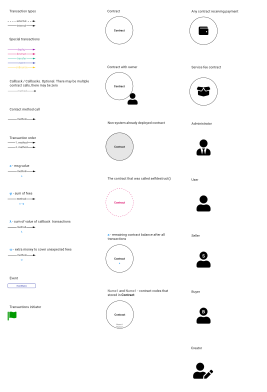
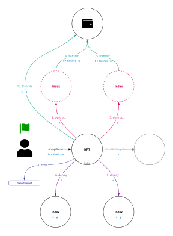

# Non-Fungible Token on-chain indexes (TIP-4.3)
Requires: [TIP-4.1](1.md)
Requires: [TIP-6.1](./../TIP-6/1.md)

## Abstract
Using the Index contract code, you can find all your NFT with one [dApp](https://main.ton.dev/graphql) query.
This makes blockchain application less dependent on different off-chain parsers and indexers

On-chain Indexes solves easy and fast searching any data in blockchain.
This document shows standard for basic query.
Any developer can get an idea of this solution and realize his own on-chain index.

## Motivation
A standard interface allows search all Collection and all NFT by owner using base [dApp](https://main.ton.dev/graphql) functionality

## Specification
The keywords “MUST”, “MUST NOT”, “REQUIRED”, “SHALL”, “SHALL NOT”, “SHOULD”, “SHOULD NOT”, “RECOMMENDED”, “MAY”, and “OPTIONAL” in this document are to be interpreted as described in [RFC 2119](https://datatracker.ietf.org/doc/html/rfc2119)

## Contracts
* `Collection` - [TIP4.1](1.md) contract that minted token
* `NFT` - [TIP4.1](1.md) contract that store token information
* `IndexBasis` - contract, that helps to find all collections by the **code hash** of which
* `Index` - contract, that helps to find:
  * All user tokens in current collection using **owner address** and **collection address**
  * All user tokens in all collections using **owner address**

**code** of `IndexBasis` and `Index` contracts and **code hash** of contracts is fixed and **CANNOT BE CHANGED**

## IIndexBasis
```solidity
pragma ton-solidity >= 0.58.0;

interface IIndexBasis {
    function getInfo() external view responsible returns (address collection);
    function destruct(address gasReceiver) external;
}
```

## IndexBasis
```solidity
pragma ton-solidity >= 0.58.0;

import 'IIndexBasis.sol';

/**
 * Errors
 *   101 - Method for collection only
 **/
contract IndexBasis is IIndexBasis {
    address static _collection;

    modifier onlyCollection() {
        require(msg.sender == _collection, 101, "Method for collection only");
        tvm.accept();
        _;
    }

    constructor() public onlyCollection {}

    function getInfo() override public view responsible returns (address collection) {
        return {value: 0, flag: 64} _collection;
    }

    function destruct(address gasReceiver) override public onlyCollection {
        selfdestruct(gasReceiver);
    }
}
```

**Code hash** of `IndexBasis` compiled by [TVMCompiler](https://github.com/tonlabs/TON-Solidity-Compiler/tree/a222452e27aacff14fdf2fff356542843a2a8d1c) `v0.58.2` and [TVM-linker](https://github.com/tonlabs/TVM-linker/tree/740f9f62a4e68c9f515667c109b116f265942d72) `v0.14.51` without salting is `2359f897c9527073b1c95140c670089aa5ab825f5fd1bd453db803fbab47def2`

### IIndexBasis.getInfo()
```solidity
function getInfo() external view responsible returns (address collection);
```
* `collection` (`address`) - collection token contract address

### IIndexBasis.destruct()
```solidity
function destruct(address gasReceiver) external;
```
* `gasReceiver` (`address`) - address of contract that receives all remaining contract balance after `selfdestruct()` call

## IIndex
```solidity
pragma ton-solidity >= 0.58.0;

interface IIndex {
    function getInfo() external view responsible returns (
        address collection,
        address owner,
        address nft
    );
    function destruct(address gasReceiver) external;
}
```

## Index
```solidity
pragma ton-solidity >= 0.58.0;

import 'IIndex.sol';

/**
 * Errors
 *   101 - Method for NFT only
 *   102 - Salt doesn't contain any value
 **/
contract Index is IIndex {
    address static _nft;
    
    address _collection;
    address _owner;

    constructor(address collection) public {
        optional(TvmCell) salt = tvm.codeSalt(tvm.code());
        require(salt.hasValue(), 102, "Salt doesn't contain any value");
        (, address collection_, address owner) = salt
            .get()
            .toSlice()
            .decode(string, address, address);
        require(msg.sender == _nft);
        tvm.accept();
        _collection = collection_;
        _owner = owner;
        if (collection_.value == 0) {
            _collection = collection;
        }
    }

    function getInfo() override public view responsible returns (
        address collection,
        address owner,
        address nft
    ) {
        return {value: 0, flag: 64} (
            _collection,
            _owner,
            _nft
        );
    }

    function destruct(address gasReceiver) override public {
        require(msg.sender == _nft, 101, "Method for NFT only");
        selfdestruct(gasReceiver);
    }
}
```

**Code hash** of `Index` compiled by [TVMCompiler](https://github.com/tonlabs/TON-Solidity-Compiler/tree/a222452e27aacff14fdf2fff356542843a2a8d1c) `v0.58.2` and [TVM-linker](https://github.com/tonlabs/TVM-linker/tree/740f9f62a4e68c9f515667c109b116f265942d72) `v0.14.51` without salting is `61e5f39a693dc133ea8faf3e80fac069250161b0bced3790c20ae234ce6fd866`

### Index.getInfo()
```solidity
function getInfo() external view responsible returns (
    address collection,
    address owner,
    address nft
);
```
* `collection` (`address`) - collection token contract address
* `owner` (`address`) - token owner contract address
* `nft` (`address`) - token contract address

### IIndexBasis.destruct()
```solidity
function destruct(address gasReceiver) external;
```
* `gasReceiver` (`address`) - address of contract that receives all remaining contract balance after `selfdestruct()` call

## Collection
* [TIP-4.1](1.md) `Collection` contract must implement the `TIP4_3Collection` interface and [TIP-6.1](../TIP-6/1.md) interfaces
* [TIP-4.1](1.md) `Collection` contract must deploy `IndexBasis` contract after deployment with **code salt**
* [TIP-4.1](1.md) `Collection` contract must `destuct()` `IndexBasis` contracts before collection destruction

### TIP4_3Collection
```solidity
pragma ton-solidity >= 0.58.0;

interface TIP4_3Collection {
    function indexBasisCode() external view responsible returns (TvmCell code);
    function indexBasisCodeHash() external view responsible returns (uint256 hash);
    function indexCode() external view responsible returns (TvmCell code);
    function indexCodeHash() external view responsible returns (uint256 hash);
    function resolveIndexBasis() external view responsible returns (address indexBasis);
}
```
**NOTE** The [TIP-6.1](../TIP-6/1.md) identifier for this interface is `0x4387BBFB`

#### TIP4_3Collection.indexBasisCode()
```solidity
function indexBasisCode() external view responsible returns (TvmCell code);
```
* `code` (`TvmCell`) - basis index contract code

#### TIP4_3Collection.indexBasisCodeHash()
```solidity
function indexBasisCodeHash() external view responsible returns (uint256 hash);
```
* `hash` (`uint256`) - basis index contract code hash

#### TIP4_3Collection.indexCode()
```solidity
function indexCode() external view responsible returns (TvmCell code);
```
* `code` (`TvmCell`) - index contract code

#### TIP4_3Collection.indexCodeHash()
```solidity
function indexCodeHash() external view responsible returns (uint256 hash);
```
* `hash` (`uint256`) - index contract code hash

#### TIP4_3Collection.indexBasis()
```solidity
function resolveIndexBasis() external view responsible returns (address indexBasis);
```
* `indexBasis` (`address`) - basis index contract address

### Code salt parameters
* `stamp` (`string`) - stamp that determine type of index. `stamp = "nft";` for all NFT indexes

### Example of `IndexBasis` deployment
```solidity
function deployIndexBasis(TvmCell codeIndex, address collection, uint128 value) private pure {
    string stamp = "nft";
    TvmBuilder salt;
    salt.store(stamp);
    TvmCell code = tvm.setCodeSalt(codeIndex, salt.toCell());
    TvmCell stateInit = tvm.buildStateInit({
        contr: IndexBasis,
        varInit: {_collection: collection},
        code: code
    });
    new IndexBasis{stateInit: stateInit, value: value}();
}
```

## NFT
* [TIP-4.1](1.md) `Collection` contract must implement the `TIP4_3NFT` interface and [TIP-6.1](../TIP-6/1.md) interfaces
* [TIP-4.1](1.md) `NFT` contract must deploy at least two `Index` contract after deployment with different **code salt**
  * With zero collection address `collection = "0:0000000000000000000000000000000000000000000000000000000000000000"` in **code salt**
  * With non-zero collection address `collection = "0:3bd8…"` in **code salt**
* [TIP-4.1](1.md) `NFT` contract must `destuct()` `Index` before NFT burning
* [TIP-4.1](1.md) `NFT` contract must `destuct()` old `Index` contacts and deploy new `Index` contracts if owner changed

### TIP4_3NFT
```solidity
pragma ton-solidity >= 0.58.0;

interface TIP4_3NFT {
    function indexCode() external view responsible returns (TvmCell code);
    function indexCodeHash() external view responsible returns (uint256 hash);
    function resolveIndex(address collection, address owner) external view responsible returns (address index);
}
```
**NOTE** The [TIP-6.1](../TIP-6/1.md) identifier for this interface is `0x4DF6250B`

#### TIP4_3NFT.indexCode()
```solidity
function indexCode() external view responsible returns (TvmCell code);
```
* `code` (`TvmCell`) - index contract code

#### TIP4_3NFT.indexCodeHash()
```solidity
function indexCodeHash() external view responsible returns (uint256 hash);
```
* `hash` (`uint256`) - basis index contract code hash

#### TIP4_3NFT.resolveIndex()
```solidity
function resolveIndex(address collection, address owner) external view responsible returns (address index);
```
* `collection` (`address`) - collection token contract address
* `owner` (`address`) - token owner contract address
* `index` (`address`) - index contract address

### Code salt parameters
* `stamp` (`string`) - stamp that determine type of index. `stamp = "nft";` for all NFT indexes
* `collection` (`address`) - collection token contract address
* `owner` (`address`) - token owner contract address

### Example of `Index` deployment
```solidity
function deployIndex(TvmCell codeIndex, address nft, address collection, address owner, uint128 value) private pure {
    string stamp = "nft";
    TvmBuilder salt;
    salt.store(stamp, collection, owner);
    TvmCell code = tvm.setCodeSalt(codeIndex, salt.toCell());
    TvmCell stateInit = tvm.buildStateInit({
        contr: Index,
        varInit: {_nft: nft},
        code: code
    });
    new Index{stateInit: stateInit, value: value}();
}
```

## Example of dApp query for search by index
```graphql
query {
  accounts( 
    filter: {
      code_hash: {
        eq: "207dc560c5956de1a2c1479356f8f3ee70a59767db2bf4788b1d61ad42cdad82"
      }
    }
  ){
    id
  }
}
```

Part of response example
```json
{
  "data": {
    "accounts": [
      {
        "id": "0:000001b0422f6a7069786fa9a27aa7bb8042f58e1df01dfebc51dcb2baa5eeae"
      },
      {
        "id": "0:00022772794253c1bf8cb4fa59d6161d574033c13d881f3eea14675b911e61b0"
      }
    ]
  }
}
```

## Source code
[link](https://github.com/numizteam/indexes)

## Visualization
### Legend


### `IndexBasis` deployment for `Collection`


### `Index` contracts deployment for `NFT`


### Redeploy `Index` contracts after `changeOwner`


