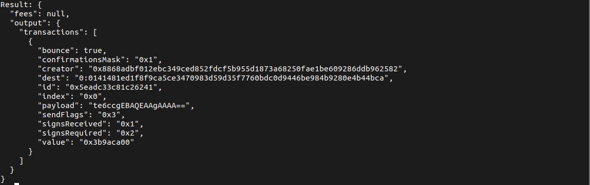

# Staking

## Glossary

`Validator` - the entity performing validation of new blocks on the blockchain through a Proof-of-Stake system. Requires a multisignature wallet for staking.

`Deployer` - person who generates the public key for multisignature wallet, collects custodian public keys and deploys the wallet.

`DevOps` - IT Engineer who sets up validator node and scripts, generates Validator Custodian key

`Custodians` - Multisignature wallet owners who submit and confirm transactions from multisignature wallet. Deployer may be one of the custodians.

`Deployer` seed phrase - the seed phrase, generated by Deployer, used to deploy the wallet.

`Validator` Custodian Key - public key generated by DevOps during Node setup.

## Prerequisites

- Synced validator node with initialized wallet - all responsible persons have completed all steps up to and including step 4.4 of [Run Validator page](../validate/run-validator/run-mainnet-node.md).
- [TONOS-CLI](../develop/api-tools/tonos-cli.md) installed and configured with the correct network for all  wallet custodians, including the Deployer - refer to [Multisignature Wallet page](../develop/smart-contract/multisignature-wallet.md).
- Elections have started - `election_id` parameter of the elector contract != 0
- `~/ton-keys/msig.keys.json` - file with validator custodian keypair.
- `~/ton-keys/$(hostname -s).addr` - file wallet address.

## 1. Validator script submits staking transaction

Synced validator node should be continuously running validator script (see step 5 of [Run Validator page](../validate/run-validator/run-mainnet-node.md)):

```
./validator_msig.sh <STAKE> >> ./validator.log 2>&1
```

Once election begins, validator script attempts to create a staking transaction, pledging `<STAKE>` amount of tokens to the elections contract.

> **Note**: to continuously participate in elections validator should have at least 2x `<STAKE>` on its balance.

When the transaction is successfully created, script extracts `transactionId` and prints it in terminal.

> **Note:** if the multisignature wallet has only one custodian the transaction is confirmed automatically and steps 2 and 3 of this guide can be skipped. Go to step 4.

## 2. Custodians identify Transaction ID

> **Note:** Custodians should know the address of their multisignature wallet.

A number of custodian signatures are required for a transaction to be executed.

Custodians can request the list of transactions awaiting confirmation with the following command:

```
./tonos-cli run <multisig_address> getTransactions {} --abi SafeMultisigWallet.abi.json
```

`multisig_address` – address of the validator wallet.

If there are some transactions requiring confirmation, they will be displayed:



Identify the **transaction ID** of the transaction where the `"dest"` parameter equals 1:333333....3333333. This is the transaction to the elector contract.

Alternatively DevOps may send `transactionId` to other custodians directly.

## 3. Wallet custodians confirm staking transaction

The required number of validator wallet custodians confirm the transaction through TONOS-CLI with their seed phrases.

To create a confirmation message use the following command:

```
./tonos-cli call <multisig_address> confirmTransaction '{"transactionId":"<id>"}' --abi SafeMultisigWallet.abi.json --sign "<seed_phrase>"
```

`multisig_address` – address of the validator wallet.

`transactionId` – the ID of the transaction identified on the previous step.

`seed_phrase` – custodian seed phrase.

## 4. Custodians check that the staking transaction was executed

To confirm the transaction has been executed, use the `getTransactions` command again:

```
./tonos-cli run <multisig_address> getTransactions {} --abi SafeMultisigWallet.abi.json
```

The staking transaction will no longer be displayed in the list of transactions awaiting confirmation.

You can also visit the [ever.live](https://ever.live/landing) explorer and find the message from your address to the 1:333333....3333333 address in the message list.

## 5. After the elections cycle completes, script checks the size of validator stake to be returned

If `election_id` == 0 (that means no validator elections at the moment):

1. script requests size of validator stake that can be returned from elector. Returned value will not be 0 if validator won previous elections and was a validator;
2. if this value != 0, script submits new transaction from wallet to Elector contract with 1 token and `recover-stake` payload, extracts `transactionId` and prints it in terminal and then exits. 

## 6. Wallet custodians confirm the recover transaction

If the number of custodian confirmations required to execute a transaction is > 1, repeat step 2 and 3 for this guide for the recover transaction.

Otherwise the transaction will be confirmed automatically and the stake will be returned from elector.

> **Note:** It is recommended to run `validator_msig.sh` periodically, for example with `cron` utility. `validator_misg.sh` will automatically make a stake and request it (stake + reward) back when it is available. Only custodian confirmations will have to be done manually in this case.


